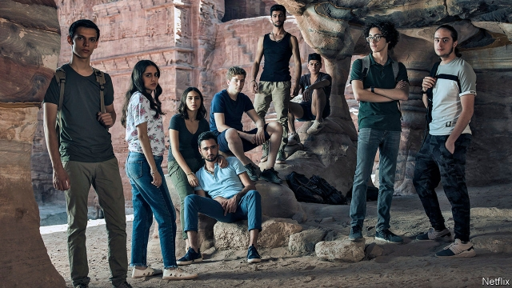

###### Magical thinking

# Netflix tries to jinn up its prospects in the Arab world 

 

> print-edition iconPrint edition | Business | Jun 29th 2019 

SHAPE-SHIFTING jinn have been part of Arab culture since before the Koran described how Allah wrought them from smokeless fire. They have inspired poets and the tale of Aladdin and his genie, popularised in the 18th century—and now Netflix, which started streaming “Jinn”, a supernatural teen drama, this month. Like its other upcoming series in Arabic, “Al Rawabi School for Girls”, it is set in a Jordanian high school. A third, “Paranormal”, will be its first Egyptian show. 

The streaming business in the Arab world is small, with 1.8m paying subscribers, according to IHS Markit, a research firm. But it grew by 45% last year. It now seems big enough for Netflix, which has offered mostly foreign fare in the region since 2016, to invest in original programming. The new shows aim to lure Arab binge-watchers and increase its market share from a quarter or so. 

Will “Jinn” make this wish come true? Not necessarily. A dearth of Arabic shows is not the only reason why Netflix finds itself, unusually, having to catch up with others. It has been slower than it has elsewhere to forge deals with broadband and mobile providers, which market its service to customers. STARZ Play Arabia, the regional leader part-owned by Lionsgate, an American entertainment company, has made these left and right, as well as licensing lots of Arabic-language shows. 

Netflix is now busily buying more local content and sealing new partnerships. It is testing cheaper mobile-only packages in Egypt. But outside the Gulf, where it competes with STARZ, digital infrastructure is mostly too shoddy, incomes too low and mobile data too pricey for similar schemes. 

The region’s prickly authorities raise hurdles, too. Even in relatively permissive Jordan, state-run media reported that officials want to censor “Jinn” for “lewd scenes” that offend public morals. In January Netflix took down an episode of “Patriot Act with Hasan Minhaj”, a current-affairs comedy show, in Saudi Arabia after its government accused the show of violating an anti-cybercrime law. The episode discussed the murder in Turkey of a Saudi journalist by Saudi security forces. Such constraints are unlikely magically to disappear.◼ 

