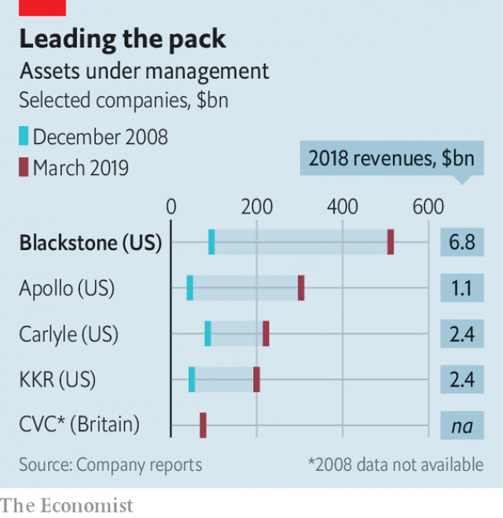

###### Alternative reality

# Stephen Schwarzman says that Blackstone is not done growing 

 

> print-edition iconPrint edition | Business | Jun 29th 2019 

WHEN BUY-OUT firms first came to prominence in the 1980s, they were seen as wolves in fine Italian wool. Private-equity (PE) companies won a reputation for devouring companies, which they loaded with debt, stripped of assets and rid of workers. All to make a killing for their millionaire investors—and themselves. 

In the past 30 years the industry has softened its image while maintaining a red-bloodedly capitalist devotion to returns. PE firms have diversified into a wider array of assets, from commercial property to corporate debt; anything not traded in public markets is fair game. They have also grown a bit cuddlier, collaborating with their targets rather than consuming them—and considerably bigger. 

None more so than Blackstone, the world’s largest “alternative asset manager”, as it now calls itself. It manages $512bn in assets, as much as Apollo and Carlyle, its two nearest rivals, combined (see chart). Its funds have chalked up internal rates of return (a measure of performance) of 15% since the 1990s. Companies it controls employ around 400,000 workers, about as many as Kroger supermarkets and more than IBM. Since Blackstone listed its own shares in 2007 it has created around $41bn in value for shareholders. 

 

Blackstone’s ambitions, as its top brass tell it, do not stop there. “The old model of buying a slow-growth company, adding leverage and selling assets is dead,” says Stephen Schwarzman, its boss. The new vision that emerges from a series of interviews with The Economist is of a firm that wants to dominate alternative investments much as publicly traded ones are dominated by BlackRock, whose $6trn in assets under management make it the biggest asset manager ever (and which was spun out of Blackstone in 1994). In its quest to stand among the giants of Wall Street, Blackstone is also becoming a more normal company. Can it preserve its abnormal profits? 

Blackstone was founded in 1985 by Mr Schwarzman and Peter Peterson (who died last year, aged 91). On July 1st Mr Schwarzman, a 72-year-old with a penchant for pinstripes and a knack for networking, will oversee the biggest change to its structure since it floated on the New York Stock Exchange a dozen years ago. 

Like many buy-out groups, however, Blackstone has maintained a complicated partnership structure. The principal reason, predictably, is tax. Partnerships, in theory, pay the American taxman little or nothing. Their shareholders do: they are subject to a capital-gains levy of up to 23.8% on distributed earnings. This was of enormous value at a time when corporate profits were taxed at 35%. But then, last year, President Donald Trump’s tax reform took effect, cutting the corporate rate to just 21%. 

Just as the benefits of partnerships have diminished, their costs have grown. The biggest is exclusion from equity indices, which are confined to funds invested in corporations. This put PE companies out of bounds for many big mutual funds. Of the $12trn deployed by American mutual and exchange-traded funds, just $4.5trn could be invested in partnerships. Many managers of the remaining $7.5trn would like a chance to do so: since Blackstone announced it would convert to a corporation in mid-April, its share price has risen by 24%, during which time the S&P 500 index has only risen 0.5%, adding $11bn to its market capitalisation. Ares, a mid-sized PE firm, was the first to turn its partnership into a corporation in March last year. KKR did so last July. Mr Schwarzman confesses that Blackstone might have been better off making the switch sooner. 

Imminent incorporation has prompted investors to take a second look at Blackstone, says Michael Chae, the firm’s chief financial officer. There is plenty to like. Blackstone has pushed into a wider range of asset types, starting with property in 1991. Today property accounts for one-third of its managed assets, as much as traditional PE. Most of the rest is spread across GSO, a private-credit business that the firm acquired in 2009, and a fund-of-funds operation that invests in a selection of hedge funds. Lastly, Blackstone has launched funds to invest in biotechnology firms and is offering insurers funds tailored to their desired return profile. 

A greater number of funds has allowed Blackstone to finance bigger deals. In June two of its funds joined forces to buy 179m square feet (16.6m square metres) of warehouse space for e-commerce. A greater variety, meanwhile, means it can offer investors a bigger choice of time horizons. The lifetime of a typical PE fund is around a decade: the firm will deploy capital over five years and hold on to its investments roughly as long. Blackstone now offers property funds that invest over 20 or 30 years. In 2015 it paid $5.3bn for an apartment complex in New York on the condition, demanded by City Hall, that it does not sell it for a few decades. Some Blackstone funds hold capital in perpetuity. 

These innovations have served Blackstone rather well, reckons Craig Siegenthaler of Credit Suisse, a bank. So well, in fact, that others are apeing it. Apollo, Carlyle and KKR all now invest in more asset classes. Half the capital managed by Apollo is now held in perpetuity—meaning only the returns earned will be given back to investors, not their initial investment. 

Blackstone’s early-mover advantage positions it well for what analysts see as a period of growth for the industry as a whole. An analysis published in March by Morgan Stanley, an investment bank, and Oliver Wyman, a consultancy, forecasts that alternative investments will rise from 7% of all assets in 2018 to 9% by 2023. Assume that the overall stock of assets will grow by 5% a year—possible if the world avoids a full-blown trade war or other economic shock—and total investments in private markets, like those offered by Blackstone, would rise from $5.6trn to $9.5trn. 

In a world of low returns, where passive funds by definition do no better than the market and active managers do so less often than they like to think, alternatives look alluring. Mr Schwarzman boasts that Blackstone’s best funds have historically recorded double the return of a typical index fund—as well they should given how, unlike liquid stockmarket funds, they lock up investors’ money for a decade or more. 

The analysis by Morgan Stanley and Oliver Wyman found that PE returned on average 6.2 percentage points a year more than a global public-equity index from 1997 to 2016. For the top half of funds the figure was 13.2 percentage points, even after factoring in the high fees. Private credit outperformed a high-yield credit index by a similar margin. 

Whether it can keep this up is another matter. Academic studies find smaller differences, especially of late. Performance is down from the lofty heights at the turn of the century. Even buy-out advocates doubt double-digit returns can come back. 

Retail investors, the super-rich and insurers, who currently keep just 1-5% of their portfolios in non-traditional assets, could nevertheless be persuaded to funnel more, given the opportunity. So could pension funds, which need returns of 7-8% to keep their promises to future pensioners, and have around 10% of their money stored in such investments, less than sovereign-wealth funds (15%) or endowments (25%). 

But the competition for that money—and the assets it pays for—is heating up. And not just among Blackstone’s old rivals. In April BlackRock raised $2.8bn for a new PE fund that charges a 1% management fee and a 10% performance fee. It hopes to raise $12bn. On June 23rd the Wall Street Journal reported that Vanguard, the world’s second-biggest asset manager, is in talks to launch something similar. Goldman Sachs, an investment bank, has recently consolidated its own alternatives arm. 

Mr Schwarzman welcomes the competition. “Capital should be drawn to sources of higher performance,” he declares. Traditional asset managers’ have had mixed success in the PE realm. Despite its lower fees, BlackRock’s PE venture did not manage to close its fund last year, as planned. Expertise in private markets takes time to build, says Jon Gray, Blackstone’s president. So does firepower. Blackstone has managed to raise $238bn over the past two years—almost doubling its assets under management. It has $133bn in cash ready to spend. This much “dry powder” is useful when markets tumble—as sooner or later they will—and cheap assets abound but new money to buy them does not. 

Whether Mr Schwarzman joins the likes of John Pierpont Morgan, Marcus Goldman or Samuel Sachs in the Wall Street pantheon will be determined by how he handles two transitions. The first is the imminent one from partnership to corporation. This will require the financier to relax his lockjaw on the company, now that the firm will be held by a wider range of shareholders—while maintaining the discipline that has prevented Blackstone from blowing its money at the top of the cycle. 

The second transition will be from Mr Schwarzman to his successor, probably Mr Gray. Mr Schwarzman says he has no plans to retire anytime soon. But the longer he stays in charge, the louder the question of whether his firm’s success can outlive him. Mr Gray says that Mr Schwarzman has built an investment firm that rivals Wall Street greats. When the time comes, Mr Schwarzman would be wise to let him prove it.◼ 

