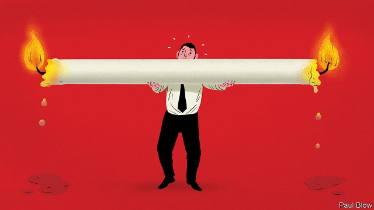

###### Bartleby

# The American exception 

 

> print-edition iconPrint edition | Business | Jun 27th 2019 

AMERICANS LIKE to work hard whereas Europeans prefer a more leisurely life. That is the widely held perception of the continental divide in business culture. But it has not always been the case; 40 years ago, there was precious little difference between the two. 

In his new book, “Spending Time: The Most Valuable Resource”, Daniel Hamermesh, an economist, examines how work and leisure patterns in America differ from those in the rest of the developed world. In the first half of the 20th century the American working week fell sharply from nearly 60 hours to around 40. By 1979 the average worker in America put in around 38.2 hours a week, similar to the number in Europe. 

That is where the figures started to diverge. For a while, the American workweek got longer, reaching 39.4 hours in 2000, before falling back to 38.6 in 2016. The main difference, however, is holidays. In the 1980s Europeans began to take more annual leave but Americans did not. Over the year as a whole, Americans average 34 hours a week, six more than the French and eight more than the Germans. 

What explains this gap? Some point to cultural factors but, as Mr Hamermesh points out, it is hard to see why American culture suddenly diverged from that of the rest of the world in the past 40 years. Others point to lower taxes, which raise the value of putting in the extra hour. Yet American taxes were lower than European rates back in the 1960s, when working hours were similar. Another potential explanation is that a decline in trade union membership has weakened American workers’ bargaining power—except that unionisation rates in France and America are not far apart. 

A more plausible reason is policy. There is no legal requirement to offer paid holiday in America, whereas France mandates a minimum of 25 days, and Germany, 24. Famously, France also limits the working week to 35 hours. Mr Hamermesh finds similar examples in Asia. In the 1980s and 1990s Japan passed laws reducing the standard working week from 48 hours to 40. Beyond that, workers were entitled to overtime pay. A similar process occurred in South Korea between 2004 and 2008. Employers responded by cutting hours; workers earned less as a result but surveys found they were happier. 

In America, by contrast, champions of workers’ rights have recently focused on raising the minimum wage (so far to little avail at the federal level, though some states have enacted more generous wage floors). Wage gains have certainly skewed toward the better-off. The median American worker makes about $20 an hour while the worker at the 95th percentile makes $62. That is a ratio of 3.1. Back in 1979, the ratio was 2.2. 

These higher wages do seem to have had an incentive effect. High-paid employees work eight or nine more hours a week than the lowest-paid. In part, this may reflect the low earnings of part-time workers, who have grown as a share of the workforce. Either way, the gap has widened since the late 1970s. 

But don’t shed too many tears for the wealthy. They may work more hours, but the poor often work more inconvenient ones. It is a myth that well-paid workers put in more hours at the weekends or at night, Mr Hamermesh says. Cleaners and food-delivery people tend to work when it is dark, not bankers. 

So what is going on? John Maynard Keynes, an economist, dreamed that his grandchildren would be working only 15 hours a week. But the decline in hours he predicted slowed after the 1970s. This may hint that 35-40 hours is close to the most efficient working period. Any more and workers become too stressed; any less and companies lose too much production. But it is also a sign that Keynes was wrong to think that society would place a high value on extra leisure. 

In the developed world most workers have more than enough to feed themselves and their families. But they still want “positional” goods—homes in a nice part of town, holidays in sun-drenched resorts and possessions that demonstrate their social status. Prices of these goods will be pushed higher, driving status-seeking employees to work more hours to earn them. 

So whatever labour-saving gadgets Silicon Valley dreams up, future generations will probably still have to put in a long shift. But Americans could enjoy a bit more holiday. Those who agree ought to ask their politicians why those pesky Europeans deserve more rest.◼ 

