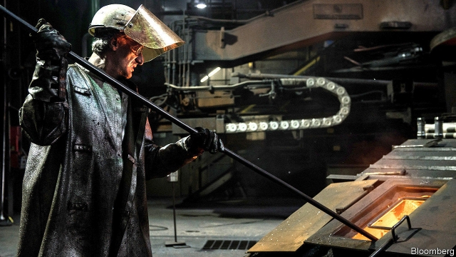

###### Something good

# The European steel industry is being clobbered 

 

> print-edition iconPrint edition | Business | Jun 29th 2019 

LUSH FORESTS, cowbells ringing and a fairy-tale castle make the alpine foothills above Linz seem alive with “The Sound of Music”. Down in the valley, however, the Austrian city’s skyline is dotted with piles of coal, smoke-belching funnels and the blackened silhouettes of blast furnaces, the home of Voestalpine, an Austrian steelmaker. High-wage, prealpine Linz is not a cheap place to smelt steel. Yet the firm has been adduced as proof that Europe’s steel industry has a future—even as this future once again looks in doubt. 

On June 26th steel executives gathered in Brussels to discuss their mounting challenges. Mills around the world are enjoying rising profits. Except in Europe. A 10% rise in the cost of coking coal and a doubling of iron-ore prices in the past 12 months have crimped already thin margins. So has the price of European emissions-trading permits, triple what it was at the start of 2018. 

The price of steel is going in the opposite direction. Rebar is down by a fifth on the London Metal Exchange. Blame American steel tariffs imposed last March. Two-thirds of the steel imports that would once have gone to America have flooded Europe instead, laments Axel Eggert, director-general of Eurofer, a trade body. The EU imposed a tariff of 25% on imports in February to try to stem the flow. Demands for more protection and bail-outs for ailing steel works are growing. 

Not at Voestalpine. “Politics ruined this group from the first,” says Wolfgang Eder, its chief executive. Mr Eder’s scepticism of state intervention is long-standing. He recalls how in the 1980s, shortly after he joined the firm as a junior lawyer, politicians who dominated the company’s board refused to lay off workers made redundant by labour-saving technologies. Idle hands were kept busy with ill-considered forays into shipbuilding (in a landlocked country), making weapons (that neither NATO nor the Warsaw Pact wanted) and trading oil (which nearly bankrupted the firm in 1985). By the time Austria joined the EU in 1995, the newly privatised Voestalpine looked in no position to compete with the bloc’s lower-cost plants. 

Compete it has. Over the past decade its post-tax margins have topped 4%, compared with 2% for ArcelorMittal, 1.8% for Thyssenkrupp and -7.5% for Tata Steel Europe, its largest local rivals. Christian Obst of Baader Bank, an investment bank, credits Mr Eder’s push in the 2000s to focus on quality over quantity. 

That was an unorthodox move. In 2005 Aditya Mittal, now president of ArcelorMittal, the world’s biggest steelmaker, mused that companies would need to smelt at least 100m tonnes a year to survive. Voestalpine was too puny to compete with the Mittals of this world when it came to exporting cheap, bog-standard steel to feed China’s construction boom, Mr Eder reasoned. But it could profit from rising demand for high-margin speciality steel from Europe’s growing car and aircraft industries—and itself produce some of the even more lucrative rail equipment, car and aircraft components. 

Some sheen has come off Voestalpine’s performance. In October it issued its first profit warning since February 2014. Then, in January, it issued another. Investors fret about potential fines relating to an anti-cartel investigation launched by German regulators in 2017. The company’s share price has lost nearly 40% in the past year—not quite as bad as ArcelorMittal and ThyssenKrupp, but nearly. 

Voestalpine’s profits could bounce back faster than those of rivals. Last year they were corroded by cost overruns at new steel plants in America and problems in the German car industry, its biggest customer. The first was a one-off and the second may prove temporary, thinks Ingo Schachel of Commerzbank. And Mr Eder’s firm looks better placed to withstand the EU’s impending climate-friendly rules on carbon emissions. These would hit bigger steelmakers, which use more carbon-intensive methods. This year Voestalpine plans to open its first plant in Linz to experiment with making the stuff with clean hydrogen instead of dirty coking coal. Mr Eder is due to retire on July 3rd. It is up to his successor to ensure that the few scrapes and dents he leaves behind do not turn to rust. ◼ 

