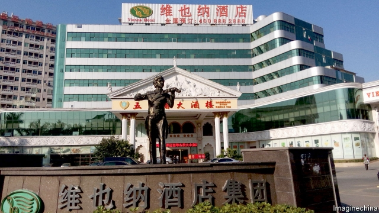

###### Nominal confidence

# China is waging war on Western names for buildings and places 

 

> print-edition iconPrint edition | China | Jun 29th 2019 

CHINA’S SOUTHERNMOST province of Hainan is a tropical tourist-magnet of white-sand beaches, mountains and rainforests. Posh resorts line the island’s shore. It is also on the front lines of a culture war. In June Hainan’s government published a list of 53 places and buildings, including many hotels, with names that “worship foreign things and toady to foreign powers”. It said these names must be “cleaned up and rectified”—ie, changed. 

Many of the offending names use Chinese characters that, put together, sound like foreign words: Kaisa for Caesar, for example (used in a hotel name), or Weiduoliya for Victoria (the name of a residential area in the capital, Haikou). Several of the buildings are hotels called Weiyena, or Vienna. They belong to the Jinjiang Group, a state-owned firm. The Vienna chain has publicly complained, saying its brand was legally registered in 2012. 

That was the year Xi Jinping took over as China’s leader. Since then Mr Xi has been waging a campaign against Western influence and to instil “cultural confidence”. Hainan issued its directive in response to one published late last year by several central ministries on the “rectification” of foreign names as well as “strange” or “exaggerated” ones. Examples given by the ministries included the phonetic renderings in Chinese of foreign names as well as Chinese names using Roman letters. Provinces have been dutifully producing blacklists like Hainan’s. 

The campaign has triggered an outcry online. One blogger wondered whether a subway station in Shanghai called Dishini, or Disneyland, after a nearby theme park, would have to be renamed. Others worried that the new policy might harm firms with foreign-sounding names, or result in clumsy efforts to translate Western names into Chinese rather than using phonetic approximations. To restore calm, the Ministry of Civil Affairs warned against “random expansion” of the purge. 

Mr Xi’s efforts are unlikely to achieve much. Wang Yahuang, a columnist, put it well in an article published by China Business Online, a state-owned website: “Cultural confidence does not stem from restriction. Genuine cultural confidence presents fearlessness to external cultures.”◼ 

