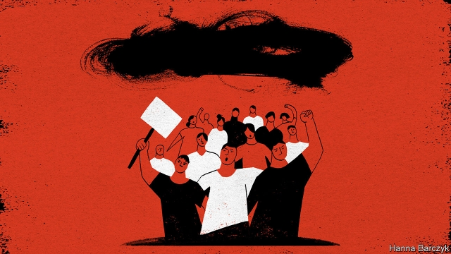

###### Chaguan

# Xi Jinping sees protests in Hong Kong as a threat to the party 

 

> print-edition iconPrint edition | China | Jun 29th 2019 

STRIKINGLY OFTEN, campaigners for Western-style freedoms in Hong Kong pretend that they are not seeking a fight with the Communist Party of China. Rather, activists say that their goals and those of party chiefs in Beijing should be nicely aligned: both camps seek continued prosperity for Hong Kong, 22 years after the former British colony became a free-market enclave in China, under the slogan “one country, two systems”. Instead, the campaigners sound crossest with Hong Kong’s government, for failing to maintain a strict enough separation from the mainland. 

Campaigners have mostly held to that don’t-poke-the-Chinese-dragon stance during protests that have snarled central Hong Kong since June 9th. Two of the demonstrations have involved more than a million people demanding the withdrawal of a bill that would allow extraditions from the city to mainland China. At times, the contradictions have been a little dizzying. Some protesters defied baton-swinging police and tear-gas as they denounced the Hong Kong government—and above all its chief executive Carrie Lam—for exposing them to a Chinese justice system in which they have no confidence. Marchers waved blood-red banners adorned with images of handcuffs. They yelled obscene Cantonese insults aimed at Mrs Lam, at police officers and (Chaguan regrets to report) at the mothers of those officers. Protest signs depicted Mrs Lam as Gollum, a small and malevolent hobbit. But slogans targeting Xi Jinping, China’s leader, have been rare. 

Over a coffee grabbed between protests, Nathan Law, a leader in Hong Kong’s democracy movement, concedes that when activists demand a freely elected, democratic government, they are, logically, defying Hong Kong’s ultimate rulers in Beijing, who have interpreted Hong Kong’s law to require loyalty tests for candidates for public office. But defying the central leadership is not the activists’ primary objective, he says: “All our demands are directed to the Hong Kong government.” 

These are vertiginous times for campaigners like Mr Law, who at the age of 25 has already been elected to Hong Kong’s Legislative Council (only to be expelled for incorrectly reciting his oath of office) and served jail time for his role in pro-democracy protests in 2014. After Mrs Lam suspended the extradition bill, some foreign media called her climb-down one of the biggest political setbacks that Mr Xi has faced in his years as China’s leader. It feels very different to protesters, says Mr Law, as chanting comrades walk past. Activists want Mrs Lam to withdraw the bill entirely. They also want a committee to investigate heavy-handed policing, and an agreement not to prosecute marchers accused of assaulting police officers and other lawbreaking. To date, Mrs Lam has not budged. “Actually, we haven’t gained anything,” says Mr Law. 

He has a message for the central government: that “keeping Hong Kong as a very vibrant and very competitive city is good for both of us”. But in the short term he sounds more concerned by local opinion, guided by a lesson from the protests of 2014, that “we have to keep the public onside”. He stresses small acts of restraint by the leaderless, digitally mobilised movement. He cites a new tactic of surrounding government offices during the day, rather than blocking roads first thing, so that civil servants can get to work but may (he hopes to their delight) be sent home early. 

Rank-and-file protesters are also focused on local politics. Wayne, a 20-year-old student blockading the city’s main tax offices, shrugs when asked about his chances of being heeded by Mr Xi. “He is a king,” he says. His grievances are with Hong Kong officials for failing to keep the rest of China at a sufficient distance. Grumbling about “our money” being taken to build new connections to the mainland by rail and bridge, Wayne says—inaccurately—that under one country, two systems, which runs until 2047, Hong Kong is “not China, not yet”. 

Such talk would enrage most mainland Chinese—if strict censorship were ever to let them hear from Hong Kong’s protesters directly. It certainly appals central government officials, who play an ever-more visible role in Hong Kong’s politics. 

Regina Ip, a prominent pro-establishment politician in Hong Kong, says the territory is unhappy. She blames economic mismanagement, including a housing crisis and a failure to seize the opportunities offered by a rising China. She also blames meddling by foreign powers. “My own conspiracy theory is there are people trying to manufacture June 4th crises in Hong Kong,” she says darkly, referring to the date of the bloody end of the Tiananmen Square protests in 1989. Mrs Ip credits the central authorities with wisdom and pragmatism. But she fears that Hong Kong’s “weakened” government will now “lie low”, avoiding contentious bills. 

Western governments face a dilemma. They feel obliged to speak out on the extradition bill, amid cries of alarm from businesses in Hong Kong. But when democracy activists petition Western consulates in Hong Kong, as hundreds of them did on June 26th, it prompts the central government to weigh in, and fuels Chinese propaganda. The West’s strongest argument is an appeal to enlightened self-interest. Western leaders urge Mr Xi to see the harm that his party’s clumsy actions could do to Hong Kong, a valuable place. Alas, each year brings more evidence that Mr Xi sees things the other way round. He worries about what troublesome places like Hong Kong might do to the Communist Party. 

After previous mass protests in Hong Kong, the central government staged tactical retreats. It allowed the territory to drop contentious laws, then quietly tightened its grip. The party stepped up funding for loyalists to run for local office. It leant on businessmen to support government plans. Tame tycoons bought up media outlets. Political veterans expect more such efforts. Hence the pro-democracy camp’s caution. Its members may fear confronting Mr Xi. He does not fear confronting them. ◼ 

