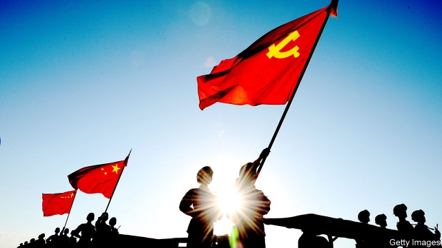
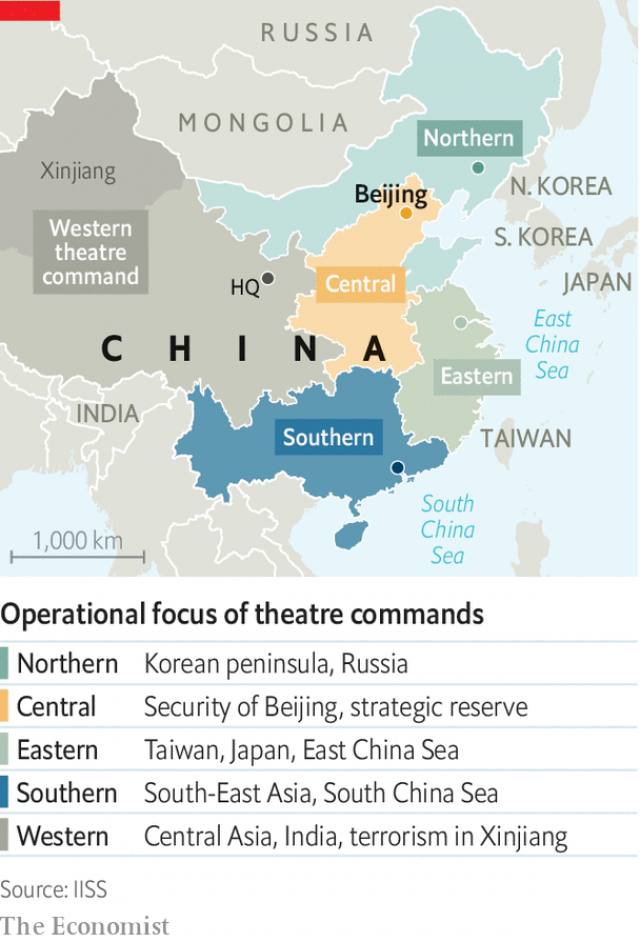

###### Army dreamers

# Xi Jinping wants China’s armed forces to be “world-class” by 2050 

 

> print-edition iconPrint edition | China | Jun 27th 2019 

OVER THE past decade, the People’s Liberation Army (PLA) has been lavished with money and arms. China’s military spending rose by 83% in real terms between 2009 and 2018, by far the largest growth spurt in any big country. The splurge has enabled China to deploy precision missiles and anti-satellite weapons that challenge American supremacy in the western Pacific. China’s leader, Xi Jinping, says his “Chinese dream” includes a “dream of a strong armed forces”. That, he says, involves “modernising” the PLA by 2035 and making it “world-class”—in other words, America-beating—by mid-century. He has been making a lot of progress. 

Organisational reforms may be less eye-catching than missiles that fly at Mach 5, unmanned cargo planes and electromagnetically powered superguns (all of which China has tested in the past year). Yet Mr Xi has realised that there is little point in grafting fancy weapons onto an old-fashioned force. During the cold war the PLA evolved to repel the Soviet Union and America in big land wars on Chinese soil. Massed infantry would grind down the enemy in attritional battles. In the 1990s Chinese leaders, alarmed by American prowess in the Gulf war of 1991, decided to focus on enhancing the PLA’s ability to fight “local wars under high-technology conditions”. They were thinking of short, sharp conflicts on China’s periphery, such as over Taiwan, in which air and naval power would be as important as ground forces. Mr Xi decided that winning such wars required changing the armed forces’ structure. He has done more in the past three years to reform the PLA than any leader since Deng Xiaoping. 

Mr Xi’s principal aim is to increase “jointness”. This term, borrowed from Western military jargon, refers to the ability of different services—army, navy and air force—to co-operate on the battlefield quickly and seamlessly. Jointness is especially important for fighting wars that break out abroad. It can be difficult for commanders at national headquarters to choreograph soldiers, sailors and pilots from a great distance. The different services must be able to work together without instruction from on high. 

China’s model is the United States, which—under the Goldwater-Nichols Act of 1986—drastically reformed its own armed forces in order to achieve this goal. The Pentagon carved up the globe into “combatant commands”. No longer would services squabble among themselves. All soldiers, sailors and pilots in a given area, such as the Persian Gulf or the Pacific, would take orders from a single officer. 

Mr Xi has followed suit. Before his reforms, army and navy commanders in the country’s seven military regions would report to their respective service headquarters, with little or no co-ordination. In February 2016 Mr Xi replaced the regions with five “theatres”, each under a single commander (see map). The eastern one based in Nanjing would prepare for war with Taiwan and Japan, for instance. The sprawling western theatre, in Chengdu, would handle India. The southern one in Guangzhou would manage the South China Sea. 

 

As well as these geographic commands, two others were formed in 2015, each aimed at an American vulnerability. American forces depend on communications via satellites, computer networks and other high-tech channels. So Mr Xi created a new Strategic Support Force to target these systems. It directs space, cyber, electronic and psychological warfare. In 2018 it conducted exercises against five PLA units in what the Pentagon called a “complex electronic warfare environment”. American military power in Asia also depends on a network of bases and aircraft carriers. Mr Xi took aim at these by establishing a new service called the PLA Rocket Force—an upgrade of what was previously known less rousingly as the Second Artillery Corps. 

He has also been trimming the armed forces’ bloated ranks, though they remain over 2m-strong. Since 2015 the PLA has shed 300,000 men, most of them from the land forces, which have lost one-third of their commissioned officers and shrunk from 70% of the PLA’s total strength to less than half (though happily the army has kept its dance troupes, which it had been told it would lose). By contrast, the marines are tripling in size. Navy and air-force officers have gained more powerful posts, including leadership of two theatre commands. This reflects the PLA’s tilt towards the seas—and the skies above them. 

It is hard to tell whether the new PLA is more proficient on the battlefield. China has not fought a war in four decades. The last Chinese soldiers with experience of a large-scale conflict—a war with Vietnam in 1979—will retire shortly. 

But there is evidence that the PLA is getting better at jointness. Some of China’s growing number of forays beyond its borders, notably bomber flights around Taiwan and over the South China Sea, indicate increasing co-ordination between air and naval forces. “We see a lot of joint exercises to work out kinks in the system and get the services used to working with each other,” says Phillip Saunders of the National Defence University in Washington, DC. Chinese war games were once highly scripted affairs. Now officers are assessed on the realism of their training, says Meia Nouwens of the International Institute for Strategic Studies in London. Before Mr Xi’s reforms the “blue team”, which simulates an adversary, would always ritually lose large-scale annual exercises known as “Stride” in Inner Mongolia. Now they usually win. 

But China’s troops may still be ill-prepared for complex warfare. In America promotions depend on officers’ ability to work with other services. Their Chinese counterparts often spend their entire careers in one service, in one region and even doing the same job. Political culture is another problem. “The structures that China is trying to emulate are based on openness, on delegation of authority and collaboration,” notes Admiral Scott Swift of MIT, who retired last year as commander of America’s Pacific Fleet. He says modern warfare requires decentralised decision-making because cyber and electronic warfare can sever communications between commanders and units. “Militaries that are founded on democratic principles are going to be much more adept at adapting to that environment,” Admiral Swift suggests. 

Mr Xi is an authoritarian who strives for centralised control. His predecessor, Hu Jintao, did not have a tight grip on the PLA, says Mr Saunders. That is because Mr Hu’s own predecessor, Jiang Zemin, had appointed the two vice-chairmen of the Central Military Commission, a powerful body that oversees the armed forces. They stayed throughout Mr Hu’s tenure, frustrating any efforts to reform the PLA and curb its endemic corruption and ill-discipline. 

Mr Xi is determined not to suffer the same fate. His anti-corruption purges have ensnared more than 13,000 officers (three serving generals were demoted in June, according to the South China Morning Post, a newspaper in Hong Kong). Mr Xi slimmed down the military commission from 11 to seven members, kicking off the service chiefs and adding an anti-graft officer. The body was also given control of the paramilitary People’s Armed Police, which in turn absorbed the coast guard. 

Predictably, the restructuring has generated resentment. Senior officers are irked at losing privileges. Demobilised soldiers sometimes take their grievances to the streets—one reason why Mr Xi founded a ministry of veterans’ affairs in 2016. But, says Ms Nouwens, younger ranks benefit from merit-based promotion, take pride in the growing prominence of the PLA in Chinese film and television, and admire Mr Xi’s “great rejuvenation of the Chinese nation”. They will have an opportunity to show off on October 1st when a huge military parade will be staged in Beijing to mark the 70th anniversary of Communist rule. It will be the first such show in the capital since Mr Xi launched his reforms. Expect a world-class performance. ◼ 

