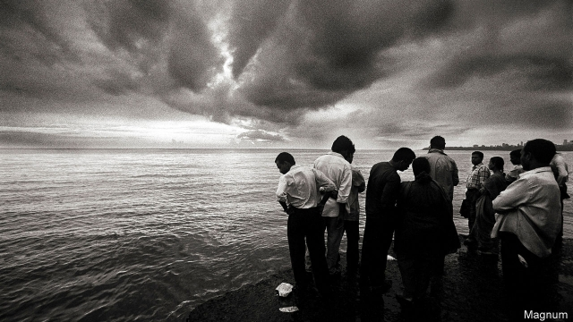
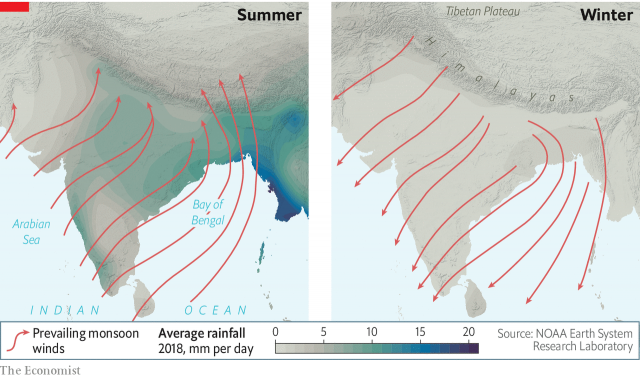
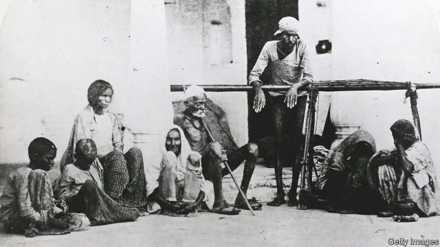
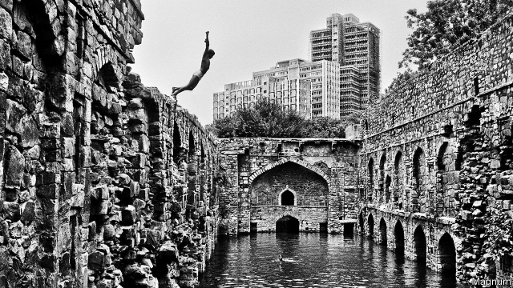

###### A gamble on the rains

# The South Asian monsoon, past, present and future 

 

> print-edition iconPrint edition | Essay | Jun 27th 2019 

WITH RHEUMY eyes and a face wizened by the sun, Narayanappa looks down to the ground and then, slowly, up to the skies. After weeks of harsh heat his land, one and a half hectares (four acres) of peanuts, chillies and mulberry bushes, has turned to dust. At the beginning of June, a dozen families local to Kuppam, a village in the Chittoor district of the south-eastern state of Andhra Pradesh, came together, as they do every year, to sacrifice a goat as a divine downpayment on a good monsoon. By mid-June the monsoon rains should be quenching the parched ground. Yet there is no sign of the livid clouds running up from the south-eastern horizon which serve as its evening harbingers, rising and roiling, filling the sky with their rumbling and the night with veiled lightning. The sky is as blank as the ground is dry. Narayanappa has his sacks of nuts ready to sow. But time is running out. 

In his office at the India Meteorological Department in New Delhi, Madhavan Nair Rajeevan, the department’s boss, looks at portents which are dry in a different way—figures and lines on paper and screens. Where once the oncoming monsoon was spotted through telescopes on the veranda of the observatory built by the Maharajah of Travancore on a hill above Thiruvananthapuram (formerly Trivandrum) in Kerala, now the signs of its coming are looked for through tracked radar and satellites. But they are still of intense interest to the country’s rulers, and its people. The monsoon’s arrival in Thiruvananthapuram at the beginning of June marks the official beginning of India’s rainy season. The rains’ subsequent movement is tracked on a daily basis by national television stations, rather like the advance of the spring cherry blossom in Japan but with far greater human consequence. 

A century of meteorological progress means that Mr Rajeevan can say with much more confidence than his predecessors how fast the summer monsoon will sweep up the nation and how much rain, overall, it will bring. When the monsoon started late this year he could give a convincing non-goat-related reason; Cyclone Vayu, in the Arabian Sea, upset the flows on which the monsoon depends. But though meteorology has improved, it has a long way to go. On average the monsoon is a regular wave of rain, rising and falling over the months from June to September. In any given year, though, the smooth wave is overwritten by spikes and troughs, bursts of intense precipitation and weeks of odd dryness, variations known as “vagaries” which science still struggles to grasp. 

There is a complex structure in space, as well as time. Some places may be almost completely skirted by the rains. Others see deluges violent enough to destroy crops and carry away soil, the water running off the land before it can be caught and stored. The flooding that goes with such rains is expected to become worse and wider-spread as the global climate warms. Agriculture remains the Indian economy’s largest source of jobs, directly accounting for a sixth of its GDP and employing almost half of its working people. A bad monsoon can knock Indian economic growth by a third. The effects in Bangladesh, Bhutan, Nepal, Pakistan and Sri Lanka are on a similar scale. Almost a quarter of the world—1.76bn souls—lives with the South Asian monsoon. 

As Guy Fleetwood Wilson, a finance minister, put it in 1909, the “budget of India is a gamble in rain.” Thanks to Mr Rajeevan and his colleagues, the odds of each year’s gamble are now better known. But obvious steps that might lower the stakes being played for are still not taken. Storage systems in cities have fallen into disuse; aquifers under farmland are depleted year by year faster than the monsoons can refill them. In a country where more people will face the risks of climate change in the decades to come than any other, the problems of the current climate are being ducked. 

The metamorphosis brought by the burst of the monsoon is profound. Brown landscapes turn green, dusts become muds, cracks turn into mouths through which the earth slakes its thirst. The Ganges and the other great rivers fill then overflow, spreading silt-rich fertility across their floodplains. In the countryside the air takes up the petrichor aroma of fresh earth. In gardens, the scent of frangipani carries on the damp breeze; in cities, that unmistakably Indian blend of ordure, asphalt and spice. 

The people respond. The rains bring a sense of relief and a new sensuality. In “The Cloud Messenger” by Kalidasa, one of the greatest Sanskrit poets of north India, the meeting of earth and clouds is nothing less than a kind of lovemaking. In the Sangam literature of the deep south, the heroine waits for her lover, who is away seeking war, wealth and adventure, to return with the rains. People still tell stories of inhibitions cast aside and new lovers taken. The heart takes on the driving, unpredictable rhythms of the rain. 

For all its complexity and importance, on every scale from that of smallholders to empires, at its heart the monsoon is something fairly simple: a season-long version of the sea breezes familiar to all those who live by coasts. Because land absorbs heat faster than water does, on a sunny day the land, and the air above it, warm faster than adjoining seas. The hot air rises; the cooler air from above the sea blows in to take its place. 

A monsoon is the same sort of phenomenon on a continental scale. As winter turns to summer, the Indian subcontinent warms faster than the waters around it. Rising hot air means low pressure; moist maritime water is drawn in to fill the partial void. This moist water, too, rises, and as it does, its water vapour condenses, releasing both water, to fall as rain, and energy to drive further convection, pulling up yet more moist air from below. 

The heroine waits for her lover, who is away seeking war, wealth and adventure, to return with the monsoon rains 

There are other monsoonal circulations around the world—in Mexico and the American south-west and in west Africa, as well as in East Asia, to the circulation of which the South Asian monsoon is conjoined. But geography makes the South Asian monsoon particular in a number of ways. The Indian Ocean, unlike the Pacific and the Atlantic, does not stretch up into the Arctic. This means that water warmed in the tropical regions cannot just flow north, taking its heat with it. It stays in the Arabian Sea and the Bay of Bengal, lapping at India from the west and the east. And to the subcontinent’s north sits the Tibetan plateau, the highest on the planet. The summer heat there draws the monsoon’s moisture far higher into the atmosphere than it would otherwise be able to go, adding mountains of cloud to the Himalayan peaks. 

The monsoon is thus a mixture of necessity and chance. Given the arrangement of sea and land and the flow of heat from equator to pole, such a season has to exist; given the vagaries of weather from year to year, and within the seasons themselves, it springs surprises for good and ill. It is also, and increasingly, a mixture of the natural and the human—as ever more humans depend on it, as humans learn new ways of anticipating it, and as humans face up to the climate change which will reshape it. 

THE RAINS for which Narayanappa waits are not the whole story. The word “monsoon” blew into English from Portuguese in the late 16th century not because European sailors cared about the rain on alien plains, but because when they followed Vasco da Gama around the tip of Africa they came across a type of wind they had never encountered, and for which they had no name. 

The Portuguese monção comes in its turn from the Arabic, mawsim, which means “season”. In the Atlantic Ocean, the only one to which the Portuguese were accustomed, winds in any given place tend to blow in pretty much the same direction throughout the year, though their intensities change with the season and their prevailing direction changes with the latitude. In the Indian Ocean, the prevailing winds flip back and forth. 

This is because of the role played in the monsoon by the “intertropical convergence zone” (ITCZ) which encircles the world close to the equator. The ITCZ is a zone of low pressure over the warmest water. In all the oceans, this low pressure draws in steady winds from the south-east known as the southern trade winds. 

During the northern hemisphere’s winter, the ITCZ sits south of the equator in the Indian Ocean. As warmth creeps north, so does the ITCZ, becoming a dynamic part of the monsoon. It ends up nestled against the Himalayas, bringing the southern trades with it. But their move from the southern hemisphere to the northern, and the constraining effect of high pressure over Africa, sees them twisted from south-easterlies to south-westerlies. When these south-westerly trades pick up in late spring—wind speeds in the Arabian Sea can double over a few weeks—the rains are on their way to Thiruvananthapuram. 

Just as coastal breezes turn around at set of sun, when the land cools fast and the sea stays warm, so monsoons reverse in winter. This is true both for the South Asian monsoon and the East Asian monsoon, which affects Indo-China, the Philippines, southern China, Taiwan, Korea and part of Japan. As the land cools in the autumn, north-easterly winds replace the south-westerlies (see map). Because the winds are mostly dry they are not so important to farmers, though they do bring rain to some parts of southern India. But they matter a great deal to navigation, and thus to human history. The monsoon rains feed what has always been the most populous part of the human world. It is the monsoon winds, though, which brought those people together to form Asia. 

 

Winds which reverse with the seasons shaped a maritime world stretching from the Strait of Hormuz in the north-west to the island archipelagoes of South-East Asia, from Madagascar in the south-west to Japan. With patience, this whole world could be traversed in both directions, with vessels set fair for east and north in summer, west and south in the winter—and with layovers enforced by the tropical storms called hurricanes in the Atlantic, typhoons in East Asia and cyclones in the Indian Ocean (the term comes from the Greek kukloma, the coil of a serpent). The winds of the South Asian monsoon suppress the conditions needed for cyclones to form. When the monsoon is over, they come out to play. 

It was a world of long-range trade where seafarers mingled quite freely. And India sat athwart it. Before any written record, the Bay of Bengal was the realm of floating communities of water nomads, with mastery of the seas and little sense of bounded space. Their boat-dwelling descendants live on as the Moken, Orang Suku Laut and Bajau Laut. Today they are marginalised, subjected to ever-tightening pressure by the state to respect borders and come ashore. Long ago, they showed others what lay over the horizon. 

Had sailors, traders and holy men not followed their lead on the monsoon winds, Asia would not be the heterogenous place it has been through history—and remains today, despite the nationalist narratives and more strictly bordered lives its 20th-century states forced on their newly minted citizens. Tamil merchants from southern India put up inscribed stones in Burma (modern-day Myanmar) and Thailand around the seventh century AD. They seem to have reached the southern Chinese emporium of Canton (Guangzhou) not much later. India’s influence is intense in the extraordinary ninth-century Buddhist temple of Borobudur on Java. Hindu kingdoms arose in the Indonesian archipelago. Bali represents surely the most embellished version of the Hindu faith today. Via India, Islam spread east, too, after Arab merchants carried their faith to the Malabar Coast of south-west India and, eventually, to Quanzhou on China’s eastern seaboard, where 13th-century Muslims lie beneath gravestones inscribed in Arabic. Later, with the Portuguese, Roman Catholicism came to Goa and then, via the south China coast, to Japan. 

Arabs, east Africans, Bengalis, Tamils, Parsis, Malays, Chinese, “Manila men” (Filipinos) and Okinawans met and traded, sometimes sojourning in each other’s lands, sometimes returning on the next season’s winds. When European merchant venturers—Portuguese, Dutch, French and British—came to the region they joined in these seasonal rhythms. The East India Company put the monsoon winds to the service of joint-stock capitalism, as “East Indiamen”, heavily armed merchant ships, carried Indian silks and cottons, as well as Chinese tea, back to Europe once a year. 

In the 19th century, with the coming of coal, steam and iron, the Europeans broke with seasonal rhythms, establishing colonial dominance over Asia by means of efficient weaponry and Suez-crossing steamships that could defy the wind to allow a constant flow of raw materials one way—cotton, jute, grain, timber, tin—and returned manufactures the other. The Asian ports established or greatly expanded at the time—Bombay (present-day Mumbai), Calcutta (Kolkata), Madras (Chennai), Batavia (Jakarta), Manila, Shanghai—marked the birth of a fossil-fuel age. The winds were forgotten; but they were not unchanged. As the build-up of atmospheric greenhouse gases which began back then traps ever more heat the monsoons will change; the vast clouds of pollutants created by Asia’s now endemic use of coal and oil are affecting them too, in ways that meteorologists do not yet understand. And those great low-lying colonial ports will prove far more susceptible to sudden flooding and rises in sea level than older, more defensible ports farther up rivers were. The 90m inhabitants of Asia’s great seaboard cities are among the most vulnerable to the Industrial Revolution’s longest legacy. 

JUST A FEW hundred kilometres from Narayanappa’s smallholding in Chittoor lie the deltas of the Godavari and the Krishna. India’s second- and fourth-longest rivers, respectively, they rise in the Western Ghats and flow east into the Bay of Bengal. The contrast between straitened Chittoor, at the mercy of its own local rains, and the verdant deltas could not be starker. Water drawn from the rivers and spread across their deltas allows the lowland farmers to raise two crops a year, sometimes three. Satellite pictures show their lush paddy fields of the delta as emerald patches on the brown scrub of the Coromandel coast and the land behind. It is a lesson in the power of water to make or break, and the power of humans to command it. 

The green of the deltas was not always so reliable. William Roxburgh was a surgeon who left Edinburgh in 1772 to join the East India Company. He settled in Samulcottah (modern-day Samalkota) in the Godavari delta. As Sunil Amrith writes in “Unruly Waters”, a fascinating new history of the monsoon, Roxburgh was one of those who, through measured observation, laid the foundations of modern Indian meteorology. In so doing he came to believe that nature in India was capable of much “improvement”. The Godavari’s cultivators, he pointed out, depended entirely on the rains: “when they fail, a famine is, and must ever be the consequence.” The solution was to harness the water that “passes annually unemployed into the sea”, retaining it for farmers’ year-round use. 

The British were far from the first of the rulers of the Indian subcontinent to transform the hydraulic landscape. The water tank known as the Great Bath of Mohenjo-Daro is part of an urban complex built by rulers of the Indus valley civilisation in the third millennium BC. In 1568AD Akbar, the third Mughal emperor, had water brought to Delhi not only to “supply the wants of the poor” but also to “leave permanent marks of the greatness of my empire”. He did so by restoring and enlarging a canal to the Yamuna river first cut two centuries earlier by a 14th-century sultan. Akbar’s works, in turn, were restored and re-engineered by the British two and a half centuries later. 

Yet no illustrious ruler had turned his attention to the Godavari. Its improvement fell instead to an unassuming engineer from Dorking in Surrey, Arthur Cotton. Thousands of Indian labourers working under his direction built a giant barrage at Dowleswaram, regulating the river’s flow through the use of huge gates described at the time as “the noblest feat of engineering skill which has yet been accomplished in British India”. To this day, local people lionise Cotton dora (“Boss” Cotton) for turning the delta into India’s rice bowl. On his birthday farmers hang garlands on his statue. 

But if India’s Victorian rulers were happy to lay a restraining hand on the subcontinent’s rivers, they were chillingly unwilling to interrupt the free markets they imposed on it. Growing cash crops for distant markets uprooted old community patterns of mutual obligation during periods of rain-starved stress. In the late 19th century terrible famines linked to failed monsoons took tens of millions of lives in Asia. 

In 1876 and 1877, when the summer rains failed completely, India’s administrators invoked the authority of Adam Smith to argue against intervening in the famine which began to spread across the dry land, eventually claiming 5.5m lives (some estimates say the total was far higher). A couple of years earlier, during a local drought in Bihar, a major catastrophe had been averted through imports of rice from Burma. Yet such expenditure on relief had met with much criticism, not least from The Economist. Such an approach, we wrote, would encourage lazy Indians to believe that “it is the duty of the Government to keep them alive.” 

 

When famine spread in 1877, the viceroy, Lord Lytton, was determined that such folly should not be repeated. He vehemently opposed district officers’ attempts to stockpile grain, on the basis that it would distort the market. The railways, built with the help of taxes that had impoverished the now starving peasants, ensured that grain could get to where it would fetch the highest price—for example, by being exported to Britain—rather than stay in place, unprofitably saving lives. The administration cut both relief rations and the wage for a punishing day’s work in the relief camps, limiting the victims’ access to markets yet further. 

A century later, Amartya Sen, a Nobel-winning economist, argued that what happened in the 1870s was the rule, not the exception: governments are the general cause of famine. Mass starvation is not brought about by a crop-disease- or climate-driven absolute lack of food but by policies and hierarchies which stop people from exchanging their primary “entitlement”, in Mr Sen’s terms—for instance, their labour—for what food there is. Such policies are a feature of autocracies; where the entitlements of the people include real political power, as they do in functioning democracies, they are normally untenable. It was an academic insight born of childhood witness. As a child Mr Sen lived through the Bengal famine of 1943, during which Indians died in the street in front of well-stocked shops guarded by the British state. 

That famine, in which up to 3m Bengalis died, followed a devastating cyclone. But much of the damage was done by the scorched-earth policy of colonial officials who, fearing a Japanese invasion, burned the vessels that local cultivators used to ship rice. Britain sent no relief, in part, perhaps, because of Winston Churchill’s active dislike of Indians agitating for independence. Jawaharlal Nehru, who would later become India’s first prime minister, but was at the time imprisoned by the British, wrote from jail “that in any democratic or semi-democratic country, such a calamity would have swept away all the governments concerned with it.” Though India has experienced plenty of droughts and food shortages since independence, it has suffered no tragedy on a scale to compare with those of the late 19th and early 20th centuries. 

If the Raj was indifferent as to the human effects of failed monsoons, though, it did exhibit an interest in the failures’ causes. In the early 20th century Gilbert Walker, a brilliant Cambridge mathematician who became director of the India Meteorological Department Mr Rajeevan now runs, set his large staff of Indian “computers” to analysing weather data from around the world in search of patterns. His breakthrough came when he perceived back-and-forths even grander than that of the winds over the Indian Ocean—co-ordinated changes in pressure in places many thousands of kilometres apart which he called “world weather”. 

One of these features was the “Southern oscillation”. The usual pattern of air pressure over the Pacific features high pressure over Tahiti and low pressure over Darwin, in northern Australia. This dispensation helps drive the trade winds westward the better to feed the monsoon as the intertropical convergence zone sweeps north over India. But a few times a decade a reversal takes place; the pressure that was up goes down, and that which was down goes up. Low pressure over Tahiti and high pressure over Darwin disrupts the trade winds. The South Asian monsoon weakens. 

Walker guessed that the flipping back and forth had to do with “variations in activity of the general oceanic circulation”; but he did not know what they were, and the atmospheric correlations, though real, proved insufficient to the task of improving forecasts of the monsoon. The rest of the puzzle was solved by Jacob Bjerknes, a Norwegian at the University of California, Los Angeles, in 1969. In the tropical Pacific the eastern waters, off South America, tend to be cooler than the western ones. Periodically, though, the waters of the east warm while those of the west get cooler. It is this which causes Walker’s seesaw to tip. But the atmosphere in its turn influences the ocean. The strength of the easterly winds in the Pacific is one of the factors that governs distribution of warmth between the east and west. The winds and the oceans operate as a “coupled system”, with heat and momentum shifting from one to the other and back again. 

This coupled system has, since Bjerknes, been known as ENSO: EN for El Niño, the name that Peruvians give to warm waters around Christmas time; SO for the Southern oscillation. There are other regular oscillations in the planet’s climate, but ENSO is by far the most important one. When ENSO shifts in the warm-water-off-Peru direction known as its positive phase—as it did, though not very strongly, this past winter—warmth stored in the waters of the Pacific flows into the atmosphere, warming the whole globe. The changes are felt not just in the Pacific and India, but around the tropics and to some extent beyond. When ENSO is in its positive phase, drought can be expected in parts of southern Africa and eastern Brazil, too, while the southern United States can expect things to be wet. In the negative phase—“La Niña”—the situation is largely reversed. 

The advent of computerised global-climate models capable of capturing the effects of far-flung changes in sea-surface temperature at a reasonable level of detail has in the past decade given Walker’s heirs more confidence in predicting the South Asian monsoon’s relative strength. It has also underscored the complexity of the climate system and its interactions with human history. It is now clear that the failures of the monsoon which the British exacerbated in the late 19th century were due to very powerful “super El Niños”. Some climate models suggest that these will occur more often in a warming world. Others, though, disagree. Climate modelling has improved understanding of the monsoon from year to year. But if you take the models which best capture the effects of ENSO in the 20th century and ask what they have to say about how it will work in the hotter 21st century, you find no consensus. 

THERE IS ONE thing the locals do not talk about in the wettest place on Earth: the rain. What, ask the townsfolk of Mawsynram, is the point? 

Their settlement sits on a hilltop plateau in the north-eastern state of Meghalaya—“Abode of the clouds”. Immediately to the south, the hills fall away to Bangladesh’s steaming plains nearly 1,500 metres (5,000 feet) below in a sharply picturesque way—“Danger: Selfie Zone” a road sign warns. To the north are the Khasi Hills, standing athwart the path of moisture-laden southerly winds eager to continue north. The hills scoop the wet air upwards, wringing out its rain. 

The consequence, in Mawsynram, is daily rain for a good nine months of the year. The settlement sees 11.9 metres (467 inches) of rainfall in an average year, over a dozen times that seen in Manchester, say, or Seattle: in an exceptional year it can see 16 metres. Before the monsoon it comes in heavy night-time thunderstorms. From late May, it is nearly continuous, sometimes a steady drizzle, sometimes rods that rattle tin roofs too loudly for conversation. Why a tin roof? Dead wood rots quickly, so the locals often build with metal—or with wood that is still alive, training the aerial roots of Ficus elastica, the rubber fig, to form bridges over the rivers and streams by which the water flows down to the plains below. 

The certainty of daily rain, though, marks Mawsynram out as unusual. In most places, there is a great deal of variation in rainfall over the course of the monsoon. The season is marked by prominent “active” spells, typically when depressions travel west along the monsoon front, followed by dry “breaks”. Timing the sowing of a successful crop is a gamble on what breaks may come, and for how long. Yet today’s meteorological models remain poor at predicting the monsoon’s weather more than a few days out. 

Then comes the need for more localised predictions. Knowing where storms will do their worst would save not just crops but lives: lightning kills more Indians than cyclones do, though cyclones do much more damage to property. Monsoon meteorology’s big challenge, then, is to improve predictions of these intraseasonal shifts. That means combining its models of global climate with an understanding of local peculiarity. The source of much of that can be found in the source of the rains that roll down the Khasi Hills: the Bay of Bengal. 

Thanks to satellite imagery and cloud-busting radar, R. Venkatesan of the National Institute of Ocean Technology in Chennai points out, people now know pretty well what is happening in the atmosphere. But “the ocean remains very murky.” His high-roofed warehouse in Chennai is a treasure trove of toys dedicated to demurkifying it: instrument-laden, unmanned sea kayaks for taking surface measurements; buoys that anchor to the sea bed with sensors to measure temperature, salinity and current; autonomous floats that drift about collecting data at the surface and at depth; an engineless underwater “glider” that soars through the water column, surfacing every few days to tell satellites what it has gleaned. Many of them are about to be deployed in the Bay of Bengal. 

The bay, the world’s biggest, has a notable oddity. It boasts a distinct surface layer of light, comparatively fresh water floating atop its deep-sea salinity. This layer is maintained by two things. One is the Brahmaputra, the Ganges and the rest of the lesser rivers, such as the Godavari and the Krishna, that drain most of the subcontinent’s rainfall into the sea to its east. The other is rain that falls onto the bay itself. This fresher water means the top few metres of the bay are much less well mixed than is the norm in oceans—and thus that the sea-surface temperature can vary more quickly. This thermodynamic skittishness is passed on to the air above. 

In 2015 a joint American-Indian mission used Mr Venkatesan’s hardware, among other tools, to study interactions between the bay and the weather in unprecedented detail. The study reinforced the scientists’ belief that the bay’s quick changes are the key to the breaks between monsoon rains. Rain falling onto the bay itself cools the surface layer enough to limit the convection that would produce more rain for a while before the surface heats back up again. This year’s follow-on mission will try to refine the analysis by gathering real-time temperature, salinity, current and wind data to put together a better picture of how the Bay of Bengal makes the weather, propagating bursts and hiatuses. 

The aerial roots of Ficus elastica, the rubber fig, are trained into bridges over the streams by which the water flows down to the plains 

Meanwhile, in the Khasi Hills, pepper gardens and betel-leaf plots on the hillsides will go untended as the rain pours down. Instead, people will lend their hands to the rain’s long-term project of dismantling the hills themselves. In recent years local kingpins have been putting the industrious locals to new work: felling the hills’ forests to get at the coal, limestone, China clay and even gold underneath. An orgy of illegal quarrying and “rat-hole” mining is disfiguring the landscape and eroding the hillsides and stream-beds. Khasi men and women sit by roadsides with ball-peen hammers reducing boulders to pebbles the size of peas that will descend to the plains not by stream but by lorry, there to feed an infrastructure boom on the alluvial plains of Bangladesh. 

Damaging and unsightly though it may be locally, the mining and quarrying is small beer compared to the work of nature. All the sediments in the plains where the Bangladeshis are building come from hills and mountains eroded away by winter ice, springtime melts and monsoon rains for tens of millions of years. But if humans are not all that impressive on the mountain-levelling plains-building side of things, they more than make up for it when it comes to inundating the plains with ever greater bursts of flooding and washing them away with sea-level rise—processes which will have consequences for that infrastructure boom in far less than a million years. 

IN 1976 Raghu Rai, the photographer whose picture of gathering clouds graces the beginning of this essay, took a picture of water, hope and daring. Modern towers in the background speak of India’s future; ancient masonry in the foreground of its past. A lithe boy is on the cusp of flight, hanging above the deep waters below. 

The setting of the picture (reproduced overleaf) is one Delhi’s oldest structures. Agrasen ki Baoli—Agrasen’s step well—was built (or perhaps rebuilt) in the 14th century AD by followers of a mythical king whose life is chronicled in the earliest Sanskrit epics. The country is covered with a vast number of water tanks and step wells, some of them stunningly elaborate, used variously for irrigation, drinking water and religious purification. Thus contained, water signifies political and religious power—as well as life itself. 

Yet today the bottom of Agrasen ki Baoli, far below the soaring boy, is just dust. That might be read as testament to the heatwave and drought by which much of India has remained gripped as the monsoon stalls in the southern states of Kerala and Tamil Nadu. On a recent day when this correspondent climbed down to the step well’s bottom, Delhi’s temperature hit 48°C (118°F) in the shade. 

But it is all too tempting to view the empty baoli as a metaphor for decades of human folly in which precious water in India has been squandered. At the time the photograph was taken, a farming transformation was under way—a “green revolution” marrying new seed varieties with artificial fertilisers and pesticides. Just add water. The baoli’s builders would have been amazed at how crop yields soared. They would have been appalled at the green revolution’s other consequences, which include soil erosion, a plundering of aquifers and toxic water in much depleted water tables. 

They would also have been appalled to see how urban development has outrun the wells and rivers. Just one instance: in late June, Chennai, India’s sixth-biggest city, was officially declared to have run out of water. Its municipal authorities blamed the drought. Yet years ago they abandoned any coherent policy of water supply. Not only did they not factor in new water capacity or conservation measures. They allowed developers to fill in the water tanks and seasonal lakes for which the city was once famous. The towers of gated communities now rise on these lake beds. A giant billboard outside one such development, Golden Opulence, in Chennai’s western exurbs, promises well-heeled buyers limitless water as a chief sales pitch. The supply is guaranteed by the tankers of a well-established “water mafia” whose thousands of soot-belching lorries are a continuous threat to the city’s air, pedestrians and cyclists. Their cargo disgorged, they return to the countryside—specifically, to places where farmers lucky enough to sit atop an aquifer replenish them for city cash. For farmers wealthy enough to drill a bore hole and install an electric pump this is a doddle, not least because electricity for farmers is essentially free. Mining water beats farming crops. 

 

Narayanappa, in Chittoor district, has no such scam to support him. The butterflies enjoying the shade of the well he dug in the 1990s flit over a stagnant puddle. He and his family have borrowed from local moneylenders to drill five bore holes across the smallholding. Four of them, including the one which goes down 460 metres (1,500 feet), are now dry. And even in better years than this one, bore-well water is not always sweet or safe to drink, given naturally occurring levels of arsenic. For the past five years, the water tankers have been coming to farms around Kuppam village too. 

The gamble on the rains is not just for finance ministers. If, despite ENSO and Cyclone Vayu, the monsoon comes good, as Mr Rajeevan thinks it will, Narayanappa wins out, sells his crops, repays his debts. If not he goes deeper into hock. The desperation such debt drives has led to protests—some violent—and suicide. The misery is one example of how water and the want of water determine inequalities, and even fates. Another can be seen in attacks on people of lower caste using water tanks customarily monopolised by the upper castes. There are also water wars between states. These phenomena are not new—the bitter dispute between Karnataka and Tamil Nadu over extracting water from the Cauvery river dates back to the 1890s—but they speak poorly of modern India’s ability to manage the stakes in its monsoonal roulette. 

At the far end of Narayanappa’s land runs the railway from Mumbai to the south. To the old folk of the village the crammed carriages rolling past are another world, one that fleetingly flows through theirs a few times a day. When the rains fail, their children and grandchildren join the flow, streaming into Bangalore in search of work as labourers or security guards. They throng the steps of Kuppam station, crowding the train well before it has even clanged to a halt. Only the old folk are left in the fields, looking up at the fierce, empty sky.◼ 

