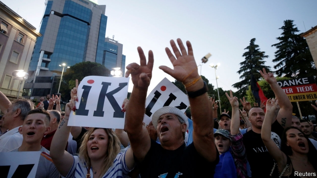

###### All blocked

# Albania is a mess 

 

> print-edition iconPrint edition | Europe | Jun 29th 2019 

CHINESE LANTERNS painted with the word “Ik” drift across the evening sky. Waving red Albanian flags emblazoned with its double-headed black eagle, as well as European Union and American ones, the crowd chants “Rama Ik! Rama Ik! Rama Ik!” Since February, in a series of mass protests, the opposition has been demanding that Edi Rama, the prime minister, must—in one word—go. During such raucous demonstrations, firecrackers and paint bombs are regularly hurled at his office. Lulzim Basha, leader of the opposition Democratic Party, which has led the protests, tells his supporters: “I won’t let this country slip into eastern despotic ways!” But as chaos in parliament and on the streets persists, Albania’s chances of being embraced by the EU are dwindling. 

A year ago the EU laid out a string of conditions before negotiations to join the club could begin. On May 29th a European Commission report recommended that they should go ahead. But on June 18th several EU countries slammed on the brakes. It was a bitter blow, though the Albanian government had expected it. Mr Rama insisted that his country’s efforts to join the EU would continue, and blamed governments pandering to populist parties for keeping it out. North Macedonia, which has made better progress towards meeting the EU’s requirements, was also rebuffed. 

But its chaotic politics mean that Albania looks increasingly ill-qualified to join the club. On June 30th elections for mayors and municipal councils are meant to take place. Mr Rama says they will go ahead, though President Ilir Meta has said he has cancelled them because of the situation. The electoral college backs the government but Mr Basha says the elections are illegal and is boycotting them. Mr Basha had banked on international approval of his protests and boycott of parliament, but has failed to get it. Attacks by his supporters on places where the polls are due to be held have been met by rebukes from foreign governments. 

If the elections do go ahead, Mr Basha’s party will lose the jobs and patronage that local government confers. At the same time the parliament, in which Mr Rama’s Socialist Party has a narrow majority, has begun moves to impeach President Meta. The law, says Erion Veliaj, the Socialist mayor of Tirana, the capital, is “very clear. If you try to stop people voting, you go to jail.” 

Mr Basha has been trying to prove that Mr Rama was helped by organised-crime bosses to win the last general election, in 2017. Mr Rama denies it and says he will sue the journalist who is making the allegations in a German paper. On June 17th Mr Basha was in his turn called to answer allegations about illegal party financing. Mr Basha says the charges are false. 

In 1997 there was a complete collapse of law and order in Albania when citizens seized tanks and forced the then president, Sali Berisha, Mr Basha’s mentor, to resign. Democracy has enough of a foothold to make this very unlikely to happen again; all the same, politics in Albania is a nasty business. The main parties are tied to clans with unsavoury connections. Mr Basha claims that the enemies of organised-crime bosses allied to the Socialists have made overtures to him, which he has rebuffed. “It is not the collusion of government and organised crime, it is a fusion,” he says. But Mr Rama says that if such accusations were true the European Commission would not have recommended the opening of EU accession talks, albeit that EU leaders decided to postpone them. 

However chaotic the current situation, at least Albania’s courts, under the aegis of the European Commission, are being cleaned up a bit. Judges and prosecutors are being screened for unexplained wealth, links to organised crime and general proficiency. Out of 140 screened so far, only 53 have been given the all-clear. ◼ 

