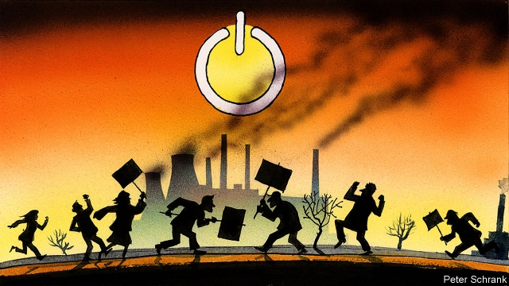

###### Charlemagne

# Environmentalism is emerging as Europe’s new culture war 

 

> print-edition iconPrint edition | Europe | Jun 29th 2019 

IN THREE DIRECTIONS pine forests, bone dry in the scorching weather, disappear into the horizon of the central Polish plain. To the south is the lunar landscape of a city-sized opencast lignite mine. A tangle of conveyors carries the coal up to Elektrownia Belchatow, Europe’s largest thermal power station and its largest producer of carbon emissions, at a rate of one tonne a second. Pawel Koszek, a repairs specialist, surveys the scene with satisfaction. “Electricity”, he says, “is our comfort and our security.” Last weekend activists from Greenpeace projected the face of Mateusz Morawiecki, Poland’s prime minister, with the caption “shame”, onto one of Belchatow’s seven cooling towers. “They don’t understand the technology,” scoffs Mr Koszek, who has worked at the plant since 1989 and met his wife there. 

Downstairs, at a bank of computers, he radiates pride as he demonstrates how to regulate the flow of oxygen to its 13 furnaces. Together they produce about 20% of Poland’s electricity. It is like flying a plane, he muses: the operators must be able to take control in an emergency. There has never been a major incident at Belchatow. Compare that with nuclear power plants like Chernobyl or Fukushima. (Happily, it is unlikely ever to be hit by a tsunami, as Fukushima was.) Wind energy? Solar energy? They come and go. Try charging your phone on a solar panel. Good old coal is reliable. 

This puts Mr Koszek and his home town at the wildly unfashionable end of the environmental debate in Europe. The place, dubbed “Belcha” in the foreign press, serves as a symbol for Poland’s foot-dragging on carbon emissions. The Greenpeace activists were angry at Mr Morawiecki’s government for blocking a commitment to make the EU carbon-neutral by 2050. Yet to its 60,000 residents Belchatow is a pleasant place to live. Amid flowers and fountains in the newly renovated Narutowicza Square is a walk of fame for stars of the local volleyball team, which is sponsored by and named after the state-owned firm that runs the mine and plant. Many families have several members working at the two sites, which employ 8,000 people and many more indirectly. 

So locals are understandably defensive in the face of Europe’s environmentalist surge. Part of this impulse is straightforwardly economic. “Without the power station and the mine,” says Marchin Nowak, Belchatow’s development director, “the town will lose its economic raison d’être.” Already EU-imposed carbon-emissions licences have increased the cost of generating electricity there. He warns that further EU measures will make Polish coal still less competitive and that generation will shift east to Belarus, Ukraine and Russia. The emissions and the jobs, he argues, will merely be displaced out of the EU. 

But the defensiveness also goes beyond the bottom line. Belchatow is proud of its industry. Coalmining began there only in the 1970s and many residents moved to the town from other places, but they venerate St Barbara, the miners’ saint, like residents of older Polish mining regions such as Silesia. The city’s logo is an electrical “on” button and its slogan is: “Belchatow: always a good reaction”. Law and Justice, the nationalist party that rules Poland and dominates local politics in Belchatow, has made the quality of Polish coal a patriotic cause (one critic refuses to give a quote for fear of reprisals). The party condemns western EU states for refusing Poland the chance to catch up with their living standards. Even those in Belchatow who accept the need to cut emissions, like Mr Nowak, say Poland is unfairly treated: “You can’t expect Poland to leap to zero carbon in 30 years.” 

Being in Belchatow reminded Charlemagne of those European towns caught up in, or at least alarmed by, the migration crisis of four summers ago. In such places, too, the issue was cultural as well as purely economic. Locals worried about jobs and wages, and fretted that the costs and benefits of the change would be unfairly distributed. But they also worried about the character of their society and felt alienated from globally minded elites in the big cities. Fake news proliferated. Today immigration has faded as a political flashpoint, as the numbers arriving have collapsed. The environmental debate is taking its place. 

It even has a similar geography. It was tempting to see the migration crisis as a struggle between the eastern and western halves of the EU. That is true of the environmental battle, too. But as with the immigration debates, it oversimplifies the matter. Zuzana Caputova, Slovakia’s new president, and Robert Biedron, an insurgent Polish opposition leader, are both keen environmentalists. And climate change is just as divisive in the western EU. Green and greenish parties are rising and populist parties like the Alternative for Germany, as well as anti-establishment protesters like the gilets jaunes in France, are turning the environmental movement into their new enemy of choice in the culture war. The real divide, as with in immigration, is within societies: between big cities with their Fridays for Future marches, car-free days and liberal politics, and small towns where the old ways of doing things die less easily. 

Immigration has vanished from Europe’s headlines because the populists won the battle. For all the optimism of the “refugees welcome” campaign in 2015, a broad consensus has now formed around much more restrictive, “Fortress Europe” policies. Environmentalists can learn some lessons from what the pro-immigration campaigners got wrong. First, do not split the difference with populists. Instead, take on their arguments with emotionally resonant facts. Europe’s record-hot summers are powerful argumentative props. Second, do not pander to those who resist change, but do not patronise them either. Treat them as grown-ups, listen to their concerns and move faster to cushion the effects of change with transition funds and retraining schemes. Europe’s liberals are entering a new culture war. They should avoid the mistakes of the last one. ◼ 

