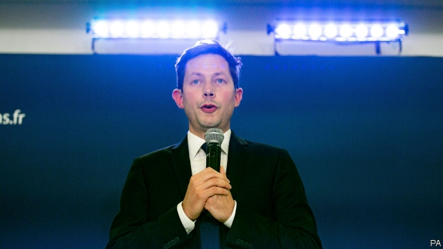

###### Into the wilderness

# France’s Republican party faces extinction 

 

> print-edition iconPrint edition | Europe | Jun 29th 2019 

TWENTY YEARS ago an ambitious politician led the French centre-right into European Parliament elections and was humiliated. The 12.8% secured by the young Nicolas Sarkozy was so dismal that the party dispatched him into the political wilderness (he later staged a comeback and won the presidency). Today, however, the party has done even worse than it did in 1999. After scoring a pitiful 8.5% in May’s European elections, the very survival of the once-mighty Republicans is in the balance. 

The French centre-right is partly hostage to broader Europe-wide voting shifts towards nationalists, centrists and greens. But the Republicans, who failed to make it into the presidential run-off in 2017 for the first time under the Fifth Republic, thought they had a solution. The party picked François-Xavier Bellamy, a philosophy teacher from Versailles, to lead its European campaign and tilt to the conservative right. Having already lost its leading moderates to President Emmanuel Macron’s centrist government—in the shape of the current prime minister, Edouard Philippe, and the finance minister, Bruno Le Maire—the party hoped to build a base on the cultural values of the traditional right. 

To this end Mr Bellamy, with the clean-cut looks of a choirboy, was an apt choice. He promised to write “Europe’s Judeo-Christian roots” into European Union treaties, and beat back immigration. Opposing abortion and gay marriage, Mr Bellamy declared that he was “not going to apologise” for being who he was. The young leader, concluded Valeurs Actuelles, a right-wing magazine, was an “exceptional man”, ready to defend family and country. “Bellamy: the right is back” declared the cover of Le Figaro Magazine, a conservative weekly. 

Voters thought otherwise. Remarkably, 27% of those who had voted Republican in the presidential election swung to Mr Macron’s party, while 15% opted for Marine Le Pen’s populist National Rally (formerly the National Front). Centre-right voters, in other words, now find Mr Macron’s party palatable, while traditionalists flirt with Ms Le Pen. The Republican party is left with those who are not liberal enough to support Mr Macron but find Ms Le Pen’s strident nationalism distasteful—and there do not seem to be enough of them. 

This is the existential problem now facing the party. In 2017 Mr Macron all but eradicated the Socialists on the left. In 2019 he has done the same to the Republicans on the right. The upending of party politics, which some considered two years ago to be a blip, has instead been entrenched. French politics is now being played out between Mr Macron and Ms Le Pen, as it was in the 2017 run-off. “There’s no space left between them,” argues a former Republican now in Mr Macron’s government, who insists that the Republicans have “no future” at all. 

Laurent Wauquiez, architect of the failed rightward lurch, has resigned as leader. A caretaker, Christian Jacob, looks likely to take over. Party membership is down to just 70,000 or so—a fifth of the figure in 2007, when Mr Sarkozy was elected president. Many local Republican mayors, who face re-election next year, fret that the party is so damaged that they will lose their jobs. Mr Macron is courting them assiduously. As is Ms Le Pen, who recently launched an “appeal” to them to join her in an alliance instead. 

Some moderates, including Valérie Pécresse, president of the greater Paris region, and Xavier Bertrand, regional president in northern France, reckon that there is nonetheless a gap for them on the right—but outside the Republicans. Both have quit the party. Watching this disarray, meanwhile, is the wily Mr Sarkozy. This week he published “Passions”, a memoir, keeping himself in the public eye. With a corruption trial pending, however, Mr Sarkozy is unlikely to return to politics. And the party he revived now looks set for a long spell in the political wilderness he once knew so well. ◼ 

