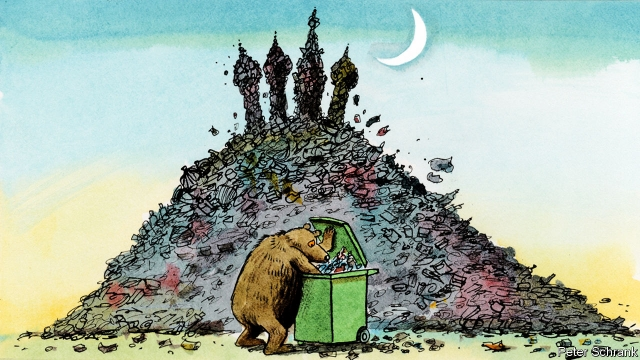

###### The history of trash heaps

# Rubbish is becoming a political problem in Russia 

 

> print-edition iconPrint edition | Europe | Jun 29th 2019 

HEAPS OF PLASTIC bottles and containers fill bins reaching towards the ceiling in a warehouse on Moscow’s southern outskirts. At weekends hundreds of people line up to offload carefully sorted rubbish at Sobirator, a non-profit centre, one of a handful of recycling sites in the Russian capital. “For more than 20 years, trash didn’t worry anyone,” says Valeria Korosteleva, Sobirator’s head. “We have a lot of territory, so everything went straight to the dump.” 

That may be about to change. Last week Moscow city authorities announced a plan to introduce recycling bins in courtyards across the city by the end of the year. For Russia this would amount to a minor revolution: while EU member states recover an average of 60% of their waste, Russia recycles just 4%, a World Bank study found in 2012. That means that landfill has taken up the slack. Such dumps cover some 4m hectares in Russia, an area roughly the size of Switzerland. 

Yet Moscow’s leaders have hardly undergone a green awakening. Instead, rubbish has become a political hot potato. Landfill sites around the capital are full; Moscow plans to ship its rubbish to the provinces. Residents of those regions have, unsurprisingly, balked at being treated as Moscow’s bin. “It’s about dignity,” says Elena Kalinina, an activist. 

The fiercest resistance has come from Ms Kalinina’s home region of Arkhangelsk. Protests have been bubbling there since late last year, drawing thousands. Activists have built a tent camp at the planned landfill site in Shiyes. “The Russian North is Not a Dump,” they chant. Local authorities have detained dozens of them. Activists now demand not only an end to landfill construction but also the resignation of the local governor. On June 25th Russia’s Supreme Court blocked activists’ attempt to force a referendum on the issue. 

If there is a silver lining to the garbage, this is it. Just as ecology became an outlet for civic activism in the late Soviet era, so too have today’s rubbish problems. Moscow’s junk, in short, may be civil society’s treasure.◼ 

