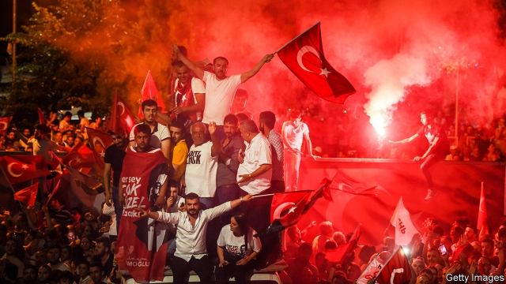

###### Erdogan rebuffed

# Turkey’s president fails to see off his most powerful rival yet 

 

> print-edition iconPrint edition | Europe | Jun 29th 2019 

CARS STREAMED down the main avenues of Turkey’s biggest city on the night of June 23rd, music and horns blaring. Street parties erupted in several neighbourhoods. Young people danced into the small hours. Ekrem Imamoglu, the man responsible for the commotion, stood atop a double-decker bus near his home, surrounded by a sea of elated supporters, and spoke the words that had become the rallying cry of his campaign. “Everything”, he said, “is going to be great.” 

Hours earlier Mr Imamoglu had coasted to victory in the re-run of the election for Istanbul mayor, defeating his opponent, a former prime minister, by nine points, and handing Turkey’s president, Recep Tayyip Erdogan, the biggest setback of his career. It was the best showing by any opposition politician in decades, and left no room for the kind of stunt Mr Erdogan pulled to rob the new mayor of his first victory. 

Three months ago, after Mr Imamoglu prevailed by a fraction of a percentage point, Mr Erdogan and the ruling Justice and Development (AK) party accused the opposition of stealing the vote and leaned on the country’s election board to order a re-run. The move backfired spectacularly. In the re-run, Mr Imamoglu received 54% of the vote against 45% for AK’s candidate, increasing his margin of victory from 13,000 to over 800,000 votes. Turnout reached 85%, boosted by thousands of people who cancelled or interrupted their holidays to be home on election day. 

Mr Imamoglu forged a coalition that included his secular Republican People’s Party (CHP), Kurdish voters, a breakaway nationalist group and some Islamists. But he also earned the sympathy of conservatives disenchanted with the ruling party and the state of the economy. A street vendor in Mr Erdogan’s old neighbourhood said he was so appalled by the decision to re-run the election that he turned against AK. “What they did to Imamoglu was an injustice,” he said. “There’s been too much corruption,” another former AK voter said. “They made too many mistakes.” 

One was to resort to the scaremongering Mr Erdogan uses to fire up his religious base. Over the years, Turkey’s leader has convinced millions of pious voters that their fate depends on his, and that they will become second-class citizens as soon as he loses power. He has attacked the opposition as terrorists, foreign lackeys and atheists. Most recently, he compared Mr Imamoglu to Egypt’s dictator, Abdel-Fattah al-Sisi. At a rare briefing with foreign journalists ahead of the re-run, he brought up the recent death of Muhammad Morsi, the ousted Egyptian leader, and compared it to the execution of a Turkish prime minister five decades ago, for which he blames the CHP. “Don’t look for anything democratic in the CHP’s mindset,” he said. “They don’t have that in their history.” 

Some hostility to religious conservatives survives in the CHP’s DNA, but the party has evolved over the past decade. In Mr Imamoglu, it has found a figure who can embrace all segments of Turkish society and expose Mr Erdogan’s narrative as a sham. The bespectacled mayor reads the Koran, fasts during Ramadan, and has the looks and demeanour of an overgrown schoolboy. He does not look like a threat to national security or Islamic values. 

Opposition figures are used to attacking Mr Erdogan. Mr Imamoglu ignored him. By running an upbeat campaign, focusing on the rule of law, and being as inclusive as Turkey’s leader has been divisive, he has made inroads with conservative voters, something his party has not done in decades. Assuming that he can reshape the CHP in his own image and run Istanbul as successfully as Mr Erdogan did in the 1990s, the new mayor may soon shine on the national stage, predicts Fehmi Koru, a newspaper columnist. 

It may be too early to proclaim Mr Imamoglu’s success a victory for Turkish democracy, or the beginning of the end of the Erdogan era. Turkey’s prisons remain packed with thousands of people arrested on outrageously vague charges in the aftermath of a bloody coup attempt in 2016. They include over a hundred journalists, thousands of bureaucrats and ten MPs from the country’s leading Kurdish party, including Selahattin Demirtas, a former presidential contender. 

The media have been bought off or defanged. Criticism of Mr Erdogan is off limits. No big news outlet dares to touch reports of widespread corruption. Dissent is rare, and punished with tear gas or arrest when it spills onto the streets. Sixteen activists face “aggravated life sentences” (meaning they must in theory serve at least 36 years) for their role in mass protests six years ago. One of them was released on June 25th after seven months behind bars. Another, Osman Kavala, was remanded in custody. He has now spent nearly two years in prison. 

Mr Erdogan himself remains popular and in charge. He enjoys sweeping powers, which he can use to undermine Mr Imamoglu, plus the support of the country’s biggest nationalist party, which gives him control of the parliament. He does not have to face another election for four years. 

But the ground beneath him is shifting. Emboldened by Mr Imamoglu’s success, some estranged AK luminaries, including a former president, seem poised to launch one or more breakaway parties. The economy, which only recently emerged from recession, may turn down again this year. America may impose sanctions over Mr Erdogan’s purchase of a Russian missile-defence system. It has already suspended Turkey’s participation in the F-35 fighter programme. Unless Mr Erdogan convinces Donald Trump to grant Turkey a waiver, additional sanctions will kick in when the missile batteries arrive from Russia. 

The opposition has the wind in its sails. Mr Imamoglu has a real chance to heal a divided society. “The era of partisanship is over,” he said in his victory speech. “The era of rights, law and justice is here.” Elsewhere, those words would sound bland. In today’s Turkey, they are revolutionary. ◼ 

