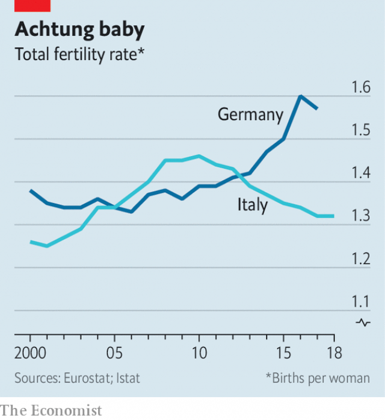

###### Kinder surprise

# Why Germany’s birth rate is rising and Italy’s isn’t 

 

> print-edition iconPrint edition | Europe | Jun 29th 2019 

IN 1907 AN anxious Austrian, Emil Reich, predicted that Germany would have a population of 150m in 1980 and as many as 200m by the year 2000. It seemed plausible at the time. Germany had a high birth rate and a falling mortality rate. Reich’s prediction, in his book “Germany’s Swelled Head”, turned out to be completely wrong. By the early 1980s East and West Germany had a combined fertility rate lower than anywhere in the world except Denmark and the Channel Islands. Far from exploding, Germany’s population seemed doomed to rapid decline. 

But in the past few years something unexpected has happened. The fertility rate, an estimate of the number of children each woman can expect to have in her lifetime, has climbed off the floor. Between 2006 and 2017 it rose from 1.33 to 1.57. The rate for 2018 has not yet been worked out, but more babies were born that year than in 2017. Germany’s fertility rate has pulled away from Italy’s and Spain’s (see chart) and is now almost identical to the euro-area average. On June 17th the UN estimated that in 2050 Germany will have 58 people over the age of 65 for every 100 people aged 20-64. That is a lot, but comfortably less than Italy’s predicted ratio of 74 to 100. 

What has happened? It is partly a statistical quirk. The fertility rate is influenced by the timing of childbirth. If women move en masse to have children at older ages, the rate will fall, then rise again as the average age of childbearing stabilises. This has happened in Germany and other rich countries. But it does not explain the whole rise in the fertility rate. German women born in 1973 (who can be assumed to be done with babies by now) have more children than women born in 1968. 

 

Another explanation is immigration. Germany has not only accepted a lot of people in the past decade—it has taken them from countries where large families are the norm. In 2017 Syrian women in Germany had 20,100 babies, up from just 2,300 three years earlier. Afghans and Iraqis had more than 5,000 each. Tomas Sobotka, a researcher at the Vienna Institute of Demography, estimates that about half the rise of Germany’s fertility rate in the past few years is explained by immigration. 

That boost will not last, because immigrants adjust quickly to native ways. Mona Shinar, a Palestinian woman in her mid-30s who fled Damascus for Potsdam, near Berlin, comes from an enormous family. Before Syria’s civil war began, she had 12 brothers and sisters. She already has four children, including one who was born just two days after she arrived in Germany. She believes her children will have no more than one or two babies each. She has “an Arabic head”, as she puts it. Her children have German heads. 

The other explanation for the baby boomlet is that Germany has made it easier to raise children. What crushes birth rates, whether in Europe or East Asia, is opening higher education and attractive jobs to women while continuing to expect mothers to do the great majority of child care and housework. If a society forces women to choose between jobs and motherhood, many will keep working. Western Germany has a tradition of stigmatising working mothers, and a special slur for them: Rabenmutter (“raven mother”). 

This is gradually changing. In 2007 Germany’s federal government introduced generous parental-leave laws and tweaked the rules to encourage fathers to take time off. In 2013 it declared that children over one year old had a right to nursery places. Although there are still not enough places to meet demand, supply is growing. Between 2006 and 2017 the number of children under three enrolled in nurseries rose from 286,000 to 762,000. 

Unlike those in France, Scandinavia and eastern Europe, German politicians seldom talk explicitly about boosting the birth rate—probably because the Nazis did. Instead they talk about empowering women. Still, their policies seem to promote fecundity. Lena Reibstein of the Berlin Institute for Population and Development says they could do more if they changed the tax system. At present married couples are allowed to file joint income-tax returns. This encourages mothers to stay at home by reducing their husbands’ tax bills if they do. 

Compare all that to the situation in Italy. It has immigrants too—but many come from low-fertility countries like Romania and Albania. Its economy has stagnated, which puts people off having children. And Italian politicians have no idea how to raise the birth rate. Three years ago the government ran an advertising campaign informing women that their biological clocks were ticking, as though this had not occurred to them. The campaign was withdrawn amid heckling. Italy is now the world’s second-oldest country, after Japan. And the truth is, says Maria Letizia Tanturri, a demographer at the University of Padova, that “people don’t care”.◼ 

