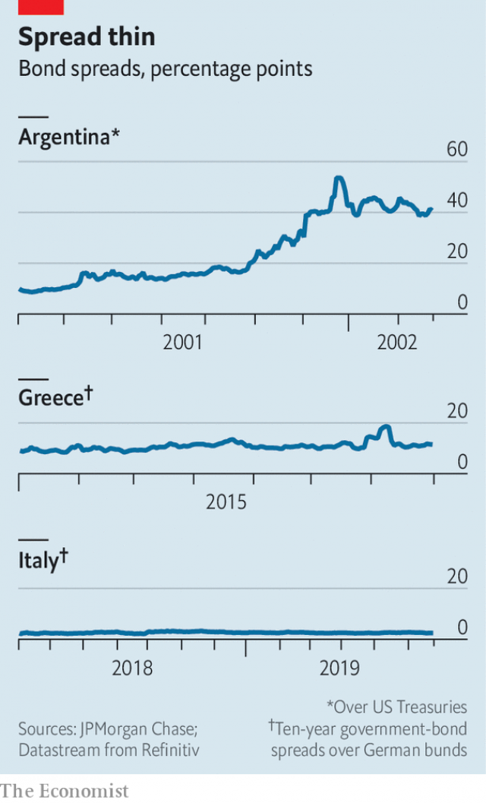

###### Funny money

# An idea for a parallel currency resurfaces in Italy 

 

> print-edition iconPrint edition | Finance and economics | Jun 29th 2019 

GOVERNMENTS IN FISCAL distress sometimes find creative ways to pay the bills. Revolutionary France sold bonds secured against land confiscated from the Catholic church; America used paper bills to fund its war of independence. In 2001 Argentina issued IOUs, as did California in 2009. During Greece’s sovereign-debt crisis Yanis Varoufakis, then its finance minister, toyed with plans for a parallel currency. 

Not the most desirable of clubs, then, yet some in Italy are eager to join. So-called mini-BOTs, originally hatched by eurosceptics to replace the euro, made it onto the ruling coalition’s manifesto last year. Mini-BOTs (Buoni Ordinari del Tesoro, or ordinary treasury bonds) would be used to settle the government’s bills with commercial suppliers. Recipients could use them to pay taxes, or for public services. Devised by Claudio Borghi, an economist of the Northern League, one of Italy’s ruling parties, they would be low-denomination bills (up to €500, or $569) that bear no interest. 

They would not be legal tender—that would break EU law. But Mr Borghi would like them to circulate widely, eventually being used in shops to price goods. He has written that mini-BOTs would enable a quick exit from the euro, though ministers say they have no such plan. 

On May 28th the lower house of parliament passed a non-binding motion calling on the government to bring down arrears, and to study mini-BOTs in detail. The latter clause was reportedly tagged on at the last minute: some lawmakers did not realise what they were voting for. As investors became uneasy Giovanni Tria, the finance minister, said mini-BOTs were not an option. But Matteo Salvini, the League’s leader, says he will press ahead with mini-BOTs in the absence of “a smarter way”. 

In truth, they would bring little gain. Though the government’s stock of unpaid bills is the euro area’s largest, at around €50bn, or 3% of GDP, the Bank of Italy reckons this has halved since 2012. And Mr Tria says the government is now settling bills more quickly. Mario Draghi, the boss of the European Central Bank, has opined that as mini-BOTs are not legal tender, they would add to Italy’s stock of debt. So the government might as well resort to conventional bonds. Though the spread between Italian and German yields has widened since the populist coalition was formed, it is far lower than in countries that have issued temporary IOUs, or “scrip” (see chart). Italy is nowhere near shut out of bond markets. In fact, ultra-loose monetary policy means bond yields are low in historical terms. 

 

History suggests such dire measures are not generally successful. Governments are tempted to over-issue scrip, as in 18th-century America. As they are less trusted and less liquid than official currency, their value slumps. In California banks eventually refused to accept IOUs. Argentines hoarded pesos, spending scrip as fast as possible (an illustration of Gresham’s law, that bad money drives out good). If much of their income becomes denominated in scrip, the government and private sector would struggle to pay back debt, which is still denominated in the official currency. 

The danger is compounded by Italy’s membership of a currency union. If mini-BOTs’ sole purpose were to pay off arrears, investors would worry that the true intention was to leave the euro overnight. On June 6th Moody’s, a credit-rating agency, said it would consider them as the first step towards preparing for an exit; even Mr Varoufakis concurs. Investors would sell off government bonds and residents would pull their euros out of banks, destabilising the public finances and banking system. 

That explains why the technocratic Mr Tria wants to squash the idea, and opposition lawmakers say they would not support it. But Mr Salvini is reluctant to take it off the table just yet. A confrontation with the European Commission over Italy’s public debt is looming. He might hope that considering mini-BOTs signals the country’s willingness to take drastic steps to introduce fiscal stimulus. If it is a threat, the gun is pointing the wrong way. ◼ 

