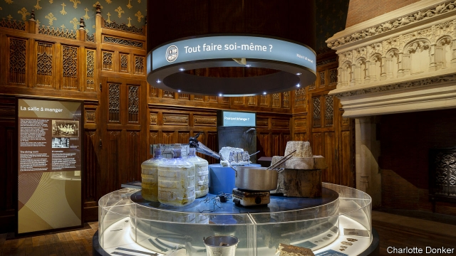

###### Museum piece

# Displays dedicated to explaining economics offer marginal returns 

 

> print-edition iconPrint edition | Finance and economics | Jun 29th 2019 

ECONOMICS IS THE study of how societies allocate scarce resources. But why let eggheads have all the fun? A museum aiming to bring the discipline to the masses opened in Paris on June 14th. A visit to Citéco offers both seasoned and neophyte dismal scientists a chance to reflect on the field’s importance. 

Plenty of central banks run museums of coins and banknotes. The Banque de France, looking to repurpose a branch closed in 2006, had higher ambitions. It aims to “reconcile the French with economics”, as if a lovers’ tiff had driven them apart. That it is housed in a neo-gothic mansion, complete with a moat defending what used to be its underground vault, adds to the mystique. 

But it turns out there is a reason why only one other economics museum exists (in Mexico City). Though books in the “Freakonomics” mould have pitched economics as an endeavour that goes beyond GDP estimates and inflation targeting, bringing it to life is hard. Barbs that economics is but the “painful elaboration of the obvious” will resonate with visitors traipsing through gallery after gallery running the gamut of economic actors, from firms to consumers and governments. Exhibits on the Basel Committee and TARGET2 payments will strain to excite the hordes of school pupils Citéco aims to attract. 

French statist biases are on display: the stockmarket is presented as little more than a glorified casino. But the private sector is also celebrated. The curators are keener on globalisation than are most French policymakers, cheering global trade’s ability to boost incomes across the world. 

Does trade create domestic winners and losers, exacerbating inequality? On this, and just about anything contentious, Citéco is frustratingly silent. Perhaps its biggest shortcoming is its technocrat’s vision. There is only the vaguest sense that economists and policymakers do not all agree. The biases and political framing that define economics in real life are set aside rather than taken on. The juiciest debates are absent. 

But it does not dumb down complicated subjects. An explainer on how money is created by commercial banks issuing loans goes beyond the simplifications of most textbooks. A game that allows players to set what they think is the correct interest rate is fun (try to visit before Jens Weidmann, a hawkish German in the running to lead the European Central Bank, pulls the lever out of the wall). A photo booth that prints banknotes with visitors’ faces in a watermark is a witty prompt to ponder what it is that makes currency worth its face value. 

But presenting economics as a settled discipline allowing for a dispassionate display of its various facets, as Citéco tries to do, turns out to be beyond the wit of homo economicus. There is too much for a mere building, no matter how grand. Perhaps the best reason to visit is the impression it conveys that economics might not belong in a museum at all. ◼ 

