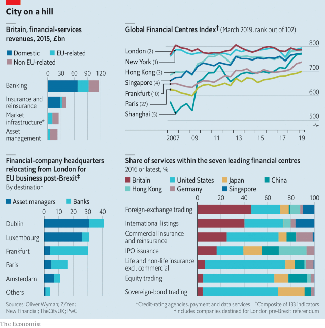

###### The City and Brexit

# London’s reign as the world’s capital of capital is at risk 

 

> print-edition iconPrint edition | Finance and economics | Jun 29th 2019 

A  WELL-KNOWN stockmarket sell signal is a company splurging on flashy new headquarters. It might then be time to go short the City of London. From the Shard, the tallest building in the European Union, the view is of a crowded skyline of fellow concept skyscrapers. There is the Gherkin, the Cheesegrater, the Walkie Talkie and, rising in their midst, 22 Bishopsgate, which will be the Square Mile’s tallest and most capacious tower. The building frenzy is even accelerating. Londoners are waiting to hear if the 1,000-foot Tulip—with a design that many contend is more phallic than floral—will be approved. 

None of this suggests a financial centre bracing for Britain’s departure from the European Union. But as soon as Theresa May, the prime minister, made leaving the single market a “red line” after the Brexit referendum in 2016, it seemed likely that the City would be sundered from its biggest foreign market. Regulators on both sides of the Channel scrambled to ensure business continuity and financial stability. British firms were asked to draw up contingency plans, including opening hubs in the EU27 (the EU minus Britain). For much of the City, Brexit happened sometime last year.  

According to New Financial, a think-tank in London, 291 big financial firms have moved some activities or people to the EU27, or opened legal entities there. Many contingency plans were triggered before March 29th, when Brexit was supposed to have happened. About £1trn ($1.27trn) of the City’s assets has gone, says EY, a consultancy. That compares with perhaps £16trn of bank assets and securities. To London’s EU rivals, Brexit looks like a once-in-a-lifetime opportunity to grab business. A repatriated French banker says so many people have moved to central Paris that she often bumps into London friends. In the run-up to the extended deadline of October 31st, another wave of staff and their families will head off to new digs, offices and schools. 

Some financial infrastructure is moving, as are whole classes of EU27 business. The London Stock Exchange has moved trading in European government bonds worth £2.4bn daily to Milan, for example. Amsterdam has gained more government-bond trading as well as trading in euro-denominated repurchase agreements. 

The moves do not seem hasty. Though Brexit’s final form is unclear, only the softest of departures would keep Britain in the single market. And nothing short of that would safeguard “passporting” rights for City firms. These allow financial firms in any EU country to sell in any other and matter hugely in banking and asset management (and a bit less in insurance). In 2016, 5,476 firms based in Britain used 336,421 passports to sell in the EU. Around 8,000 firms in the European Economic Area, where much of the EU’s writ runs, used 23,535 of them to offer services in Britain. 

Including asset managers, insurers and so on as well as banks, Britain provides a quarter of all financial services in the EU27. Scores of financial firms run their Europe, Middle East and Africa operations from London. American investment banks have as much as 90% of their European staff in London. In 2016, before the referendum, the City of London’s trajectory was better than that of New York as gravity shifted eastward to Asia, says William Wright of New Financial. “London is London as we know it, the world’s number-one or number-two financial centre, because the EU allowed it to become the financial centre of the euro zone,” says an EU27 official.  

Now that status is at risk. “Before the [Brexit] debate began in 2015 it never crossed anyone’s mind that we would have to move financial services for Europe out of London,” says Bernard Mensah, president of Europe and the Middle East at Bank of America Merrill Lynch. “It was as if the British court system suddenly stopped working.” For the hundreds of small companies doing business with the EU27, the removal of passporting and uncertainty over what will replace it is an existential threat, says John Liver, global head of regulation at EY.  

Financial services account for 6.5% of Britain’s economic output and 11% of its tax revenue. The sector and its ecosystem of lawyers, consultants, lobbyists and the like employ 2.2m people, not only in the wealthy centres of the Square Mile, Canary Wharf and Edinburgh but also in places like Cardiff and Bournemouth.  

Yet Britain’s negotiators have treated the industry as a sideshow. The government took the view that the City is strong enough to cope, and made little effort to keep passporting, which would have meant blurring Mrs May’s red lines. Nor did it press hard for “mutual recognition”, in which the EU would accept Britain’s rules as a basis for future trading as long as they did not diverge too much. The City is likely instead to be left with “equivalence”, a piecemeal status that the EU sometimes grants to third countries. 

About half of the City’s business is domestic, a quarter from the EU27 and a quarter with the rest of the world. At worst the City could lose a quarter of its business and some of its non-EU international activity. Few City veterans expect things to get that bad. If regulators work together, equivalence could be made to function well. 

Yet the obstacles are not merely technocratic. The EU would like to use Brexit to force much City activity to relocate to the European mainland. A row has broken out over plans from the European Securities and Markets Authority (ESMA) to stop EU investors trading stocks in London—a blatant land grab, say City folk. In May the Bank of England fulminated against “EU colleagues” who, it said, were scaremongering about Brexit in meetings with a foreign bank to lure it to the continent. 

But EU regulators had become concerned that London’s clout impinged on the bloc’s financial and economic sovereignty well before the Brexit referendum. In 2011 the European Central Bank (ECB) tried to force British clearing houses handling huge volumes of euro-denominated financial products to move into the euro zone, only to be defeated four years later when the EU General Court said it lacked powers to make them do so. In the middle of the ECB’s gambit, the decision by LCH.Clearnet, Europe’s dominant, London-based clearing house, to raise margin requirements on some Italian and Spanish government bonds was seen by some in the EU27 as a hostile act.  

A paper by economists at the Bank for International Settlements underlines the City’s centrality to EU financial operations. About half of all the €2.6trn ($3trn) of euro-area bonds bought by the ECB’s asset-purchase programme came from institutions outside the euro zone. Banks in Britain were the main facilitators of bond sales. That EU regulators have spotty control over activities core to the bloc’s banking stability becomes troubling post-Brexit, they say. “If I have one heart I rely on and it’s inside me, that’s fine,” explains Olivier Guersent, director-general of the European Commission’s unit for financial stability, financial services and capital markets union. “But if I am reliant on a mechanical heart outside me, I become shaky.”  

 

“How do you manage a financial crisis if the bulk of your financial services are provided by a third country?” adds Robert Ophèle, chairman of the Autorité des marchés financiers, France’s stockmarket regulator. Suppose the EU wanted to impose a blanket ban on shorting the shares of banks, he says (some countries restricted shorts during the crisis in 2008-09). In the EU, Britain could not easily refuse. 

For its part, once it has left the EU Britain will no longer be able to block the forced relocation of financial activities to the euro zone. City folk fret about four areas in particular: clearing; share trading; risk management; and “delegation”, in which firms set up office in one EU country while their funds are managed in another. 

Few rule out a fresh attempt to force euro-denominated clearing to relocate. In the meantime Eurex Clearing, LCH’s main EU27 rival, is trying the carrot rather than the stick. A new revenue-sharing model has helped increase its market share in euro-denominated interest-rate swap clearing (measured in notional amount outstanding) to 15%, from under 1% at the start of 2018. “Banks have flicked a switch in our favour where they easily can,” says Erik Müller, the firm’s boss. 

As for share trading, in late May ESMA partially backed down and said that EU fund managers could continue to trade 14 stocks in London that trade overwhelmingly there now. But that leaves 6,186 more that, in the event of a no-deal Brexit, EU-registered investors will be able to trade only on exchanges in the EU27.  

Regarding delegation, in 2017 ESMA published guidelines aimed at stopping European financial centres making “sweetheart” deals to lure financial firms from the City. It warned national regulators to watch out for firms that follow EU rules and locate there but keep managing their portfolios from Britain. Stopping EU funds from being run by City-based stockpickers would strike at the heart of the active asset-management model. Though ESMA appears to have backed off for now, risk management is still in regulators’ sights. The ECB sees “back-to-back” operations—doing business in the EU27 but shifting the risk to London using internal trades—as a ruse to minimise relocations.  

After the referendum global banks made grids to help them decide where in the EU27 they might open new offices or expand their business, says a lawyer in London. Criteria such as size, tax and regulation were colour-coded red, green and amber. Then they examined the red and orange squares—and ruled everywhere out. “Frankfurt was seen as boring; Amsterdam, Luxembourg and Dublin were too small; Madrid and Milan had tax and regulation problems; and Paris was a nightmare for employment law,” says the lawyer. 

Nevertheless, London’s rivals are doing their utmost. Paris is touting its size, cultural richness, financial-markets tradition, derivatives talent and proximity to London. François Hollande, France’s president until 2017, had declared in campaigning that his “true enemy” was finance. But Emmanuel Macron is more welcoming. Labour-market reforms and the abolition of the wealth tax have helped. And dinner with him is a big lure, bankers say. 

Frankfurt, for its part, emphasises its banking clout—it is home to the ECB and has long been Germany’s banking capital—plus regulatory and political predictability. It lies tenth in the Global Financial Centres Index (GFCI), a ranking of competitiveness. That is well above Paris, at 23rd. Germany’s government has chipped in by allowing banks to hire and fire far more readily.  

 

To some banks Frankfurt’s refusal to make “crazy” deals is preferable to Paris’s newfound flexibility. As the head of Brexit preparations for an American investment bank tells it, French officials asked “what would you like?” and offered to change national law. The bank thought they might reverse things for someone else and went elsewhere. Though it has made strides, France has still to establish a long record as a reliable home for international finance, acknowledges a government adviser.  

Staff have been mutinous about leaving London. For its way of life, Paris is the clear winner. In some of Frankfurt’s elegant suburbs the population is so elderly that “you’re the youth policy”, quips the European head of an American investment bank. All the same the German city has won the most banking business, attracting 44% of bank moves, according to New Financial. Paris has attracted a wide range of financial firms; Dublin and Luxembourg are popular with asset managers; Amsterdam is favoured by trading firms and market-infrastructure providers.  

The shifts that have happened so far are just the start, however. According to the French government adviser, banks are placing smallish bets across Europe, and are likely to reconcentrate their EU27 activities once the dust settles. For London, the harm could be substantial.  

Warning signs are already in evidence. The number of initial public offerings in London has fallen of late, with the total value in 2018 down 23% compared with 2017. Frankfurt, by contrast, had one of its best years in terms of issue volume since the turn of the century. London kept its top spot in the GFCI in March 2018 but was beaten by New York this year.  

Catherine McGuinness of the City of London Corporation, the municipal body that governs the Square Mile, says that more business is moving away than is visible in banks’ announcements. She fears more will leave than are legally required to. Asian institutions in particular are flummoxed by the Brexit chaos. Nomura, a Japanese investment bank, no longer counts London as its global wholesale hub and will soon slash staff there. American investment banks, which particularly value passporting, are among the most critical of Brexit’s harm to financial services. In a decade, under even a soft Brexit, London will no longer be the financial centre it once was, Jamie Dimon, the boss of JPMorgan Chase, recently said. 

“How much of the City’s international position relies on single-market access to the EU has not yet been tested,” says Mr Wright. Capital flows can quickly shift course if market infrastructure or regulation change. A case in point are so-called venues, where fixed income, currencies and commodities (FICC) trade. MiFID 2, a huge piece of new European regulation, regulates venues for the first time, creating greater scope for European regulators to try to bring FICC liquidity onshore. 

Over the next decade London could see business trickle away to EU27 capitals, New York and, increasingly, Asian financial centres. The situation is highly unpredictable, says Mr Mensah of Bank of America Merrill Lynch. “The City grew organically over a long period of time, so there is no blueprint to dismantle bits of it while avoiding unintended consequences.” 

Yet the City is not a passive observer of its fate. Britain’s time zone, between New York and Asia, and common-law system are powerful advantages—as are a willingness to experiment, global approach, cultural allure and deep hiring pool. And even if it loses some of its EU-related business, optimists think that revenues from the rest of the world will grow faster. 

One way to safeguard the City would be for Britain to become a rule-taker, hewing to European financial regulation. But British regulators (and especially the large insurance industry, which has less EU27 business) reckon it is too big and important to be lashed to the EU. Following the EU’s more dirigiste and inflexible rule book after Brexit could hobble it relative to New York and Asian financial centres, they say. What is more, in future EU regulators could set out to harm London deliberately. European officials know where the compromises are between British priorities and, say, French ones, says Jonathan Hill, Britain’s former EU commissioner in charge of financial services. “They know precisely how to send Exocets into London.” 

Hence another possibility: to embrace a buccaneering future. Brexiteer politicians’ conception of “Singapore-on-Thames”—slashing regulation, lowering capital standards and corporate taxes, and prioritising competitiveness—is often compared to the 1980s Big Bang. Though it is unclear how Britain could emulate a city state, EU negotiators take the risk seriously.  

The Bank of England and the FCA are pressing for a compromise. Under “stylish regulation” Britain would return to a more outcomes-based system, guided by six principles, including openness to the rest of the world, sensitivity to business models and promoting competition. 

As for equivalence, Andrew Bailey, the FCA’s chief executive, says Britain will need to see what framework the EU27 offers. “We are a global financial centre so we need to see if the price is worth paying.” Mr Bailey reckons that unless the EU27 follow Britain towards principles-based regulation, they will have little chance of developing more vibrant capital markets or bigger financial centres. And in private, officials express doubts as to whether EU27 countries really want outsized quantities of financial risk shifting to European capitals. 

Such confident views are typical of the City. Yet there is more than a whiff of complacency. Passporting is not all the City is losing: also gone is its reputation for political stability and predictability. British governments of all stripes have long supported financial services. But Brexit’s toxic politics changed that. Mrs May earned a reputation for being hostile to the City. Boris Johnson, her probable successor, said “fuck business” in pursuit of a hard exit.  

The shadow chancellor, John McDonnell, has recently begun courting the City. But the Labour Party’s plans, which include heavy taxes on the rich, giving a tenth of big firms’ equity to workers and nationalising utilities and rail, are viewed with dread. Mr McDonnell is rumoured to be plotting retroactive capital controls and clawbacks of bankers’ compensation from the crisis—though he insists that strong economic growth under a Labour government would mean no need for capital controls. 

Some hear echoes from history. In the 18th century Amsterdam’s financiers used to lead the world, but they lost faith in the city’s future under Napoleon and moved to London. For a financial hub facing the twin threats of an acrimonious Brexit and a hard-left government, that is a lesson worth heeding. ◼ 

