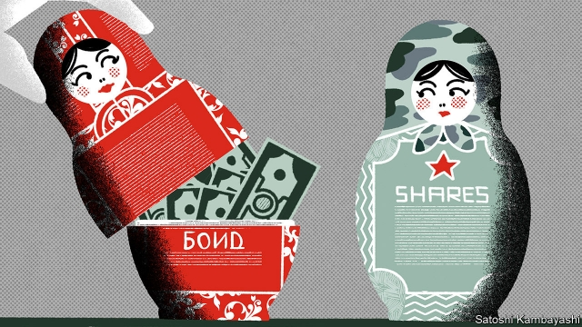
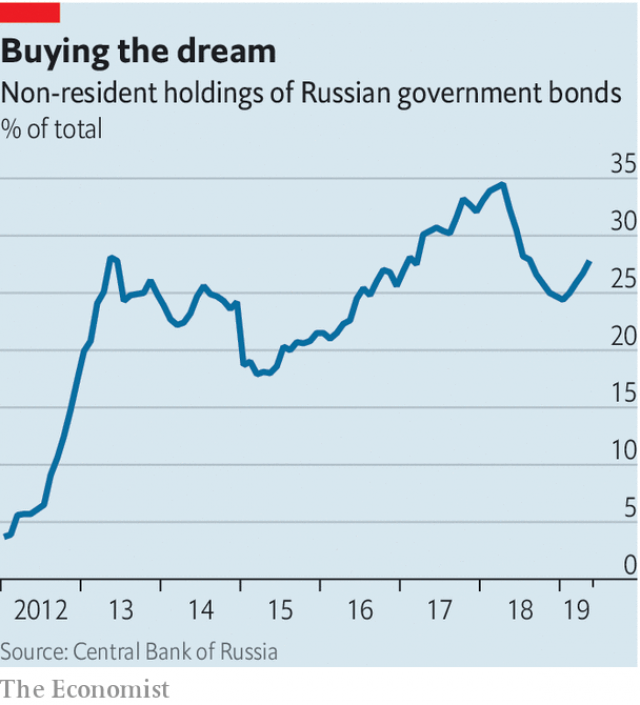

###### Buttonwood

# Russia is heaven for bondholders and hell for stockpickers 

 

> print-edition iconPrint edition | Finance and economics | Jun 29th 2019 

A  VISITOR TO Moscow inquiring about the outlook for Russia’s economy will often be met with answers that take a detour into the country’s past. Ask, for instance, why Russia runs such conservative budgetary and interest-rate policies and you may be told that the trauma of default in 1998 bred a strong desire for low debt and low inflation. Ask why property rights are weak and you may be taken further back, to the end of serfdom in 1861. Until then many Russians did not even own their own souls. 

Not all investors are history buffs. But looking at Russia through the lens of risk and reward they see a dichotomy. On the one hand, the emphasis the authorities place on controlling public debt and curbing inflation makes it an attractive place for bond investors. Russia is fixed-income heaven. On the other, the economy lacks dynamism, in large part because the venturesome cannot lay secure claim to their investments. For equity investors, Russia can be hellish. 

Start with its charms for bond investors. Their aim for their money is to get it back with interest. They would also like it to retain its purchasing power. Their big concerns, aside from default, are inflation and (unless they are buying hard-currency bonds) devaluation. So there is much to like about Russia. The public-debt burden is light, at below 20% of GDP. True, a lot of tax revenue is tied to the vagaries of oil prices. But Russia now has a fiscal rule. Its budget is based on an oil price of $40 a barrel. Any excess revenue goes into a reserve fund. Last year the budget was in comfortable surplus. 

By stopping the government from overspending, the fiscal rule also helps keep a lid on inflation. The Kremlin allows the central bank to set monetary policy without meddling, to meet a goal of inflation of 4%. The bank’s governor, Elvira Nabiullina, is admired for her professional competence—and also for persuading Vladimir Putin, Russia’s president, to allow the rouble to drop in 2014. Inflation has since come under control. She has cut interest rates slowly, to 7.5%. 

For bondholders this is wonderful: decent yields, low debt and stable inflation. The rouble is steady. American sanctions, imposed after 2014 in response to Russia’s military intervention in Ukraine, led many affected Russian firms to pay down foreign debt. Sanctions act like a global-capital quarantine. And Russia runs a biggish current-account surplus. 

But Russia is a more hazardous place for equity investors. A stock ought to be a claim on a company’s assets. A quick survey of modern history throws up reasons to doubt that such claims are secure. In 2003-04 the state seized Yukos, a giant oil company. More recently a dispute over oil assets between Rosneft, the state-backed firm that absorbed Yukos’s assets, and Sistema, a big conglomerate, rattled investors and gutted Sistema’s share price. 

 

Yet for the intrepid, Russian stocks still have appeal. For a start, they are cheap. MSCI’s Russia index has a price-to-earnings ratio of six, compared with 12 for its broader emerging-market index. That kind of value is bait for stockpickers, who hope to sort good long-term bets from the ones that might turn ugly. They cautiously avoid firms such as Gazprom, a state-owned gas producer, that are instruments of the Kremlin’s strategic goals. (American sanctions have made it unwise to hold such stocks in any event.) Instead they go for well-run firms with strong consumer brands, such as Sberbank, Russia’s biggest bank, or Yandex, its internet-search firm. The state is unlikely to mess with firms on which the economy’s day-to-day stability depends. 

Give Russia some credit, say boosters. Macro-stability is not a given. Central banks have come under political attack in other emerging markets—India, South Africa and Turkey—and now in America, too. Optimists say that plans to cut red tape and increase public investment will lift Russia’s GDP growth potential. 

Still, for the unwary investor, Russia is a snare. Even old hands can be caught out. Michael Calvey, the American boss of Baring Vostok, a private-equity firm, was arrested in February amid a conflict with an investment partner who has connections to the security services. Despite testimonials from the boss of Sberbank and the founder of Yandex, Mr Calvey remains under house arrest. 

Realists say it is the big-picture stuff that holds the economy back. Establishing the rule of law and property takes political will. But it takes time, too. In the early 1990s a prominent Western economist was asked how Russia could become a thriving market economy. His advice? “Get yourselves another history.” 

