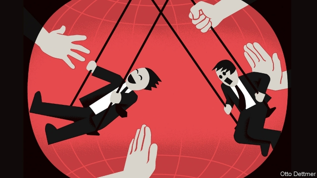

###### Free exchange

# The global economy is on a knife-edge 

 

> print-edition iconPrint edition | Finance and economics | Jun 27th 2019 

THE GLOBAL economic mood has taken to whipsawing between gloom and optimism. It can be hard to keep pace. This newspaper warned readers to prepare for “the next recession” in 2015 and 2018, pausing in 2017 to hail “the world economy’s surprising rise”. Lately, the periods of alarm and alacrity seem to have shortened. Markets began 2019 on the rebound and then took fright—only to surge in recent weeks. It is tempting to see the swings as mistaken attempts to find narratives in noise. But they have been accompanied by very real economic wobbles. Trade growth slumped in 2015, rebounded and is now decelerating. Global output, as reflected in measures of purchasing managers’ activity, bounced along with market gyrations, sinking in 2015 and lurching upward in 2017 before falling this year to levels not seen since the depths of the euro-area crisis. Rather than noise, the mood swings reflect investors’ attempts to work out which of two very different equilibria an unsettled global economy will land on. 

You might suppose that such uncertainty would be the norm. Though highly integrated, the global economy lacks a centralised, stabilising hand, like a national Treasury or central bank. During the financial crisis, the members of the G20 managed an impressive degree of policy co-ordination. But the desire to co-operate has rather waned since then. America’s Federal Reserve has some ability to call a global tune; Silvia Miranda-Agrippino of Northwestern University and Hélène Rey of the London Business School argue that American monetary policy strongly influences the global financial cycle. Similarly Emine Boz and Gita Gopinath of the IMF and Mikkel Plagborg-Moller of Princeton University reckon that fluctuations in the dollar have an enormous influence on the volume of global trade. But in a world of flexible exchange rates countries should still enjoy plenty of room to go their own way. 

The world’s problem, however, seems less that national governments are working at cross-purposes, and more that policymakers are torn between incompatible aims. Take central banks. The world’s monetary maestros are eager to leave behind the near-zero interest rates that have prevailed since the financial crisis. But the soft spots into which the global economy keeps stumbling suggest that this desire may be inconsistent with steady, robust growth. Last year the Fed raised its benchmark interest rate by a percentage point, to around 2.4%, and reckoned it would rise above 3% by the end of 2019. After its meeting on June 19th and again on June 25th, however, Jerome Powell, its chairman, hinted that markets should expect rate cuts later this year, “to sustain the expansion”. Other central banks have also chosen to beat a hasty retreat. The European Central Bank (ECB) ended stimulative asset purchases in December 2018 and suggested that policy rates could rise in 2019. But at its June meeting it too abandoned talk of impending rate rises for discussions of the need for more stimulus. 

Governments are likewise conflicted. China’s leaders want to rebalance their economy away from excessive investment and to shrink the role of state-owned firms. They keenly feel the need to depend less on rapid growth in credit. Yet both domestic tranquillity and the ability to project power abroad depend on economic growth. Whenever steps towards economic reform cause too rapid a slowdown, China’s government quickly returns to stimulus. In response to the sudden slowing late last year it has boosted spending on infrastructure, cut taxes and loosened reserve requirements for banks. The stimulus has given China’s economy, and the world’s, a shot in the arm. But it sits uneasily with the government’s aim of reducing debt. 

Meanwhile President Donald Trump is trying to harangue the Fed into a more accommodative monetary policy in the run-up to next year’s elections. But he is unwilling to abandon his belligerent approach to trade relations. At a meeting of the G20 on June 28th and 29th he and Xi Jinping, his Chinese counterpart, are expected to hold talks regarding their intensifying trade war. Unless they resolve a number of significant disputes America will probably extend its tariffs to an additional $300bn of Chinese imports. So far America’s tariffs have probably had only modest macroeconomic effects, though their impact is growing. But markets’ tendency to reel in the face of trade-war escalations suggests a growing concern that the present is prologue. 

World leaders must always manage trade-offs between competing aims. So why are policy conflicts unsettling markets just now? Except during financial crises (and none appears imminent), economic growth is rarely so balanced on a knife-edge. But interest rates around the world remain very low, leaving little tolerance for policy correction. In the euro area both short-term and long-term interest rates are close to or even below zero. New ECB easing, if it occurs, will mostly help the economy by pushing down the value of the euro and boosting European exporters, at the expense of firms elsewhere. America’s position is not much better. When markets were expecting rate increases, the Fed could give a sagging economy a boost simply by delaying them. But markets now expect the Fed to cut rates by at least 0.75 percentage points during the next year. It can either disappoint them and risk adding to pessimism, or move rates much of the way back to zero. 

Any misstep by Mr Trump or Mr Xi thus leaves central banks hard-pressed to keep economies on an even keel. And a central-bank slip-up, such as one interest-rate rise too many, increases the strain on already-conflicted governments. As slackening global demand crimps purchases of Chinese exports, for instance, the trade-off between domestic deleveraging and robust growth in Beijing becomes much starker. The global mood has not yet settled, meaning that a happy outcome remains possible. But if policymakers do not decide soon to put growth ahead of their other goals, the next turn towards pessimism could be decisive. ◼ 

