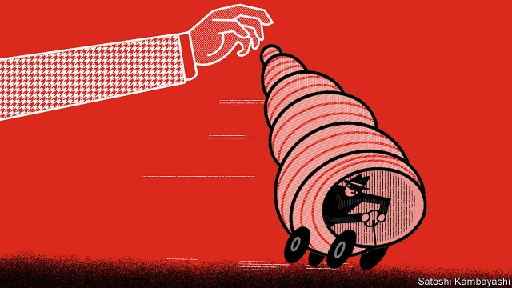

###### Cracking the shells

# The war on money-launderers’ vehicle of choice intensifies 

 

> print-edition iconPrint edition | Finance and economics | Jun 29th 2019 

FINANCIAL CRIMES come in all shapes and sizes, from politicians siphoning off state wealth and officials taking bungs to terrorists buying arms and gangs laundering drug profits. A common element is the use of shell companies, partnerships or foundations to hide the identities of those moving dirty money. Such brass-plate entities, whose ownership is typically hard if not impossible to trace, were at the heart of the theft from 1MDB, a Malaysian state fund, and a $230bn money-rinsing scandal at Danske Bank. They have been dubbed the “getaway cars” of financial crime. 

NGOs such as Global Witness and Transparency International have long highlighted shells’ pernicious role, picking up support from government investigators sick of trails going cold. Their biggest success was to persuade Britain, in 2016, to become the first G20 country to set up a public register of company owners. The rest of the European Union is set to follow once a new money-laundering directive takes effect. That leaves plenty of gaps. But two of the biggest, Britain’s offshore territories and America, are also moving in the direction of ditching secrecy. 

Earlier this month Britain’s three Crown Dependencies—Jersey, Guernsey and the Isle of Man—issued a surprise joint statement pledging to table legislation to introduce public registers by 2023. They had long insisted that efforts by British MPs to force such a move could trigger a constitutional crisis. But the growing clout of the transparency movement persuaded them to jump rather than wait to be pushed. 

Were three of the biggest offshore financial centres to end secrecy, it would make it harder for others—including Britain’s Caribbean territories, such as the British Virgin Islands and the Cayman Islands—to keep owners in the shadows. But campaigners’ optimism is tinged with caution. The Crown Dependencies envisage a staged implementation, with access first for police, then for financial firms doing due diligence, and only later for everyone else. Some fear a ruse to buy time. 

Shell companies in America, where incorporation is at state level, are among the world’s most secretive. A recent study found that in all 50 states more personal information is needed to get a library card than to register a company. In some, such as Kentucky, registration can be done without giving contact details. A study of international corruption cases in 2012 found that more of the shells involved were from America than from anywhere else. 

In every congressional session since the financial crisis, a group of federal lawmakers has proposed corporate-transparency legislation, only to see it fail. This time looks different. On June 12th a bill was approved by the House Financial Services Committee—the first time such a law had reached that stage. A similar bill has been introduced in the Senate. Campaigners are hopeful that a merged version will become law by the end of the year. 

If it does, America would not get a public register but its companies would be required to disclose their beneficial owners to the Financial Crimes Enforcement Network, a federal agency, and to keep their ownership information up-to-date. There is still opposition, including some from a small-business association that worries about red tape. But Delaware, the biggest state for incorporation, is on board, as is America’s treasury secretary, Steven Mnuchin. (His boss, Donald Trump, whose businesses have sold many a property to anonymously owned companies over the years, has not made his views known.) 

If the bill passes, anti-graft activists would then push America to adopt a public register. But Britain’s experience shows that transparency alone is not enough. Investigations by campaigners suggest that the information provided to its register is of mixed quality, to put it mildly. With enforcement lax, ne’er-do-wells are seemingly tempted to lie about who owns a firm and hope to get away with it. The government has promised an overhaul, with more money to police submissions. It will be some time before robbers’ cars are forced off the world’s financial highways. ◼ 

