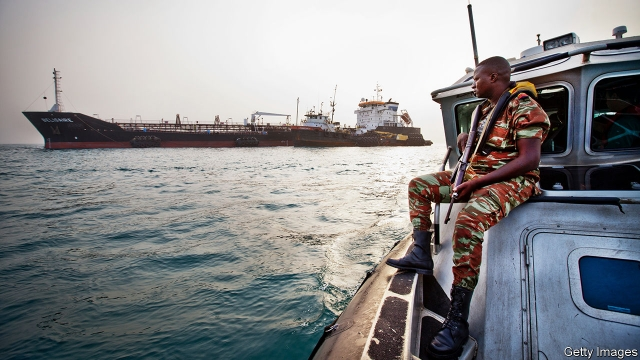
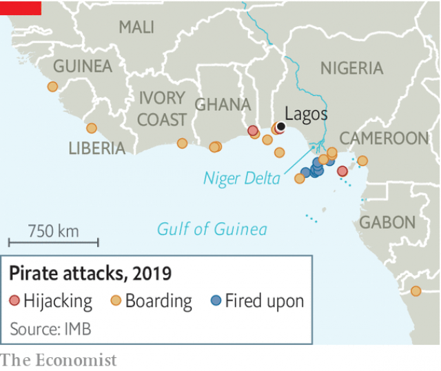

###### Crime waves

# The Gulf of Guinea is now the world’s worst piracy hotspot 

 

> print-edition iconPrint edition | International | Jun 29th 2019 

DOCKED IN THE port of Lagos, Nigeria’s commercial capital, floats a colossal oil tanker. Two layers of razor wire snake around its deck. Two life-sized human dummies in orange jumpsuits are perched on the ship’s bridge, posing as crew members keeping watch. Serving as a reminder that such precautions are prudent in Africa are the mangled steel and concrete remains of a jetty. It was blown up a decade ago by militants with a sideline in piracy. 

The Gulf of Guinea, on west Africa’s southern coast, is the world’s most pirate-infested sea. The International Maritime Bureau (IMB) reports 72 attacks last year on vessels at sea between Ivory Coast and Cameroon—up from 28 in 2014. This year so far it has recorded 30. Although some of the rise may reflect more complete reporting, Max Williams of Africa Risk Compliance (ARC), a security consultancy, says piracy remains chronically under-recorded. Ship-owners fear their vessels will be held up at port during an investigation. His firm estimates the real number of attacks last year was double the IMB’s figure. 

Elsewhere piracy is in decline. Between 2014 and 2018 the number of incidents each year in South-East Asia fell from 141 to 60, and to just three off Somalia, which in 2007-12 faced this century’s worst piracy crisis. Under-reporting is also less of a problem in these regions. The authorities in South-East Asia are more trusted; incidents off Somalia are reported to the international navies deployed there since 2009. 

Cyrus Mody of the IMB says that South-East Asian navies have curbed piracy by co-operating more effectively with each other. Mr Williams describes most of what remains as “marine mugging”: a petty thief boards a ship to swipe some rope or a can of paint. At their peak, Somali pirates hijacked entire ships and their crew for seven-figure ransoms. But the foreign navies remain there, and many shipowners have hired private armed guards to protect their vessels. Shipping companies fear that pirates in the Gulf of Guinea are becoming more like Somalia’s. Experts worry that neither of the solutions used in those two regions will work in west Africa. 

For a while, Somali piracy attracted unprecedented public attention, displacing images of peglegs, eye patches and a dreadlocked Johnny Depp from the popular imagination. Whereas buccaneers in the Gulf of Guinea and South-East Asia stole cargo, the Somalis seized crews and often the ships themselves, hauling them back to the ungoverned coast of their lawless state. A fifth of the world’s commercial shipping passes through the Gulf of Aden, a body of water flanked by failed states—Somalia and Yemen. In 2011 the IMBreported 236 attempted attacks. The pirates were raking in an average of almost $5m in ransom per ship, according to One Earth Future (OEF), an NGO. 

The scale of the problem forced shippers and foreign governments to take drastic action. Somalia’s government barely controlled its capital and was unable to help, so international navies began patrolling its waters. Western navies began doing so in 2009. Other countries, including India, China, Russia and Iran, soon joined in. Some countries began prosecuting Somali pirates arrested by their navies. Firms, often run by ex-soldiers, sprang up to meet the demand for armed guards. Floating arsenals deliver weapons to ships by speedboat in international waters, to get around gun controls on the land. On the Somali coast itself, aid pays local power-brokers to run sketchy coastguards, such as Puntland’s Maritime Police Force. 

None of this came cheap. OBP estimates that in 2012 the foreign naval presence cost $1bn and private armed guards and security equipment an additional $2bn. But it worked. By 2013 the number of attacks had shrivelled to 15. 

As the threat of Somali piracy receded, South-East Asia’s waters briefly regained their former status as the world’s most perilous. Attacks surged in 2014 and 2015, when pirates hijacked 28 ships, mostly oil-tankers, to steal their cargo. Like Somalia, the region sits on a busy shipping lane: a third of the world’s shipping passes through the Malacca Strait and South China Sea. But the littoral countries are all richer and far better-run. Historically, piracy had thrived because of their reluctance to work together. Joint patrols first started in 2004; after the surge in 2014 Malaysia and Indonesia sent a joint rapid-response team to the Malacca Strait. The two countries also agreed to joint patrols with the Philippines in the Sulu Sea, where Philippine separatist groups had made a foray into piracy. In 2015 Indonesia caught a ringleader with Malaysian help. Two years later it detained 15 other pirates following a tip-off from Singapore. Calm returned. 

Now west Africa’s pirates have the wind in their sails. The number of attacks has ebbed and flowed this century, reaching an earlier peak in 2014. But the current wave of violence seems deadlier. As in South-East Asia, pirates in west Africa used to confine themselves to raiding oil-tankers, to sell their cargo on the black market. When the oil price fell in 2015, they began copying their Somali counterparts and focused on kidnapping crews (though oil theft made a comeback last year). 

Unlike the Somalis, west African pirates never keep the vessels, as they have nowhere to hide them. Instead, armed with AK-47s and knives, they storm a ship, round up some of the crew and return to land, where they hide their hostages. Last year, says Mr Williams, they kidnapped 193 people. The pirates have struck across the region, but are primarily a Nigerian problem. They mostly operate out of the labyrinthine waterways in the Niger delta, near which most of west Africa’s attacks occur. 

Piracy is intertwined with the oil-rich delta’s myriad other problems. Unemployment is at least 20%, and banditry and oil theft on land are widespread. Cormac McGarry of Control Risks, a consultancy, says many pirates have gained experience fighting for separatist groups. These groups typically resent how much oil money is stolen by politicians in the far-off capital, and would like to steal it for their own ethnic group, or themselves. Cult-like gangs also abound in the delta, with names like the Icelanders and the Vikings. Members moonlight as pirates to make extra cash. Piracy also rises during election years, notes the IMB’s Mr Mody. Local politicians are said to pay and arm the gangs to attack rivals. 

West African governments struggle to stifle piracy. To their credit, they have been trying to co-ordinate better. Several now exchange information about piracy. A handful are discussing joint patrols. But, since west African piracy stems mainly from one country, which is also where most attacks happen, regional co-ordination is likely to make only a small dent in the problem. 

Shipping firms complain that the Nigerian government is failing to keep its waters safe. Its navy often performs admirably when it intercepts pirate attacks. But it is ill-equipped and spread too thin to prevent them. Some speculate that the pirates are in cahoots with military officials, citing incidents in which pirates flee before the navy arrives or know exactly how many crew members are aboard a ship they attack. Nigeria has yet to make piracy a specific criminal offence. Pirates captured by the navy are often quietly released. Around 300 people have been prosecuted in Somalia for piracy. By contrast, the UN Office on Drugs and Crime (UNODC) says it does not know of a single prosecution in Nigeria. 

Some favour a Somali-style approach. BIMCO, the largest international association representing shipowners, issued a statement in January calling for the EU, America and China to deploy forces to the Gulf of Guinea. Ship-owners also want to be able to deploy private armed guards in Nigerian waters. For now, Nigeria only lets them hire escort vessels staffed by naval officers. “They have turned security into a business,” grumbles one executive. 

 

Others see such demands as a non-starter. Nigeria, a democracy whose government—for all its flaws—is far less impotent than Somalia’s, is bound to resent foreign navies or mercenaries off its coast. Also, foreign governments would be reluctant to foot the bill. The Gulf of Guinea, unlike the Malacca Strait or the Gulf of Aden, is not a choke point for international trade. Mr Williams points to other constraints on the Nigerian government. Its armed forces have their hands full with a jihadist insurgency in the north-east, banditry in the north-west and clashes between farmers and herders in the “middle belt”—all of which are far deadlier than piracy. 

Instead, he argues, firms themselves should do more to protect their crews. International shipping organisations have drawn up recommendations, based on what worked in Somalia. They include wrapping the deck in razor wire and building a “citadel” on board where the crew can barricade themselves and call for help. Among the ships docked in Lagos many display obviously shoddy security—large gaps in the razor wire, for example, rendering it useless. Mr Williams often finds citadels with doors that do not close; or crews with no training on what to do if attacked. 

These lapses hint at the awkward fact that many firms lack a financial incentive to take security more seriously in west Africa. Insurance companies offer lower premiums for ships that protect themselves. But the combined cost of insuring the ship, the cargo and the crew (for kidnapping and ransom) for a voyage to Nigeria is typically no more than the cost of half a day’s fuel. It can be cheaper not to bother with armed guards. Premiums are so low in part because Nigerian pirates, unlike those in Somalia, have priced their ransoms just right: for many companies they can be written off as a cost of doing business. 

That means the heaviest toll is borne by crews, most of whom are from poor countries like India and the Philippines. Afusat Eke, a social worker for the Nigerian Seafarers’ Welfare Board, says sailors often suffer from anxiety, depression or post-traumatic stress disorder after being released from captivity. Companies say their growing criticism of the Nigerian government is proof that they care about their crews’ welfare (although complaining costs them nothing). Thanks to the internet, more seamen are aware of the risks in west Africa and loth to go there. 

Even if shipping firms did do more, it would not end piracy. The stark truth, says Mr Mody, is that it can only be stopped by fixing its underlying causes on land. In west Africa this means alleviating the Niger delta’s chronic lawlessness. In Somalia pirates still scour the oceans, looking for unprotected ships, so the frigates and private guards will be needed as long as chaos reigns on land. Analysts are nervously watching Venezuela, whose economic collapse is believed to have caused an upsurge of offshore mugging. All this suggests it will be difficult to eradicate piracy for many years to come. But for the sake of the world’s 1.6m seafarers, governments and shippers should not stop trying. ◼ 

