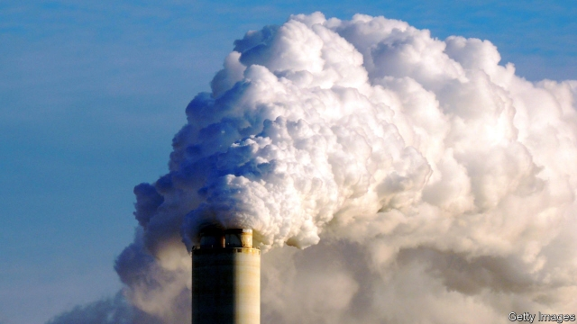

###### States’ rights

# America is not such a laggard on climate change as it seems 

 

> print-edition iconPrint edition | Leaders | Jun 29th 2019 

IS AMERICAN INACTION on climate change going to render bits of the planet uninhabitable by 2100? Or will American grit and ingenuity lower the risks? There is evidence for both views. While the White House was issuing an edict seeking to offer relief to coal-fired power stations last week, New York’s state legislature was passing a bill that called on the state to eliminate carbon emissions by 2050. America’s political divide often creates split-screen moments. For the 7.3bn people who live beyond the country’s borders, this one matters more than most. 

America is often denounced as a laggard on climate change. The reality is less bad than that suggests. More than half of all Americans now live in states that have championed legislation to reduce greenhouse-gas emissions. In the past year California, Colorado, Maine, New Jersey, New Mexico and Washington have all joined the club of states with policies to decarbonise electricity generation. Oregon and New York look set to join them. 

Those who think global warming is not man-made are, inevitably, opposed to states setting long-range targets to decarbonise the economy. Even some who accept the overwhelming scientific consensus have their doubts. Targets are not the best way to go about reductions, they argue. A carbon price would be better. Market forces are already reducing carbon emissions, as power stations switch to natural gas. There is no point in some states taking action if others do not bother, or if the federal government cannot get its act together, because energy markets do not respect state boundaries. Besides, the targets are too distant: they allow politicians to pose as green while pushing the costs of action onto their successors. 

These objections are too gloomy. A carbon price is indeed the optimal way to reduce pollution, but getting people to pay for carbon has been a vote-loser in America and Europe. In a world of second- or third-best options, targets backed by credible plans to reach them are reasonable. Emissions are indeed coming down thanks to the fracking boom, but there is a limit to how far they can fall if natural gas is the primary material from which electricity is generated. Yes, the targets are far into the future, but in New York’s case they come with a legal requirement to show progress in the next four years (see article). 

Waiting for Washington to take the climate seriously is a counsel of despair. It also ignores the magnitude of states’ plans. Pledges by states help set America on the path to a 17% cut in emissions by 2025, using 2005 as a baseline. Add a few more and the total would increase to nearly 25%, putting America within striking distance of the (albeit modest) commitment the previous White House made in Paris in 2016, even though the federal government has promised to withdraw from that agreement. 

This matters for two reasons. First, because the world’s largest economy is a significant source of pollution. America, like every other country, needs to be on a path to eliminate all emissions by mid-century or shortly thereafter if it is to reduce the risks posed by climate change. Second, because the assumption that America is a laggard gives other countries an excuse to do nothing, undermining international climate diplomacy. 

States like California with ambitious laws on emissions can encourage the development of technologies that will then be used by others. And if America can stay on track through state actions, the nationwide politics of climate change might just change in the coming decades. Just over half of Americans aged 55 or over think climate change is man-made and worry about it, according to polling by Gallup. Among Americans aged 18-34, three-quarters do. America’s economy has been through transformations before. It can go through another.◼ 

