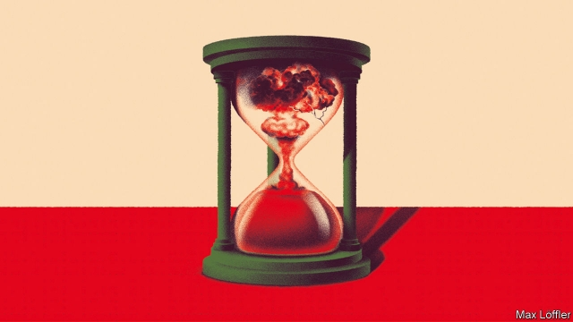

###### How to contain Iran

# As America and Iran inch closer to war, new talks are needed 

 

> print-edition iconPrint edition | Leaders | Jun 29th 2019 

FOR NEARLY four years Iran’s path to a nuclear weapon was blocked. The deal it signed with America and other powers in 2015 limited its nuclear programme to civilian uses, such as power-generation, and subjected them to the toughest inspection regime in history. The experts agreed that Iran was complying and that its nuclear activities were contained. But then President Donald Trump ditched the nuclear deal and Iran resumed stockpiling low-enriched uranium. It is now poised to breach the 300kg cap set by the agreement. Iran may hesitate before crossing that line, but it is also threatening to increase the enrichment level of its uranium, bringing it closer to the stuff that goes into a bomb. 

Fortunately, Iran is not about to become a nuclear-weapons power. Its breakout time is over a year. But it is once again using its nuclear programme to heap pressure on America. That adds an explosive new element to an already-volatile mix. America accuses Iran of attacking six ships in the Strait of Hormuz since May. On June 20th Iran shot down an American spy drone. America insisted the aircraft was above international waters, not Iran’s, and sent warplanes to strike back. Ten minutes before they were due to hit targets inside Iran Mr Trump called them off and contented himself with a cyber-attack instead. 

Neither Mr Trump, nor America’s allies, nor Iran wants a big new war in the Middle East. Yet Mr Trump’s strategy of applying “maximum pressure” on Iran is making the prospect more likely—because each side, issuing ever-wilder threats, could end up misreading the other’s red lines. The president’s room for manoeuvre is shrinking. As Iran turns more belligerent, calls for action will grow, not least from his own party (see article). Before things escalate out of control, both sides need to begin talking. That is not as unlikely as it sounds. 

Mr Trump’s Iran strategy is based on the premise that Barack Obama gave too much away too easily when he negotiated the deal in 2015. Last year the president set out to get better terms by reneging on the agreement and reimposing the sanctions that have crippled Iran’s economy. This, his advisers argue, will force a weakened Iran to accept a new deal that lasts longer than the old one, most of which expires by 2030. They also want curbs on Iran’s missile programme and an end to its violent meddling in the region. Mike Pompeo, the secretary of state, sees recent Iranian aggression as a sign that the strategy is working. 

Hard-hitting sanctions brought Iran to the negotiating table in 2015, but they are unlikely to lead to the transformation Mr Trump wants. One reason is that he has discredited Hassan Rouhani, Iran’s president and a champion of the nuclear deal. Hardliners are now calling the shots. Another is that America is acting alone. In 2015, in a rare moment of international unity, it had the support of its European allies as well as Russia and China. 

Maximum pressure comes with extra risks, to boot. The mullahs and their Islamic Revolutionary Guard Corps want to prove their mettle by showing that Mr Trump’s actions have costs—for everyone. On top of the attacks on ships and drones, Iranian proxies have hit pipelines in Saudi Arabia and are suspected of having struck Iraqi bases hosting American troops. If sanctions are not lifted, Iranian officials may resort to closing the Strait of Hormuz, through which one-fifth of the world’s oil passes. 

Hawks like John Bolton, Mr Trump’s national security adviser, retort that if Iran wants war, that is what it will get—especially if it shows signs of dashing for a nuclear bomb, which could trigger disastrous proliferation in the Middle East. But this is the riskiest calculation of all. Having pulled out of a working deal, America may not win the backing of European allies for strikes. China and Russia would vehemently oppose any action at all. 

Perhaps sanctions or war will cause the regime to crumble. But that is hardly a strategy: Cuba has resisted sanctions for decades. More probably, a defeated Iran would heed the lesson of nuclear-armed North Korea and redouble its efforts to get a bomb. Attacking Iran’s nuclear facilities would not destroy its know-how, as even Mr Bolton admits. If, as is likely, Iran barred international inspectors, its programme would move underground, literally and figuratively, making it very hard to stop. 

The alternative to today’s course is talks between America and Iran. Just now that looks far-fetched. Iran’s foreign ministry says American sanctions imposed on Ayatollah Ali Khamenei, the supreme leader, and other top officials this week mark “the permanent closure of the path of diplomacy”. Mr Rouhani has suggested that the White House is “mentally handicapped”—after which Mr Trump threatened “obliteration”. 

But optimists will remember similar clashes between America’s president and Kim Jong Un, North Korea’s despot, before they met in Singapore and “fell in love”, as Mr Trump put it. When he is not threatening to annihilate the mullahs, Mr Trump is offering to talk without preconditions and to “make Iran great again”. He does not want the prospect of war in the Middle East looming over his re-election campaign. Likewise, in Iran the economy is shrinking, prices are rising and people are becoming fed up. Pressure is growing on Mr Khamenei to justify his intransigence. Love could yet bloom. 

America might coax Iran back to the table with a gesture of good faith, such as reinstating waivers that let some countries buy Iranian oil. Iran, in turn, could promise to comply with the nuclear deal again. Behind the scenes, its leaders have expressed a willingness to sign something like the old agreement with additions—such as extending parts of the deal beyond 2030. Negotiations would never be easy; the Iranians are infuriating to deal with. But that would let the president claim victory, as he did with the United States-Mexico-Canada Agreement, which his administration signed last year and which looks a lot like its predecessor, the North American Free Trade Agreement. 

What of a deal that also curbs Iran’s missile programme and restrains it in the region? As Mr Trump seems to realise, biting everything off in one go is unrealistic. A new deal cannot solve all the problems posed by Iran or normalise ties with America after decades of enmity. It may not even lift all America’s sanctions. Neither did the first agreement. But, if done right, a deal would put Iran’s nuclear programme back in a box, making it easier to tackle all those other problems without causing a war. ◼ 

