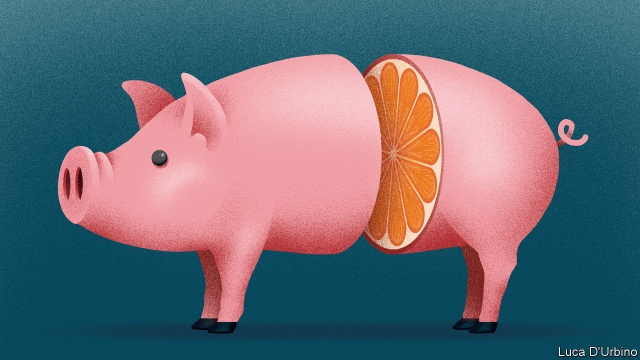

###### Silly sausages

# Europe heroically defends itself against veggie burgers 

 

> print-edition iconPrint edition | Leaders | Jun 29th 2019 

THE EUROPEAN UNION gets a lot of flak. All right, it isn’t literally blasted with anti-aircraft fire, but you know what we mean. One ongoing battle (OK, nobody died) involves the use of words. Earlier this year, the European Parliament’s agriculture committee voted to prohibit the terms “burger”, “sausage”, “escalope” and “steak” to describe products that do not contain any meat. It was inspired by the European Court of Justice’s decision in 2017 to ban the use of “milk”, “butter” and “cream” for non-dairy products. Exceptions were made for “ice cream” and “almond milk”, but “soya milk” went down the drain, lest consumers assume it had been extracted from the soya udder of a soya cow. The court has yet to rule on the milk of human kindness. 

Greens are mounting a campaign against the committee’s decision, which they suspect is supported not only by linguistic purists but also by the meat industry. This newspaper thinks the parliament is quite right to protect citizens from the confusion they would no doubt feel were they to find that no part of a “veggie burger” was made of the flesh of a dead animal. Indeed, this praiseworthy initiative needs to go further. 

“Escalopes” pose a clear danger to consumers, who might well recoil in horror when, taking a mouthful of one, they discover that it is made not of the scallops from which it got its name but of chicken or veal. “Sausages” should refer only to heavily salted meat, whence the term derives; for clarity, consumers should be informed that the item is encased in animal intestine. Steaks should be sold only on a pointed stick, on the grounds that most shoppers will rely on the proto-Indo-European etymology. Any confusion could be avoided if kebabs were, as their Arabic root suggests, always sold burned. The production of burgers should be restricted to the butchers of Hamburg, long ago deprived of their intellectual property by a shocking failure of linguistic regulation. The same right should be extended to makers of Frankfurter sausages—sorry, meat-filled gut. And “meat” itself should apply to all food, sweet or savoury, which would make the term historically accurate, if useless. 

Nor should the parliament’s reforming zeal be restricted to food. Any reference to the European budget should be confined to the money that the commissioner for economic and monetary affairs, Valdis Dombrovskis, keeps on his person in a bougette, or leather purse. Only those banks which carry out their business on wooden benches (banco, in Italian) should be included in the banking union. Discussion of computers should be limited to clerks who do budgetary calculations, while that of the digital single market should apply only to sums that people can do on their fingers. 

This linguistic rigour should be extended through both time and space. The Holy Roman Empire, as Voltaire pointed out, was neither holy, nor Roman, nor an empire; La Manche has no sartorial connections; the Mediterranean is not the centre of the Earth; there is no horticulture in the Big Apple. They need renaming. 

Not all the union’s governing structures are taking their linguistic responsibilities seriously enough. When earlier this year Donald Tusk, president of the European Council, spoke of “concrete measures” to extend the single market and a “level playing field”, listeners might reasonably have looked forward to a multi-billion-euro infrastructure project to shift French and Italian mountaintops to the low-lying bits around Brussels. 

The Treaty of Rome speaks of the need to respect member states’ culture (no, nothing to do with yogurt) and bind them together (please put the string away). In view of those aspirations, Europe’s leaders need to get on board with this reform. Not literally, obviously. It’s not a ship. Never mind.◼ 

