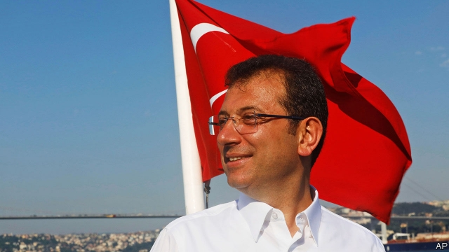

###### Istanbul stands up to a bully

# Opponents of Turkey’s erratic president should try harder 

 

> print-edition iconPrint edition | Leaders | Jun 29th 2019 

WHAT DID he think he was playing at? When Turkey’s autocratic president, Recep Tayyip Erdogan, strong-armed his country’s electoral watchdog into annulling the result of a mayoral election his party had lost in March, it looked like an obvious blunder. Surely, many observers thought, the people of Istanbul would furiously resent having their votes overruled, and flock in bigger numbers than before to support the opposition man, Ekrem Imamoglu? Unless, of course, Mr Erdogan had a sinister plan up his sleeve to rig the new election. 

He did not—or at least not one bold enough to cope with how voters in Turkey’s largest and richest city gave the challenger an emphatic victory on June 23rd, by 54% to 45%, far more than his earlier, slender margin of 0.2%. Democracy, though ailing in Turkey, is not yet dead. 

Mr Imamoglu’s fortitude is hard to overstate. Standing up to Mr Erdogan’s repressive regime can be dangerous (see article). Dozens of Kurdish mayors have been locked up, as have tens of thousands of people, many of them innocent, whom Mr Erdogan suspects of involvement in, or support for, the failed coup of 2016, masterminded by members of the Gulenist movement. 

The road ahead for Mr Imamoglu is strewn with obstacles. Mr Erdogan will no doubt fear that a successful mayor of Istanbul will attract support. People are already talking about the new man as a contender for the presidency, not least because Mr Erdogan himself once trod a similar path, using a stint as mayor of Istanbul in the 1990s as a stepping-stone to national power. 

For Mr Erdogan those days are long gone. Istanbul’s people have made it clear they want change. The president has become a liability to his country. His repression of dissidents has poisoned relations with the EU, and choked off opportunities for more trade and investment between Turkey and the giant, rich economy on its doorstep. His decision, confirmed again this month, to push ahead with the purchase of Russian air-defence technology has infuriated America, Turkey’s most important NATO ally. Fearing that Russia will take advantage of the deal to test its tracking systems on American stealth fighters, thereby learning how to counter them, America has suspended delivery of its planes to Turkey and is no longer training Turkish pilots. 

Unless President Donald Trump grants a waiver, further sanctions are likely. These will hurt the Turkish economy, which is already fragile, owing in large part to the president himself. It emerged earlier this year from a brief recession, but is expected to undergo a double-dip shortly. The Turkish lira has lost 40% of its value over the past two years, because of a credit boom that has been allowed to run out of control. The president insists that high interest rates would increase inflation—an eccentric view that economists dismiss out of hand. Inflation hovers near 20%. Mr Erdogan is unlikely to get robust advice from his finance minister, who happens to be his son-in-law. 

The central government will probably make life tricky for Mr Imamoglu. As the ruling AK party controls 25 of Istanbul’s 39 districts and has a majority on its municipal assembly, that will not be hard. Mr Erdogan could mess with Istanbul’s funding, tie Mr Imamoglu up in red tape or even find some legal pretext to prosecute him. The president would be better advised to leave him alone. Anything that harms Istanbul, the centre of Turkish commerce and tourism, will harm the country as a whole. 

The fact remains, though, that Mr Erdogan is in charge. He won his presidential election by a solid majority last year, and his AK party, together with its hardline nationalist allies, the MHP, has a lock on parliament. Another election is not due for four years. In the short term, change will have to come from within AK. There is some sign of it. Rumours swirl that Abdullah Gul, a former president, and Ahmet Davutoglu, a former prime minister, are considering setting up a breakaway party or parties. Mr Imamoglu’s success ought to stiffen their resolve. ◼ 

