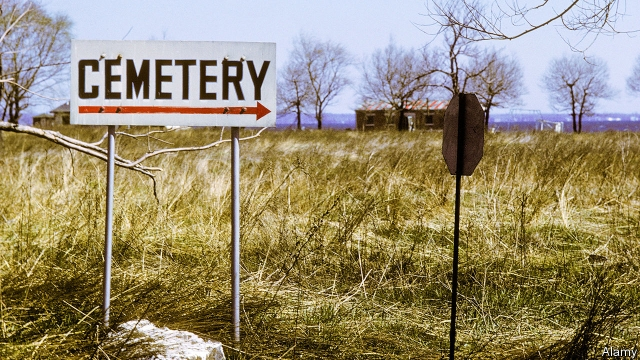

###### On investments, New York, pensions, English, Latin, the Conservatives

# Letters to the editor 

> Jun 29th 2019 

 

You appear to suggest that American and Swiss investors in central European member states of the EU may be worse off following a judgment by the European Court of Justice in a case concerning Achmea, a Dutch insurer, and Slovakia (“Treaty or rough treatment”, June 8th). However, this is not so, as that judgment only concerns cases by EU investors against EU member states. In such cases, the court held that EU law precludes arbitration before international tribunals. 

The judgment was issued in March 2018. Since then more than a dozen arbitral decisions held that they were not bound by that judgment. This included a claim by Vattenfall, a Swedish energy company, against Germany over the objections of that country, which had argued that following the judgment the tribunal did not have jurisdiction. And while the European Commission supported efforts to end intra-EU bilateral investment treaties, ultimately all EU countries undertook to terminate these treaties by the end of this year. 

If the ECJ judgment contributes to improving the functioning of national court systems in the EU, then the long-term benefits will vastly outweigh any perceived shortcomings in the near future. Full disclosure: I was lead counsel for Slovakia in the said proceedings before the ECJ. 

MARKUS BURGSTALLERPartnerHogan Lovells InternationalLondon 

You described the International Centre for the Settlement of Investment Disputes as “an obscure court across the Atlantic”. It is neither a court nor across the Atlantic; ICSID is an arbitration institution administering hearings across the globe. Nor is it the sole legal framework for investment-treaty disputes. A significant portion of cases are heard outside the ICSID regime, which makes disputes susceptible to domestic court supervision; the Achmea case is one example of this. Moreover, the evidence is decidedly mixed on a causal link between investment treaties and investment flows. 

JOEL DAHLQUIST CULLBORGUppsala UniversityUppsala, Sweden 

 

“Potters’ fields” (June 15th), an article on burying New York’s poor and unclaimed, said that there is only space for eight to ten more years at the City Cemetery on Hart Island. That pertains to land that has not yet been used. The city has recycled common graves on Hart Island for a long time, which is why over 1m bodies have been interred there since 1869 (private cemeteries cannot reuse graves, but common graves in public cemeteries can be re-employed). As a result of the recycling, which began in 1933, Hart Island is now the largest natural burial ground in the United States and offers a sustainable and ecological solution for burying unclaimed bodies, as required in New York state. 

MELINDA HUNTPresidentHart Island ProjectNew York 

 

Notwithstanding the conceptual and practical merits of the Chilean pension system, there is a serious problem that has not received proper attention: the risk-reward profile of the investment options (“Will you still feed me?”, June 8th). One recent study showed that the risk-return profile of Chilean pension funds is completely at odds with the regulator’s desire. In short, the most conservative investment option has outperformed the most risk-taking for most of the time. 

Mexican pension funds, however, over a similar time period exhibited almost perfect risk-return profiles. The reason? The Mexican regulator incorporates the value-at-risk metric; the Chilean one relies only on asset-class limits. Regulators of the world, beware: you might be creating a monster. 

ARTURO CIFUENTESClapes UC/Santiago 

BERNARDO PAGNONCELLIUniversidad Adolfo IbanezSantiago, Chile 

 

Charlemagne thinks that promoting English as the European Union’s sole official language would allow for “the sort of unity that is only possible with a common tongue” (June 15th). What is the evidence for such a claim? Britain and America share a common language and yet the present governments are far apart on reaching a consensus in many policy areas. 

The EU has not needed to promote a single official language because the unique form of monolingual ideology that has taken hold in Western Anglo nations is internationally atypical. Switzerland (an example cited by Charlemagne) does indeed have German, French, Italian and Rumantsch strongholds, but official business can, and does, take place in all four. 

Perhaps if we as a society were more understanding of the benefits inherent in multilingual operations, we would not be experiencing a national languages-skills gap that is estimated by the British Academy to be costing the economy £48bn ($61bn) a year. 

JONATHAN KASSTANLecturer in French and linguisticsUniversity of WestminsterLondon 

ALICE CORRDepartment of Modern LanguagesUniversity of Birmingham 

 

 

 

 

 

 

Cambridge 

To Charlemagne’s observations on the advantages of English in Europe can be added the long-standing acceptance by Anglophones of different groups who speak their language in different ways. The French and German languages are shaped by academies and committees that try to define from the top down what is or is not correct language. The Anglophone tradition relishes differences of region, register and class as a semantic stratum that conveys a wealth of meaning, not about what is said but about who is saying it. 

In origin, English is simply French spoken by Germans. Let us look forward to a day when Geordie, Scouse, Received Pronunciation and Cockney can hold out a hand in friendship and understanding to Europeans speaking fluent Freutsch. 

PAUL BEARDMORELondon 

 

Latin is the parent of several languages, as pointed out by Johnson (June 8th), but none of them has matched its compact beauty. The gladiators’ greeting as they entered the Coliseum: “Morituri te salutant” (“Those who are about to die salute thee”) is but one memorable phrase. An even more notable example was “Speramus meliora; resurget cineribus” (“We hope for better things; it will rise from the ashes”)—four words replacing 11. 

ANDRZEJ DERKOWSKIOakville, Canada 

 

To clarify Bagehot’s contention that the Canadian conservative party was “wiped out” in the election of 1993 (June 15th), two conservatives survived that drubbing and were returned as members of Parliament: Mrs Elsie Wayne and Mr Jean Charest. Some wag observed the party was now an endangered species and perhaps faced extinction, given it had been reduced to but a single breeding pair. 

WILLIAM MACGREGORHalifax, Canada 

