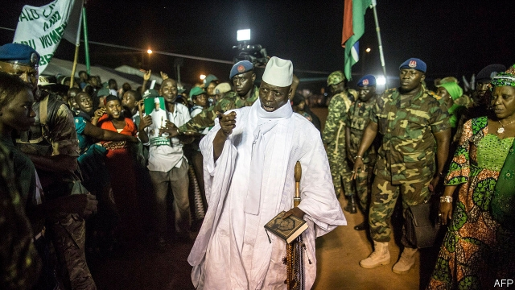

###### “We’re not property”

# A former beauty queen accuses Gambia’s former dictator of rape 

 

> print-edition iconPrint edition | Middle East and Africa | Jun 27th 2019 

WHEN FATOU JALLOW was crowned Gambia’s beauty queen in 2014, it was one of the happiest days of her life. But it was the prelude to a nightmare. Soon afterwards Yahya Jammeh, then the country’s dictator, asked the 18-year-old to marry him. Ms Jallow refused, but Mr Jammeh’s aides kept calling. After accepting an invitation to his home to attend a religious event, Ms Jallow says she was drugged and raped by Mr Jammeh. “He asked me what made me think that I could deny him,” she recalls. “I kept screaming and he kept telling me no one could hear me.” 

Ms Jallow’s torment was far from an isolated case. Human Rights Watch and TRIAL International, watchdogs based in New York and Geneva respectively, have detailed other allegations of sexual abuse by Mr Jammeh and his aides. Their report, released this week, includes disturbing accounts from two other women who allege that the former dictator sexually abused them. A spokesman for Mr Jammeh’s party denied the allegations in a written statement to the BBC. 

Mr Jammeh, who had seized power in a coup in 1994, was ousted in early 2017. But public anger against him lives on, stoked by a stream of new revelations about the horrors of his rule. Many have emerged in testimony before a Truth, Reparations and Reconciliation Commission established by Gambia’s new president, Adama Barrow, to investigate the old regime’s crimes and recommend prosecutions. 

Mr Jammeh’s henchmen allegedly killed and tortured thousands. Journalists and activists disappeared in the night, never to be seen again. Dissidents were thrown into an airless dungeon, known as the “crocodile hole”, beneath the headquarters of Mr Jammeh’s intelligence agency. 

The longer he ruled, the more erratic he became. His men once detained and drugged an estimated 1,000 villagers with a powerful hallucinogen because he thought that witchcraft was responsible for the death of a family member. He also claimed to be able to cure HIV with his bare hands. 

In a poor country of about 2m people, he allegedly stole energetically. When he fled into exile in Equatorial Guinea he did so in his Rolls-Royce, leaving the state’s coffers empty. Campaigners are pressing Equatorial Guinea’s president, Teodoro Obiang, to hand him over for trial. 

Reed Brody, an American lawyer working with Human Rights Watch, notes that many of Mr Jammeh’s victims came from other west African countries, including Ghana and Ivory Coast. These included 56 migrants who were massacred by his men in 2005. Mr Brody thinks that the latest rape allegations will add pressure. “It’s going to be harder and harder for Obiang to keep protecting Jammeh,” he says. 

Ms Jallow managed to escape from Gambia and now lives in Canada, where she is studying social care. Talking about what happened “is my duty to other girls”, she says. “I am willing to open the gate and make sure that this man will one day face justice. I want to send a message to men in our society, that we’re not property, that we’re not goats.” ◼ 

