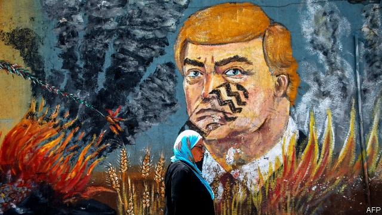

###### Half a plan

# An underwhelming start to the “ultimate” Israeli-Palestinian deal 

 

> print-edition iconPrint edition | Middle East and Africa | Jun 27th 2019 

IT COULD HAVE been Davos, or any other conference on the annual circuit for the world’s wealthy. Jared Kushner, the son-in-law and adviser to America’s president, took the stage in Manama to offer his vision for solving the Israeli-Palestinian conflict. The combatants, he lectured, were “trapped in an inefficient framework of the past”. The IMF director suggested looking at best practices from Mozambique. During a surreal segment on property rights, which lie at the very heart of the conflict, the moderator mused about using blockchain for Palestinian land deeds. 

Before he took office in 2017 Donald Trump vowed to broker the “ultimate deal” between Israelis and Palestinians. To oversee the effort he chose Mr Kushner, a property developer with no experience in diplomacy or the Middle East. The result has been roughly as expected. There is still no plan for resolving the underlying conflict and its many thorny issues: borders, refugees, the status of Jerusalem, or the very notion of Palestinian statehood. Its release has been repeatedly delayed. Diplomats hint that it may remain on the shelf until Mr Trump’s second term, if he wins one. 

Instead Mr Kushner organised this two-day confab in Bahrain. Dubbed the “Peace to Prosperity” workshop, the centrepiece was a 96-page plan that pledged $50bn-worth of investment in Palestine and neighbouring countries after a peace deal. The document is impressive in scope. It suggests projects to boost agriculture and tourism, fix Palestine’s infrastructure and improve governance. All of this would be funded by a mix of grants, concessional loans and private money. 

 

Missing amid all this detail was anything about the Israeli occupation, in its various forms, of the West Bank and Gaza, or about the schism between the Palestinian leaders in the two territories. The plan presupposes that the Holy Land’s noxious politics have simply vanished. Mr Kushner would spend $5bn to connect the West Bank and Gaza, for example. Israel has promised to do this for years but never has, because the link is not simply a matter of building a monorail: it raises complex political and security questions. The $2bn plan to give Palestine 5G wireless infrastructure would thrill entrepreneurs, but there was no mention of how to overcome objections from the Israeli army, which let the West Bank have 3G only last year, a decade after the rest of the world. 

None of the speakers in Bahrain commented on this dissonance, perhaps because few were familiar with the conflict, or even its geography. To estimate the cost of installing 5G in Palestine, the president of AT&T compared it with Mexico, which he said was five to ten times as big (it is in fact 316 times larger). 

As it stands, the plan is thoroughly unrealistic. That is the point, Mr Kushner’s supporters argue. It is meant to offer the Palestinians a peace dividend, an incentive to accept his (perhaps) forthcoming political vision. They certainly need the help. Unemployment in the West Bank is 17%. In Gaza it is more than 50%. Adjusted for inflation, GDP per person is almost unchanged from 20 years ago. 

But to the Palestinians this smells like a bribe from a hostile president. Mr Trump cut all American aid to them. He overturned decades of precedent to recognise Jerusalem as Israel’s capital. And aides hint that the political plan will give the Palestinians far less than the sovereign state along the pre-1967 borders that they demand. 

So they decided to boycott the workshop. Their president, Mahmoud Abbas, refused to send anyone from his government. “The deal of shame will go to hell,” he said in May. The private sector also declined invitations. Arab states were thus reluctant to share a stage with Israeli officials—who were not invited in the end, though some Israeli businessmen did come. Reporters from six Israeli outlets sent fawning dispatches. The country’s largest newspaper, Israel Hayom, which backs both Mr Trump and the Israeli prime minister, Binyamin Netanyahu, dubbed Bahrain the “island of hope”, an odd appellation for a kingdom that crushed a popular uprising in 2011. 

And that, perhaps, points to the real outcome of the workshop. It was the most public manifestation of a long and mostly private rapprochement between Israel and the Gulf states, one the Trump administration is keen to promote. The event did nothing to end the Israeli-Palestinian conflict. But it was another sign that the Gulf states are looking to move past it. Though they are not quite ready to recognise Israel, they see it as an ally against a shared threat from Iran. The Palestinians have far less to offer. “All we have is our moral power,” says Mkhaimer Abu Saada, a political analyst in Gaza. That still counts for something—but less and less each passing day. ◼ 

