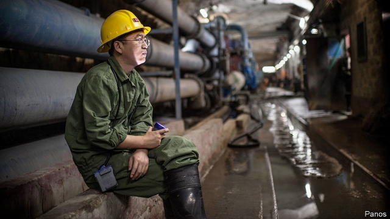
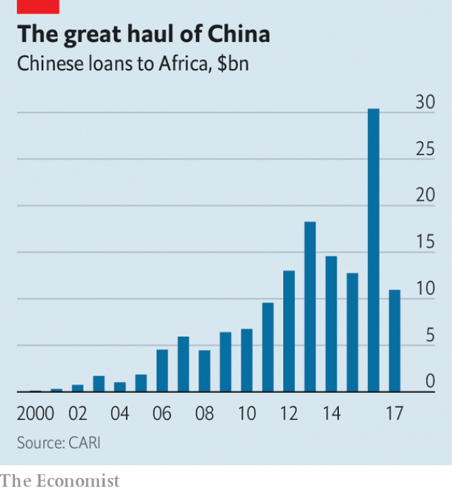

###### Debt sum

# China is thinking twice about lending to Africa 

 

> print-edition iconPrint edition | Middle East and Africa | Jun 29th 2019 

FOR TEN days in May Uhuru Kenyatta, Kenya’s president, vanished from view. Kenyans feigned concern on Twitter, using the hashtag #FindPresidentUhuru. A missing-person poster appealed for information on the whereabouts of a five-foot-eight African male last seen in Beijing. A government spokeswoman sought to reassure the public: Mr Kenyatta had been in his office “meditating”. But others speculate that the president was in a funk after his trip to China failed to yield a new loan for the next phase of Kenya’s ambitious $10bn railway. 

Mr Kenyatta could be forgiven for feeling piqued. Beijing’s largesse to Africa has sometimes seemed limitless (see chart). In September China promised another $60bn in aid and loans to the continent. Xi Jinping, its president, promised the money would come with “no political strings attached”. John Magufuli, Tanzania’s strongman president, was delighted. The West, he griped, made its money dependent on “strange conditions”, such as insisting that Tanzania should not lock up gay men. “China is a true friend,” he enthused. Its assistance comes “free of charge”. 

Being chummy with China has served Tanzania well. It has received more than $2bn in loans since 2010, reckons the China-Africa Research Initiative at Johns Hopkins University. In 2013 China agreed to finance and build a $10bn port in Bagamoyo, once a big slave- and ivory-trading entrepôt but now a sleepy fishing village. 

 

Kenya has done even better. It was an early African member of the Belt and Road Initiative, China’s global infrastructure project. It scooped up at least $9.8bn between 2006 and 2017, making it Africa’s third-largest recipient of Chinese loans. 

Mr Kenyatta must have reckoned that his railway project, on which he has staked much political capital, was due another cut of Mr Xi’s cash. Not only has it been one of China’s highest-profile projects in Africa, but Beijing has already doled out $4.7bn to finance its first two sections. An almost 500km stretch between the port of Mombasa and the capital, Nairobi, is up and running. The second is nearly completed. Kenya had assumed that China would fork out the $3.5bn needed for the penultimate section, to Kisumu on Lake Victoria. If China’s ultimate vision was a railway network connecting resource-rich inland states to Indian Ocean ports, why stop funding the project halfway through? 

Some Africans suspect that China deliberately lends countries more than they can repay in order to seize strategic assets when they default. They point to the Chinese-financed port at Hambantota in Sri Lanka. After the project flopped commercially, a Chinese state-owned firm took control. Hambantota would be a handy place to park Chinese naval vessels seeking to patrol the Indian Ocean. “The situation that Sri Lanka got itself into may not turn out to be unusual,” says Mutula Kilonzo, a prominent Kenyan senator. “It is going to happen to African countries, too. The conditions of many loans are...a debt trap.” 

Deborah Brautigam at Johns Hopkins argues that Hambantota is an exception. She looked at more than 3,000 projects overseas financed by China, and found that it was the only example of such an asset being seized to cover a debt. 

Nonetheless, African leaders are spooked. Dialogue with the Chinese is becoming edgier. On June 7th Mr Magufuli indefinitely suspended construction at Bagamoyo, balking at demands from the project’s Chinese partner for a 99-year lease and a ban on port development elsewhere in Tanzania. Moving smoothly from cheerleader to critic, he accused the firm of setting “tough conditions that can only be accepted by mad people”. Last year Sierra Leone scrapped a Chinese-funded project to build a new international airport for fear that it would involve too much debt. 

The perception of a plot to turn the Indian Ocean into a Chinese lake endangers the political capital China has amassed in Africa. Since Mr Kenyatta came to power in 2013, public debt has nearly tripled. Last year the IMF raised the country’s risk of debt distress from low to moderate. If Kenya defaults, China risks being blamed. 

China’s hesitation also reflects the uneven performance of past projects. A railway between Djibouti and Addis Ababa, completed in 2017, cost China’s state-owned insurer Sinosure $1bn in losses, its chief economist said last year. Corruption and mismanagement drive up costs. Sometimes plans smack of unreasonable optimism. Bagamoyo’s port was expected to handle more containers than Rotterdam, Europe’s biggest freight terminal. 

Kenya’s railway has had its critics from the outset. Corruption made it a ludicrously expensive venture, costing twice the international average per kilometre of track. The railway’s freight-carrying capacity was miscalculated and has proved to be only 40% of what was predicted. It was meant to be cheaper to ship goods up the line than send them by road. Even though the opposite has proved true, Mr Kenyatta’s government has forced all containers coming out of the port onto the railway. Hapless traders in Mombasa have to pay for goods arriving by sea to be sent to Nairobi and back again as a result. China seems to have belatedly realised that throwing good money after bad would be an error. 

So it is embracing caution instead. When Mr Kenyatta and his delegation arrived in Beijing in May, they were treated to an unfamiliar experience, according to a presidential adviser. The Kenyans were questioned not only about their sums, but about corruption. Mr Kenyatta was asked how he would afford a census and a referendum on constitutional change. The Chinese even wanted to know if he planned to stand for office again (he is obliged to stand down in 2022). “It was like talking to the World Bank,” grumbled another aide. 

Mr Kenyatta did not return from Beijing empty-handed. He agreed to export avocados to China and won funds for a data centre and a road connecting Nairobi’s suburbs to its airport. Such laudably modest deals should be celebrated. Mr Xi might not be about to champion human rights, but China’s shift closer to Western lending standards is a step in the right direction. ◼ 

