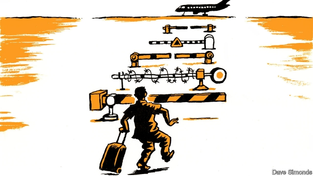

###### Where security is a misnomer

# How airports explain the Arab world 

 

> print-edition iconPrint edition | Middle East and Africa | Jun 29th 2019 

IN MOST AIRPORTS, going through security checks is a streamlined if soulless passage into a hermetically sealed, sanitised zone. Not so in much of the Arab world. Reaching your departure lounge is a mental as well as physical obstacle course which reveals much about the regime—or regimes—in charge. 

Some airports have competing security services. Beirut’s main airport is mostly controlled by Hizbullah, the Shia militia that dominates southern Lebanon. But as befits the country’s tortuously sectarian system of government, various groups have a foothold. Security agencies controlled by Sunni Muslims and Maronite Christians have their own X-ray machines and lines of control. The ensuing duplication leads to one of the airport’s hallmarks: gridlocked queues. 

At Mitiga, the sole airport still serving Tripoli, Libya’s capital, Islamist militiamen peruse Western passports with an air of contempt. But other competing security forces conduct checks, too. In their varying uniforms, the guards are more concerned to secure their bit of the airport than to protect passengers. 

Iraq’s airports also replicate the plethora of checkpoints that punctuate its roads. To reach Baghdad’s main airport, you pass through a series of concentric rings, starting many kilometres before the terminal. Passengers offload their luggage numerous times, first onto airport buses, then onto trolleys. Sniffer dogs, x-ray machines and officials, all from different factions, scrutinise your contents several times over—and you feel none the safer. 

Here and there across the Arab world, private VIP services, often in cahoots with official security chiefs, sell fast-track passage to bypass the rigmarole faced by hoi polloi. In Cairo baksheesh is the simplest way to cut through the airport’s tangle of red tape. And the equipment is only as good as its operators, who often seem more focused on their mobile-phone screens than their x-ray monitors. Semi-literate police at Egypt’s airports let passengers through only if they present a valid ticket—or something that looks like one. An old rental-car reservation recently sufficed. 

At the airport serving Khartoum, Sudan’s capital, notices recently said that no one could leave the terminal once he or she had passed through security checks. No one paid the slightest attention, happily walking in and out.◼ 

