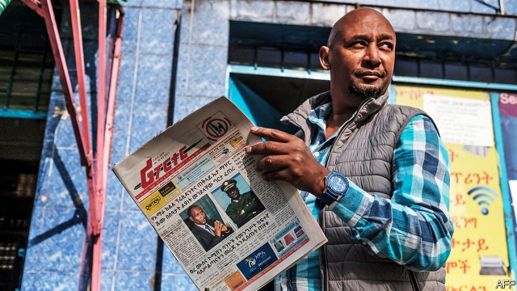
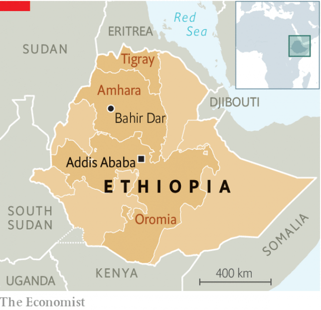

###### Coups and contradictions

# Killings and claims of an attempted putsch rock Ethiopia 

 

> print-edition iconPrint edition | Middle East and Africa | Jun 27th 2019 

ON JUNE 23rd 2018 Abiy Ahmed, Ethiopia’s newly inaugurated prime minister, took to the podium wearing a bright green T-shirt. Smiling and waving, he offered hope of democratic change to tens of thousands of supporters at a rally in the capital, Addis Ababa. 

A year later, almost to the day, he again addressed the nation, this time in army uniform, to declare, stony-faced, that his government had thwarted a coup. It was a sharp reminder of the fragility of his democratic revolution. 

Abiy said the putsch had originated in the northern region of Amhara, Ethiopia’s second-most populous, and was the work of General Asamnew Tsige, Amhara’s head of security. The prime minister’s office claimed that General Asamnew’s men attacked government offices in the regional capital, Bahir Dar, on June 22nd, killing the Amhara region’s president, Ambachew Mekonnen, and other officials. 

In a separate attack in Addis Ababa, the army’s chief of staff, Seare Mekonnen, was killed in his home by a bodyguard. (Also murdered was a retired general who had been visiting.) The government said the attacks in Addis Ababa and Bahir Dar were linked. Since then, it has shut down the internet and released few details of the plot. But from what little information has emerged, the incidents look more like an unplanned outbreak of violence than a calculated attempt to seize power. 

General Asamnew was a former political prisoner sentenced in 2009 for his alleged role in another failed coup. Abiy released him last year and gave him a powerful job as part of a campaign to embrace former opposition leaders. But General Asamnew provoked alarm with his strident talk of defending Amhara territory against other Ethiopians. 

Ethnicity has been a central feature of Ethiopian politics since 1995, when the current constitution came into force. It carved up the country into nine ethnically based semi-autonomous regions. The Ethiopian People’s Revolutionary Democratic Front, which has run the country with a heavy hand for almost four decades, kept a lid on tensions between ethnic groups for most of that time. But they are on the rise as Abiy has liberalised politics. Last year intercommunal fighting forced almost 3m people from their homes. 

The Tigrayans, who are around a tenth of Ethiopia’s population, have largely run things since the toppling of a Marxist dictatorship, the Derg, in 1991. The Oromo, Abiy’s group, who are a third of the population, resented Tigrayan domination, which in part accounts for Abiy’s rise. The Amhara, who are about a quarter of the population, ruled the roost under Ethiopia’s last emperor, Haile Selassie, who was deposed in 1974.  

 

As the Amhara region’s security chief, General Asamnew strengthened its paramilitary forces, creating a special police unit that answered directly to him. Both the federal government and Ambachew were troubled by this. People familiar with the events on June 22nd say that Ambachew had called a meeting with his advisers to discuss ways of stopping General Asamnew from expanding his forces and possibly firing him. (Among those killed was Migbaru Kebede, the attorney-general of Amhara.) 

General Asamnew is said to have sent men from his special police force to the meeting who shot and killed Ambachew. The general may have been outside the building at the time. It is not clear whether the murder was premeditated, or the general lost control. He fled immediately, which suggests this may not have been an organised putsch. The army killed him two days later. 

There are many unanswered questions, including whether and how events in Bahir Dar were connected to the killing of the army chief. If the incidents were indeed linked, as the government claims, that would point to a wider conspiracy and suggest that Abiy faces a threat from elements of the national army. 

The ramifications for a country that seemed on the path to reform are gloomy. Scores of journalists, politicians and activists linked to Amhara nationalists have already been arrested. Repression may, in turn, stoke further resentment in Amhara, a region in which many young people are beginning to feel discriminated against by Abiy and his Oromo faction. The euphoria that greeted Abiy’s rise to power just over a year ago seems a distant memory. ◼ 

