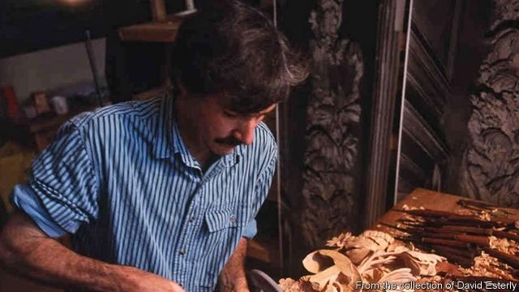

###### Master and apprentice

# Obituary: David Esterly died on June 15th 

 

> print-edition iconPrint edition | Obituary | Jun 29th 2019 

IT MIGHT HAPPEN at any time of day. David Esterly would be at his workbench, gouge in hand, when he felt the breath on his shoulder. The voice would say: “I wouldn’t do it like that,” or “I’ve made a leaf curl that way before. Why are you bothering?” 

He did not need to ask who it was. The man’s portraits at three different stages of his life, the last plump, bewigged and comfortable, hung round his workshop in a converted barn at Barneveld, in upstate New York. Grinling Gibbons, England’s 17th-century genius of woodcarving, was the god of the place. For ten years his admirer had been labouring to emulate his astonishingly meticulous chains and cascades of foliage, fruit, flowers, feathers and shells in the same white lime or linden wood. The tradition of such carving was long-lost. Mr Esterly, whose studies as a Fulbright scholar at Cambridge had been in Yeats and the philosopher Plotinus, hoped he had found a way to combine intellectual, moral and sensory experience into what Yeats called “unity of being”. 

There were many satisfactions in working as Gibbons had done. Standing at his workbench—not sitting, for carving involved the whole body—he would take up, with a quick flip of the hand, one of the dozens of tools spread before him. He could have done it blindfolded, knowing just where each one was. The multiplicity of blades reflected the fecundity of nature, which he would strive to reproduce with ever-more-delicate gouging. 

He began each piece by stabbing down the outline on a sawn board a few inches thick, then wasting away the wood around it and modelling the form. The rearward hand, and that half of his body, propelled the tool; the forward hand, on the wood, resisted. This opposition gave him exquisite control over the blade edge. It reminded him of the empowering contrast between Dionysian impulse and Apollonian restraint; and of Hamlet, too, torn between action and thought, whose tension drove through the play. 

For him, as for Gibbon, the limewood responded beautifully, as only limewood could. It was soft, almost oily, with a nutty smell that filled the workshop and a crisp zip under the gouge; pliable, kindly, magically white and forgiving of mistreatment, such as his necessary cutting across the short grain to mould the shape of an apple or a grape. (He had tried other woods, but found ash too hard, beech and birch thuggish.) Its tolerance allowed it to be drastically undercut in Gibbons’s style, with a gouge held like a pencil, until the wood was scarcely thicker than a petal or a feather and the piece filled with shadow and air. At that point he would add the selective exaggerations, a curl here, a bulge there, that would make a leaf look real, even though carved in wood. And then, leaving the piece bare except for gentle abrading with Dutch rush, as Gibbons would have done, he would set it aside to shine like ghostly marble with its own independent life. 

He never kept anything he made. Ever since he had sold a small mirror frame for £100 at a village fair, he had worked only to commission. He could not afford to do otherwise, for though his pieces eventually sold for six figures they were so time-consuming that he made only about 50 in his life. Carvers were starvers, he often said: an existence his comfortably middle-class parents in Akron, Ohio would have struggled to understand. 

And it had begun in a moment: that moment in 1974 when his girlfriend Marietta, later his wife, took him to see the Gibbons carvings behind the altar in St James’s Church, Piccadilly. He was thunderstruck, and his reaction was physical: hairs rising on his neck, his skin tingling, and his tongue seeming to move over ivory’s coolness and smoothness. (“The thinking of the body”, Yeats would have called it.) His first, academic, thought was to write a book about Gibbons; his second was just to pick up tools and teach himself to carve. The minute his chisel struck the wood, he was in thrall. Ensconced in a cottage in Sussex for eight years, then at Barneveld, he became a ghost’s apprentice. But no, that put it too lightly: by the end of a decade, he was a slave. Enslaved not only to his carvings, which about halfway through would start to impose their own ideas on him, but also to the long-dead master he so revered, beside whose work he could only despair about his own. 

There was a way out. That, too, was completely unexpected. In 1986 he was asked to replace a seven-foot Gibbons drop at Hampton Court Palace, south-west of London, which had been destroyed by fire. He hesitated over it. Exact reproduction, which he had never done, was surely the most slavish tutelage of all. Yet the closer he got to Gibbons—first touching a single stem, then whole pieces, scrutinising his technique, following the movements of his gouges and his thought—the more his own workbench seemed transported to 1698, and the more he saw the larval forms of the half-modelled wood with Gibbons’s eyes. When after a year the drop was made, with its exhausting ropes of crocuses and trefoil, he was no longer a slave, but a colleague. The spell was broken. 

He was now a master in his own right and one for his own age. Freed from Gibbons’s riotous acanthus, he let other influences crowd boldly in: the peonies, roses and lilies of Dutch Old Masters, the vegetable heads of Arcimboldo and a touch of modern cynicism in insect-blighted leaves. Letter-rack trompe-l’oeils became a favourite theme, as they were for 17th-century painters, but his racks contained cameras, car keys, film spools and iPhones, as well as delicate hibiscus, holly or sprays of oak. He became Gibbons’s confident ambassador, curating an exhibition and writing books. 

Strolling into his workshop for a day of meditative carving, still in his bathrobe and carrying his tea, he would go straight to Adobe Illustrator to map out his designs in many overlapping layers. As well as daylight, halogen spotlights illuminated his bench. Between defining the edges of his peony leaves and excavating tiny florets of lilac, he would check his emails. The portraits of Gibbons were still on the walls, but the voice no longer bothered him. He might have sensed, from time to time, an approving nod.◼ 

