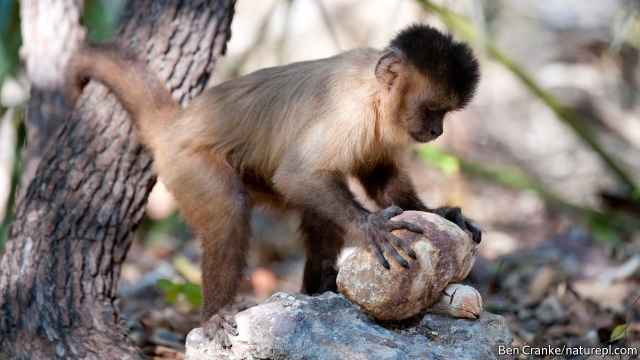

###### Animal archaeology

# Capuchin monkeys have been using stone tools for around 3,000 years 

 

> print-edition iconPrint edition | Science and technology | Jun 27th 2019 

ONE OF THE most famous edits in cinematic history comes early in “2001: A Space Odyssey”. A primitive hominid hurls a bone club into the air, and a match cut to a spacecraft instantaneously tells the millennia-long story of human ingenuity. Tools maketh man. But there was never a human monopoly on tool use, as a new paper in Nature Ecology & Evolution shows. A team led by Tiago Falótico of the University of São Paulo, in Brazil, and Tomos Proffitt of University College, London, has demonstrated that a species of monkey called the wild bearded capuchin has been employing stone tools for perhaps 3,000 years, and that their use of the technology has changed over the course of time. 

Capuchins, chimpanzees and sea otters, among others, are known to use rocks to crack open, respectively, nuts and shellfish. And an earlier dig by Dr Falótico found evidence that, in capuchins, this habit goes back at least 600 years. Though some may question whether bashing a nut with a rock truly qualifies as “tool use”, capuchins (as the picture shows) use both hammerstones and anvils—which demonstrates quite a high level of sophistication. 

They also demonstrate sophistication in the wielding of their tools, because not damaging the soft kernel of a nut while breaking the shell takes skill. Cracking open a cashew, the favourite for this treatment, requires the tool-wielder to employ a single, practised motion. First, the animal brings the hammerstone down two-handed for a glancing blow on the nut’s far side. It then rolls the stone towards itself, over the nut. Youngsters take around eight years of mimicking their parents to get the knack of all this. And although the stones used are not actually modified for the task, monkeys are assiduous in searching for and selecting those of the perfect shape. (They do, however, lack the insight to keep such stones for future use.) 

Dr Falótico and Dr Proffitt returned to the site of the previous excavation—a part of Serra da Capivara National Park in the Brazilian Amazon. They dug into an area of 67 square metres, to which the monkeys bring stones from a nearby stream bed. The site’s capuchins use quartzite cobbles as hammerstones, and tree limbs and loose stones as anvils. 

By excavating 1,699 stones, pebbles and flakes, and working out the age of 122 hammerstones from the radiocarbon dates of charcoal buried alongside them, the team split the site’s history into four phases. Capuchins first swung a rock in the area somewhere between 3,000 and 2,400 years ago—the beginning of a period the researchers call Phase IV. This is the oldest known instance of non-ape tool use. Phase IV hammerstones are light and have many impact marks. This suggests they were used mainly on seeds (possibly from cassava) smaller than the cashews which today’s monkeys pound, meaning hammerstone and anvil often came into contact with one another. 

Phase III, between 640 and 565 years ago, featured transitional behaviours that led to Phase II, from about 257 years ago, when hammerstones were heavier and are associated with many large anvils, suggesting a food source bigger and harder than cashews (the hard-shelled jatoba fruit is a possibility). More recently, in Phase I (from 27 years ago), cashew residue on stones suggests the monkeys were moving towards their present-day alimentary focus. What Dr Falótico and Dr Proffitt do not yet know is whether the variation they saw is a result of different groups of capuchins, with different habits, occupying the site at different times—or, alternatively, whether a single lineage of the animals has changed its nutritional culture over the years. 

Until Dr Falótico’s original dig, chimps were the only species other than human beings for which an archaeological record of tool use had been found. (In 2007 researchers discovered chimpanzee-modified stones that were 4,300 years old.) There is no reason, though, not to expect the finding of further, and perhaps older, sites in future. Moreover, studying how capuchins and chimps have used tools may give an inkling of how the process happened in people. One thing Dr Falótico and Dr Proffitt have noticed is that some of the sharp flakes that fly off when hammer meets anvil look identical to Stone Age blades made by human beings. Capuchins have not yet—so far as is known—thought to use such flakes as knives. But perhaps their own “2001” moment awaits them in the future.◼ 

