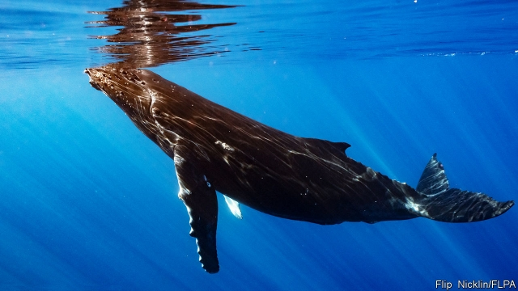

###### Oncology

# In fighting cancer, look to what other animals do 

 

> print-edition iconPrint edition | Science and technology | Jun 29th 2019 

IN 1977 RICHARD PETO, an epidemiologist at Oxford University, observed a contradiction. Cancer begins as a mutation in a single cell. Organisms with more cells should therefore have a higher risk of developing it. Elephants, which have 100 times as many cells as human beings do, should swarm with malignancies. Whales, with ten times more again, should be barnacled with tumours. In fact, the planet’s behemoths are blessed with extremely low rates of cancer. Titanic bodies and tumour resistance have evolved in tandem. The secret of suppressing cancer may therefore be hidden in the genes of giants. 

Inspired by Peto’s paradox, as this contradiction has come to be known, researchers are exploring rates of cancer and resistance to cancer in thousands of animal species, with an emphasis on heavyweights. Their hope is to translate the animals’ cancer-fighting talents into treatments for people. 

In one recent study, published in Molecular Biology and Evolution and entitled “Return to the sea, get huge, beat cancer”, Marc Tollis of Northern Arizona University and his colleagues sequenced the genome of the humpback whale and began trawling through it for tumour-suppressor genes. Previous research had revealed that, around 50m years ago, creatures which looked something like a cross between a rat and a wolf dog-paddled into the sea and eventually evolved into whales. These animals remained fairly small until about 3m years ago. Then they rapidly ballooned into whoppers the size of buses. 

Dr Tollis found that as ancestral whales grew, numerous alterations to their tumour-suppressor genes hopped on board. He and his colleagues identified 33 known tumour-suppressing genes in humpback whales that showed evidence of advantageous changes. These included ATR, which detects damage to DNA and halts the cycle of cell division that cancer-promoting mutations encourage; AMER1, which stifles cell growth; and RECK, which reins in metastasis, the tendency of cancer cells to peel off their natal tumour and wander around the body looking for other sites to colonise. Humpback whales also have duplications in genes that promote apoptosis, the process that commands mutated cells to commit suicide. All this suggests that the evolution of gigantism in cetaceans is associated with strong selective pressure in favour of genes that conquer cancer. 

Cancer biologists are familiar with ATR, AMER1 and RECK because people have them too. But whales may also harbour tumour-fighting genes unknown to science. The next step is therefore to irradiate laboratory-grown lines of whale cells, in order to encourage cancer-causing mutations and thus find out which genes become active in an attempt to clamp down on those mutations. The eventual goal is to discover which strategies whale genes use to combat cancer. Researchers will do this by transferring whale genes into human cell lines, zapping those cells with radiation, then seeing if the whale genes attempt to repair the DNA damage—as human genes often do—or opt for the often more effective method of triggering apoptosis. 

Similar studies are already being done using cancer-fighting proteins from another group of giants—elephants. These have a cancer-mortality rate of about 5%, compared with 11-25% in human populations. Some participants in the whale study were previously involved in sequencing African and Asian elephant genomes. They found that an important weapon in the elephants’ arsenal is TP53, a gene that encodes an apoptosis-inducing protein called p53. This protein is known colloquially as “the guardian of the genome”. 

Human beings have two copies of TP53 in their chromosomes—one from each parent. Those in whom one of these does not work manifest a condition called Li-Fraumeni syndrome, and are almost certain to develop cancer. Elephants’ chromosomes, by contrast, sport 40 versions of TP53—part of the explanation, surely, of why elephant tumours are so rare. 

Joshua Schiffman, a paediatric oncologist at the Huntsman Cancer Institute in Utah who was involved in the elephant study, is investigating how elephants’ multiple copies of TP53 co-ordinate an attack on mutated cells. He is also studying how slight differences in the composition of elephant p53 make it a more efficient mutant-cell killer than its human counterpart. The power of elephant p53 led Dr Schiffman to co-found PEEL Therapeutics, based in Utah and Israel (the firm’s name is derived from the Hebrew word for elephant). PEEL’s purpose is to translate discoveries in comparative oncology into human patients. The firm’s researchers are experimenting with minuscule lipid spheres loaded with proteins, including synthetic elephant p53. Their most promising experimental drug is designed to deliver this directly to a patient’s tumour cells. Details are still under wraps, but Dr Schiffman says that, in a laboratory, introducing synthetic elephant p53 to human cancer cells induces “incredibly rapid and robust cell death”. 

These studies on elephants and whales are part of a larger effort in comparative oncology—some of it based at Arizona State University’s Arizona Cancer Evolution Centre (ACE). Researchers at ACE, including Dr Tollis and the centre’s director, Carlo Maley, are looking at cancer rates in 13,000 animal species, using more than 170,000 records of individual animals. This study is the first of its kind, and is intended to search for patterns that might explain resistance and susceptibility to tumours. To this end the researchers are casting their net wide. They have, for example, attempted to induce tumours in sponges that have no reported incidence of cancer. 

Dr Tollis, Dr Maley and their colleagues will also search for tumour-suppressing genes in previously sequenced genomes available in public databases. These include about 65 species of mammal—some of which, such as naked mole rats, are noted for low cancer rates even though they are small compared with elephants and whales, and so do not seem to conform to Peto’s paradox. The search will also look at non-mammalian exceptions to the paradox, such as crocodiles and birds. Dr Tollis and Dr Maley speculate that birds, at least, inherited their cancer resistance from dinosaur ancestors which were much larger. They are working on computational models to test this hypothesis. 

One novel aspect of all this research is its willingness to take the animals under study on their own terms. Medical science uses animals a lot—but almost always they are there to act as stand-ins for human beings, a role encapsulated in the word “model” that is often applied to such laboratory organisms. Comparative oncology explicitly rejects this idea. Instead, it studies a phenomenon, namely cancer and the body’s response to it, without prejudice, and only then attempts to draw medically useful lessons. Whether that approach might be extended to other fields of medicine is surely worth consideration.◼ 

