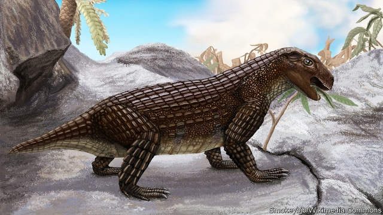

###### Palaeontology

# Vegetarian crocodiles once roamed the world 

 

> print-edition iconPrint edition | Science and technology | Jun 29th 2019 

COMPARED WITH mammals, living members of the crocodile clan have exceptionally boring dentition. From the slender-snouted gharials of India and the nocturnal caimans of South America to the saltwater behemoths of the South Pacific, crocodile teeth vary little in morphology. All are conical and pointed. Each tooth in an animal’s mouth is almost identical to its neighbours—as befits a group of that feed on a mixture of fish and the occasional careless beast that strays too close to the shore, or even into the water itself. 

This predilection for pointed fangs is not, however, how it has always been. During the days of the dinosaurs, the Jurassic and Cretaceous periods, crocodile-clan members showed extraordinary dental diversity. Many of their teeth have proved so bizarre that some palaeontologists have theorised that, far from being carnivorous, these ancient species might have been eating plants. A study published this week in Current Biology, by Keegan Melstrom and Randall Irmis at the University of Utah, confirms this. It also suggests that herbivory evolved in the crocodile clan on several occasions. 

When trying to work out what ancient animals ate, palaeontologists usually look to modern analogues. If teeth from an extinct beast match those of a modern species, the two are quite likely to have had similar diets. With extinct crocodilians, however, this palaeontological tactic has routinely been stymied because their teeth, which are adorned with many rows of cusps and wrinkled enamel, look nothing like what is found in the mouths of animals alive today. This has left the topic of what ancient crocodilians ate very much up for grabs. Some palaeontologists argue that certain species, such as Simosuchus clarki (illustrated below in an artist’s impression) were vegetarian. 

To solve the puzzle Mr Melstrom and Dr Irmis turned to Orientation Patch Count Rotated (OPCR) analysis. This technique scans a tooth and measures the complexity of its surfaces. Use of OPCR has demonstrated, in a quantifiable manner, that diet is closely related to tooth complexity. Carnivores tend to have simple teeth. Omnivores have more complex teeth. Herbivores have the most complex teeth of all. 

Until now, however, the technique has been used mostly on the molars of living mammals. Indeed, Mr Melstrom and Dr Irmis knew of no studies that had tested it extensively on crocodiles and their kin. This lack of testing made sense, because living crocodilians have no complex tooth morphologies to analyse—so why bother? However, the strange teeth of ancient crocodiles, they reasoned, might give OPCR something to work with. 

In total, they threw 146 teeth from 16 extinct crocodilians at OPCR. For comparison, they also added teeth from a modern caiman into the mix. The analysis revealed that two of the extinct species were, like the caiman, carnivorous. But even these were notably different from modern animals in that one had serrated steak-knife-like teeth and the other had triangular teeth that made contact with one another when the animal closed its mouth (something not seen in modern crocodilians). The system identified two of the species as “durophagus”, meaning that their teeth looked as if they would be good at crushing the shells of clams, crabs and other armoured invertebrates. One species was identified as omnivorous. And eight, including Simosuchus, were identified by OPCR as obligate herbivores. (The other three were hard to classify, but may have been insectivores.) 

What particularly surprised Mr Melstrom and Dr Irmis, though, was the way herbivory mapped onto the crocodile family tree. Rather than evolving once at some point long ago and then appearing in all later species on that branch, it came into existence at least three times during the history of these reptiles. Herbivorous crocodiles of the Jurassic and Cretaceous, then, were capable of competing successfully with their dinosaur counterparts in a way that a modern herbivorous crocodile presumably could not with the plethora of herbivorous mammals that now exists.◼ 

