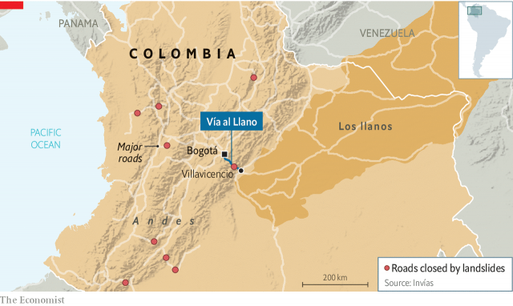

###### Lost llanos

# A blocked road cuts Colombia in two 

 

> print-edition iconPrint edition | The Americas | Jun 29th 2019 

VILLAVICENCIO, A SHABBY city of half a million people, considers itself the gateway to los llanos, Colombia’s eastern plains. Now and for the next few months few people will be passing through it. Mudslides since May have blocked the main highway, the Vía al Llano, which connects the city to Bogotá, Colombia’s capital, 86km (53 miles) away (see map). More rocks and mud threaten workers trying to unblock the road, along which two-thirds of domestically produced goods are transported. Colombia’s government says this could take up to three months. 

This has cut off from the rest of the country a region of 1.7m people which produces much of Colombia’s oil and food. Residents of Villavicencio and the surrounding plains are beginning to feel the consequences. Potatoes, garlic and eggs have become scarce in grocery stores. Shoppers hunt through produce bins to find the few tomatoes and carrots that have not rotted. More than 90% of hotel reservations in the plains region, newly popular with tourists, have been cancelled. Bistronomy, Villavicencio’s fanciest restaurant, ran out of Club Colombia, its most popular beer, on a recent evening. The politicians and landowners who dine there had to settle for Andina, a new brew. 

Goods can get through on two smaller toll roads, but these are not fully paved. Some farmers have sold their products at a loss to pay the cost of shipping to Bogotá, which has jumped by 40%. Rice growers fear they will lose their harvest in July, when about a sixth of the crop is picked. According to Villavicencio’s chamber of commerce, the blocked road is costing the region more than $15m a day. State governors are asking the national government to declare a state of economic emergency and suspend sales and income taxes. Prices might rise in Bogotá, too. 

Colombia is a road-builder’s nightmare. The Andes split into three ranges at the southern border. The mountains can climb to 4,000 metres (13,000 feet) from sea level in less than 100km. Colombia gets more rain than any other country in the world, which makes maintenance difficult. Currently 12 major roads are blocked by mudslides. In a ranking of 137 national road networks by the World Economic Forum, Colombia’s comes 110th. 

Short of cash, the government has given private firms concessions to build roads. Vía al Llano, among the earliest projects built under concession, has been accident-prone. Recently a crater opened up in Guayabetal, near the site of the biggest mudslide. Under the terms of the contract the government, not the concessionaire, is responsible for carrying out the work needed to prevent mudslides. It will now have to do that, expensively. 

To relieve los llanos’s isolation in the meantime, Satena, a state-owned airline, and EasyFly have announced more flights between Bogotá and Villavicencio. The government has suspended passenger fees on flights between the cities. Tolls on the two alternative roads will be halved. But what the plains need most is a road that can cope with Colombia’s treacherous, rain-soaked topography. That goes for much of the rest of the country.◼ 

