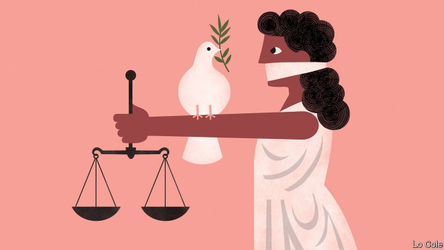

###### Bello

# Are amnesties in Latin America always a bad idea? 

 

> print-edition iconPrint edition | The Americas | Jun 29th 2019 

SOME ARE elderly and frail. Others are merely greying. Some thought they were untraceable, having invented new identities in other countries. Some were generals, others subalterns. Over the past few years executioners and torturers from Latin America’s dictatorships of the 1970s and 1980s have at last been brought to account, despite amnesty laws that were the price of democracy. And that is producing a backlash. 

Take El Salvador, where civil war between Marxist guerrillas and the army killed 75,000 people between 1980 and 1992. In one of the most heinous crimes of the cold war in Latin America, an American-trained army unit slaughtered almost a thousand unarmed civilians, mainly women and children, at the village of El Mozote in 1981. The perpetrators were protected by a blanket amnesty decreed in 1993 as part of a peace accord. 

Since then international law has changed. It has moved towards the principle that crimes against humanity cannot be amnestied. In 2016 El Salvador’s supreme court adopted that doctrine. A score of retired officers, including the former defence minister, are now on trial for the massacre. That has prompted an attempt to pass a law reimposing the amnesty, backed by both the main political parties, whose roots lie in the opposing sides in the war. They worry that reopening the past will aggravate political conflict. 

The bill is likely to fail. El Salvador’s new president, Nayib Bukele, who was born months before the massacre, has promised to veto it. Yet the issue of what to do about the crimes of Latin America’s past dictatorships and guerrilla insurgencies is unlikely to go away until the last war criminal dies. 

Any civilised society must try to punish such horrors. But in ending internal conflicts, peace, reconciliation and truth are as important as justice. There is often a trade-off. Rebels and dictators often refuse to give up unless they are promised amnesty. Moral imperative is thus tempered by political feasibility. And the politics is not getting much easier. 

The most straightforward requirement is that perpetrators of crimes tell the truth, which allows victims’ relatives some small relief. In this Latin America was a pioneer, with truth commissions in Argentina and El Salvador. Colombia’s peace agreement of 2016 between the FARC guerrillas and a democratic government was also pioneering in applying current international law, but through restorative justice. Provided guerrilla commanders confess their crimes and offer at least symbolic reparation they will not face jail (though many Colombians think that too soft). 

Attempts to achieve justice in older cases have been patchy. Self-bestowed amnesties by military regimes were repealed in Argentina and unpicked by the courts in Chile, but not in Brazil. Uruguayans twice voted for an amnesty in referendums. Argentina and Chile have jailed some military butchers. So has Guatemala, though conservatives there are now trying to free them by extending what was a partial amnesty. 

To go back 30 years or so requires judges to strike down amnesty laws and a change in political conditions, notes José Miguel Vivanco of Human Rights Watch, a pressure group. “If these guys are still alive they should face justice and tell the truth,” he says. 

Retroactive justice is more problematic if it is seen to be one-sided. Under left-wing governments Argentina’s judiciary convicted military leaders but left guerrilla crimes unexamined. With less cause, proponents of amnesty in Guatemala invoke political bias. 

There are other reasons why undoing amnesties might be bad. Although El Salvador’s peace process was successful, the country has not been. Like much of Central America, it suffers from criminal violence. Some citizens might argue that establishing the rule of law in the present should be the priority. 

That some countries have torn up amnesties may make achieving peace or democracy harder in others. In Venezuela the opposition has offered amnesty to generals who turn against the dictatorship of Nicolás Maduro. But “most high-ranking officers…don’t believe in the amnesty,” according to Caracas Chronicles Political Risk Report, a newsletter. 

Political debate in Latin America is too often focused on the past. A region that has fallen behind the rest of the world economically and technologically can ill afford that luxury. None of this is an argument against applying justice where possible. It is to recognise that it carries risks.◼ 

