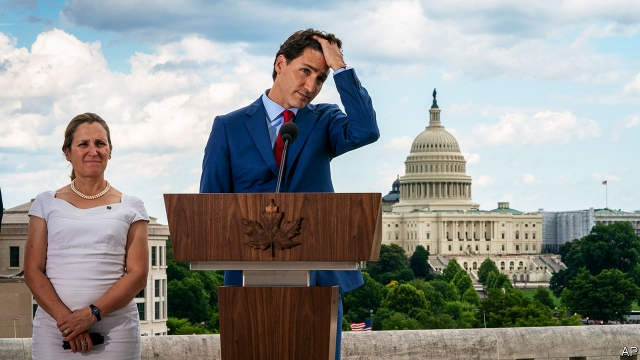
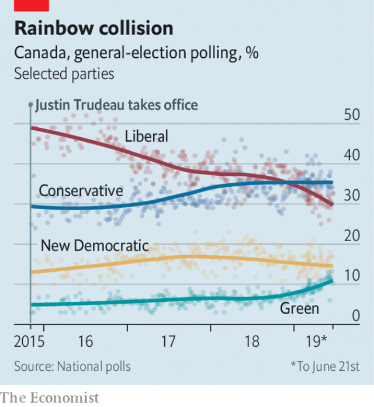

###### Getting ready for a grilling

# Justin Trudeau starts Canada’s election campaign as the underdog 

 

> print-edition iconPrint edition | The Americas | Jun 29th 2019 

JUSTIN TRUDEAU received the kind of welcome in Washington, DC, on June 20th that Canadian prime ministers dream of. President Donald Trump, who a year ago called him “dishonest” and “weak”, now saluted him as a “friend” and treated him to lunch at the White House. He promised to help Canada in a diplomatic row with China, provoked in December when Canada arrested a prominent Chinese businesswoman to comply with an American extradition request. Nancy Pelosi, the Democratic Speaker of America’s House of Representatives, said she was optimistic that Congress would eventually ratify a deal, which includes Mexico, to replace the North American Free Trade Agreement (NAFTA), a Canadian priority. She gave Mr Trudeau a basket of Californian wines, nuts and chocolates. Those were his winnings from their wager over the duel between the Toronto Raptors and the Golden State Warriors in a basketball championship. An auspicious rainbow appeared over Andrews Air Force Base as Mr Trudeau’s motorcade arrived for the flight home. 

The omen may have been misleading. On the day of his Washington visit, Canada’s MPs dispersed from Ottawa and hit the barbecue circuit to begin the unofficial campaign for the general election due in October. In the opinion polls Mr Trudeau’s Liberals have been trailing the opposition Conservatives, led by Andrew Scheer, since a controversy erupted in February over what looked like an attempt by the government to interfere with the justice system (see chart). 

Canadians are not giving Mr Trudeau credit for steadying relations with the United States. They care more about matters at home. The top issues in the election will be health care, the economy, taxes, poverty and climate change, predicts Darrell Bricker of Ipsos, a polling firm. On issues that affect household finances, voters trust the Conservatives more, he says. 

An additional challenge will come from unfriendly provincial governments. Left-leaning governments in Ontario, Quebec, Alberta and New Brunswick, which were sympathetic to Liberal spending policies during the campaign in 2015, have been replaced by conservative ones intent on thwarting them. 

 

Those policies should be a Liberal strength. Early on the Trudeau government introduced a means-tested child benefit, which has helped lift 300,000 children out of poverty. The government also cut the income-tax rate for the middle class and raised it for Canadians with incomes of more than C$212,000 ($162,000) a year. Economic growth has been unspectacular but steady, despite uncertainty caused by the renegotiation of NAFTA and a drop in oil prices in 2014, which walloped Alberta. The unemployment rate of 5.4% is the lowest in 40 years. More than 1m new jobs have been created since 2015. 

Yet many voters do not believe these cheery numbers. They are uneasy about job security and the cost of housing, though property prices in Toronto and Vancouver have dipped from record highs. Social media fan these anxieties. A survey this year by Edelman Canada, a consultancy, showed that just 24% of the “informed public”, a group that comprises about a sixth of the population, and 16% of the “mass population” thought the system was working for them. Almost three-quarters of both groups think they are being treated unfairly and a majority want change. 

The Conservatives have done a better job than the Liberals of showing that they care about these anxieties. Last month Mr Scheer, a bland but affable former Speaker of the House of Commons, laid out an economic plan that was light on ideas but heavy on empathy. “The economic indicators might say one thing. But the human indicators say something entirely different,” he said. He would be the prime minister for “the people who just need a break”. That will come from modest tax cuts. He also promised to make unspecified spending reductions to narrow the budget deficit (expected to be 0.9% of GDP this year). 

On health care and the environment, the Liberals seem to have the electoral edge. They swiped from the New Democratic Party, a more leftish outfit, the notion that government should subsidise prescription drugs. A proposal for “pharmacare”, made by a government-appointed commission this month, comes too late for Parliament to legislate before the election. But it is well in time for the Liberals to dangle the idea in front of voters. They have not yet made clear which drugs would be covered, how much the benefit would cost or who would pay for it. 

In a battle between greens and supporters of the oil industry, which generates a fifth of Canada’s exports, Mr Trudeau has tried to strike a balance. On June 18th the government approved an additional pipeline to run alongside the 1,150km (715-mile) Trans Mountain pipeline from Alberta to the west coast. The government bought the project last year for C$4.5bn after its owner tired of delays caused by opposition from environmental and indigenous groups. At the same time, it is trying to meet its commitments under the Paris climate agreement, in part by requiring provinces to set a price on carbon emissions. 

Partisans on both sides have lambasted Mr Trudeau. After the government approved the pipeline expansion Elizabeth May, leader of the Green Party, which could win votes from the Liberals, called it a “cynical bait-and-switch”. Albertans focus on the pipelines Mr Trudeau has blocked (one going east, the other west) rather than the one he approved. A few days after the Trans Mountain decision, Parliament passed a law changing the rules for assessing the environmental impact of such projects. Jason Kenney, the recently elected Conservative premier of Alberta, called the decision a “flagrant violation” of provincial rights and vowed to challenge it in court. 

Both Mr Kenney and Doug Ford, Ontario’s Progressive Conservative premier since June 2018, killed their provincial carbon-pricing schemes (in Ontario’s case, a cap-and-trade system). They are fighting in court the national tax, which is imposed on provinces that do not have plans that pass muster with the federal government. 

Conservative provincial governments will also attack the Liberals’ pharmacare plan. They object in principle to expanding the role of government, especially in areas such as health care, in which provinces share responsibility with the federal government. Mr Ford made Ontario’s pharmacare plan less generous as part of an austerity programme, which he says is needed to cut the province’s debt and deficit. 

The chaotic administration of Mr Ford, the brother of Toronto’s late crack-smoking mayor, Rob Ford, may be Mr Trudeau’s best hope of winning. Ontarians are enraged by Mr Ford’s spending cuts, which include sacking 400 health-care workers. He even cancelled Canada Day (July 1st) celebrations at Queen’s Park in Toronto, site of Ontario’s legislature. His unpopularity is dimming Conservatives’ prospects in the province, which elects 121 of the 338 MPs in the House of Commons. It will be the chief battleground in the election. 

Early polls predict little. At this point in 2015 the New Democrats were ahead (they came third). Mr Trudeau is planning another come-from-behind victory. He is betting that most Canadians will understand the need for compromise on the environment and will give him credit for a strong jobs market, generous public benefits and avoiding a trade bust-up with the United States. He will be scanning the Canadian sky for rainbows. ◼ 

