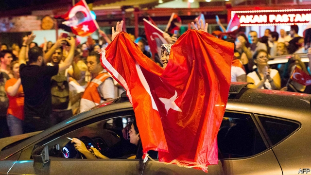
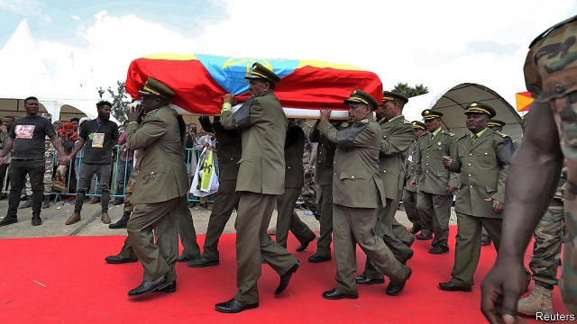

###### How to contain Iran

# Politics this week 

 

> Jun 29th 2019 

Turkey’s president, Recep Tayyip Erdogan, was humiliated by voters, as his attempt to reverse the mayoral election in Istanbul, which his party had lost, backfired spectacularly. At his behest, the electoral board ordered a re-run, but this week the opposition challenger, Ekrem Imamoglu, won by a much larger margin than in March: 54% to 45%. See article. 

After three weeks of talks that followed an election, Denmark’s Social Democrats won the backing of smaller parties on the left to form a minority government headed by Mette Frederiksen as prime minister. The smaller parties agreed to support Ms Frederiksen only after she promised to water down the hard-line policies on immigration that her party had touted during the election. 

Ukraine responded angrily to the decision of the Council of Europe, which is separate from the EU, to restore Russia’s voting rights. But supporters of the move said this would ensure that Russian citizens could lodge claims against their government at the European Court of Human Rights, a body of the council. 

Dozens of schools were closed in France; temperatures there and other European countries have soared above 40°C. 

Boris Johnson and Jeremy Hunt emerged as the final two in the race to lead Britain’s Conservative Party and thus become prime minister. Mr Johnson is the favourite, but his bumbling style seems odd at a time of crisis. In an effort to revive his stumbling campaign he declared that Britain must leave the EU on October 31st, “do or die”. That went down well with Tory party members. See article. 

Scattered protests, drawing as many as several thousand people, continued in Hong Kong over legislation that would allow the extradition of criminal suspects to mainland China. The government has shelved the bill, but protesters want it to be scrapped. See article. 

Hong Kong’s Supreme Court overturned the conviction of the territory’s former chief executive, Donald Tsang, for misconduct. His original sentence in 2017 was 20 months in prison. 

North Korean media reported that the country’s dictator, Kim Jong Un, had received an “excellent” letter from Donald Trump. In mid-June Mr Trump said that he had received a “beautiful” letter from Mr Kim. The exchange suggests that talks between the pair on nuclear disarmament are making progress again. 

The Australian Broadcasting Corporation said it would petition the courts to void a warrant that authorised the Australian police to raid its offices and seize documents related to a report it published in 2017 about abuses by Australian special forces in Afghanistan. 

Jared Kushner unveiled the first half of the White House’s peace plan for Israel and Palestine. It proposes $50bn worth of investment in Palestine and neighbouring countries, but offers no solutions to the underlying conflict (those are expected later). Neither the Israelis nor the Palestinians attended a conference in Bahrain showcasing the plan. See article. 

Mr Trump imposed new sanctions on Iran’s leadership. This came after he ordered and then called off air strikes on military installations in the country in response to Iran’s downing of an American spy drone. Ali Khamenei, Iran’s supreme leader, said the sanctions marked the “permanent closure of the path of diplomacy”. 

 

The chief of Ethiopia’s army and the president of the Amhara region were killed along with several other people in two incidents in what the government called an attempted coup. The government blamed the head of security in Amhara for the attacks. He was subsequently killed by the army. See article. 

Zimbabwe reintroduced its currency, the Zimbabwe dollar, amid a deepening economic crisis. It had abandoned the notes in 2009 after their value was destroyed by hyperinflation and instead adopted American dollars. The finance minister said the move would give the central bank more flexibility. 

Robert Mueller agreed to testify at an open session to Congress on July 17th. Evidence from the man who investigated Russian influence in the Trump campaign will make it the most eagerly awaited congressional hearing in years. 

Republicans in Oregon’s state Senate refused to show up for work, thus denying a quorum for a vote on a bill that would introduce a carbon cap-and-trade system. The Democratic governor asked state troopers to find the absconders. 

A photograph of a father from Guatemala and his 23-month-old daughter who both drowned trying to cross the Rio Grande intensified America’s debate on illegal immigration. Reports also emerged of 300 children being held in squalid conditions at a border station. The House of Representatives and the Senate passed competing packages on aid for the border to cope with the surge of migrants. 

Mexico sent 15,000 troops to its border with the United States. It is the largest deployment to control migration that Mexico has ever undertaken. Donald Trump has demanded that Mexico do more to stop illegal immigration, mainly by Central Americans, or face export tariffs. Mexico had already sent 2,000 national guardsmen to help police its southern border. 

At least three people were killed in protests against Honduras’s president, Juan Orlando Hernández. Doctors and teachers are demonstrating against plans to restructure the ministries of education and health, which they say will lead to privatisation. 

Authorities in Spain arrested a Brazilian sergeant who flew in on a presidential plane carrying 39kg of cocaine. The aircraft was on its way to the G20 summit in Japan. Brazil’s president, Jair Bolsonaro, who was travelling on another aircraft, normally extols the armed forces. In this case he demanded “severe punishment” for the smuggler. 

