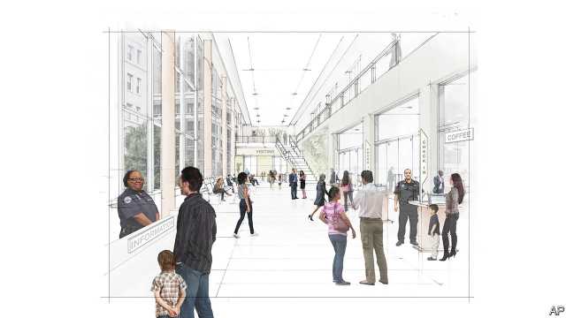

###### Boutique slammers

# A jail in Denver offers some lessons for criminal-justice reformers 

 

> print-edition iconPrint edition | United States | Jun 29th 2019 

ON JUNE 7TH Layleen Polanco, a 27-year-old transgender woman, was found dead in her cell at Rikers Island Jail. She was being held on $500 bail for a misdemeanour prostitution offence and the lowest-level drug charge, and she was being kept in solitary confinement for fighting. The death was not unusual in a jail renowned for corruption and cruelty, where mostly poor defendants can languish for years while awaiting trial. Bill de Blasio, New York’s mayor, plans to shut Rikers by 2026 and replace it with four smaller jails near courthouses in Brooklyn, the Bronx, Manhattan and Queens. Among other things, this fresh start offers a chance to rethink prison architecture in the city. 

America’s prison-builders have mostly wrestled with basic questions such as whether to house prisoners separately or together, and how to manage them with as few staff as possible. In the second half of the 20th century tough-on-crime laws sparked a boom in low-cost jail-building. By 2007 one in every 100 adults was typically housed in an isolated cinder-block compound surrounded by barbed wire. More recently there has been a fashion for high-rise prisons in the middle of struggling cities. Milwaukee has a 12-storey jail. 

In New York, awareness of the high costs of incarceration has spurred demand for more humane spaces. “This is a watershed moment,” says David Ziskind, a criminal-justice expert at STV, an architecture firm. The new jails are expected to emphasise rehabilitation over retribution and be used more sparingly. The goal is to house under 1,500 inmates at each facility, which means reducing the total prisoner population to under 5,000. This is far less than the nearly 8,000 housed at Rikers, but it is in line with current trends. New York’s prisoner count has already fallen 30% since Mr de Blasio took office in 2014; jail admissions are down nearly 50%. Meanwhile, crime continues to fall. 

Architects will submit proposals in 2020, but the city is already casting about for models. Officials have visited the 1,500-bed Van Cise-Simonet Detention Centre in Denver, Colorado. This building, which opened in 2010, offers some lessons. With its limestone façade, Van Cise-Simonet looks more like a museum or a university library. The interior is notable for its open spaces and the natural light from its bar-less windows. A booking area for new inmates resembles a bus terminal, with a few holding cells for those who misbehave. 

Instead of long grey corridors lined with clanging metal-doored cells, inmates stay in smaller units that hold up to 64 people, plus a deputy. In theory this reduces violence among inmates and against staff because officers get to know the prisoners and can see problems before they arise. The pods have areas for meals, classes and recreation, which limits the risk that comes from taking inmates to and from their beds several times a day. The facility also has a full medical unit, a mental-health unit and two courtrooms to handle misdemeanours and preliminary hearings. 

“Environments cue behaviour,” says Ken Ricci of CGL, a consulting firm, who was a principal designer of Van Cise-Simonet and is a member of the mayor’s taskforce to close Rikers. Sunlight and better acoustics improve life for the staff. The Denver jail suggests design has its limits, though. Overcrowding and short-staffing dogged the facility for years, and a report in the Denver Post in 2017 found that the number of assaults between inmates and against staff had started going up. The city spent around $12m to settle claims from the deaths of two inmates, in 2010 and 2015, one of whom was mentally ill. 

Mr Ricci is quick to concede that the design of Van Cise-Simonet is not perfect. Zoning constraints on the height and width of the building left inmates and staff with less elbow room and made view-obscuring pillars structurally necessary—an architect’s nightmare. Attracting and retaining staff is hard when the unemployment rate is so low, especially as the job now demands an ability to manage psychiatric emergencies and behave more like a social worker, rather than merely booting recalcitrant inmates in the stomach. “Our goal is to send these people back to the community in better shape than how they came to us,” says Elias Diggins, the Denver Sheriff Department chief and the president of the American Jail Association. Better design is a good start, but only that. ◼ 

