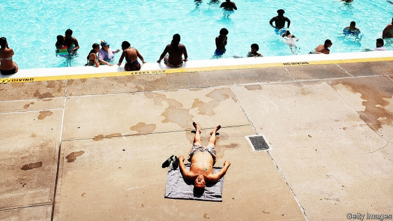

###### The great divide

# Can American states slow global warming on their own? 

 

> print-edition iconPrint edition | United States | Jun 29th 2019 

BRIAN BOQUIST, an Oregon state senator and fugitive of sorts, does not take his pursuers lightly. “Send bachelors and come heavily armed,” he warned from his hideout, which is allegedly in Idaho. “I’m not going to be a political prisoner in the state of Oregon,” he added. Since June 20th Mr Boquist and the rest of his Republican colleagues in the state Senate have fled from the capitol in Salem as part a final effort to derail a climate-change bill. Kate Brown, the Democratic governor, who is keen to sign the bill, has invoked her constitutional authority to haul the absentee lawmakers back, thus giving Democrats a quorum. Threats from armed militias then forced the closure of the capitol altogether. 

When the western stand-off subsides, Oregon may emerge as the latest state to pass ambitious emissions-reductions legislation, in this case a cap-and-trade programme for carbon pollution. New York is poised to approve its own ambitious climate targets—carbon-free electricity by 2040 and a carbon-neutral economy by 2050. A long line of states, including Colorado, Washington and New Mexico, have already enacted clean-energy laws this year. All this as federal environmental policy languishes under an administration that denies climate change is a problem worth tackling and is keen to undo regulations aimed at slowing it down. 

More and more states are following California, which began instituting stringent environmental rules decades ago. Rigorous efficiency standards for appliances, businesses and vehicles have brought the Golden State’s emissions down. From 2000 to 2016, California’s emissions fell by 9% even as its economy and population grew. 

Since 2002 renewable-energy standards, which mandate that a steadily increasing percentage of electricity must come from renewable sources, have spurred innovations. And since 2013 the state has had a cap-and-trade programme, which prices carbon by capping maximum emissions. This scheme covers 85% of total greenhouse-gas emissions. The current price of a metric ton of carbon dioxide is $17.45—sizeable, but less than the total cost of carbon pollution, which is estimated to be about $50 per metric ton. So far the specific contribution of the cap-and-trade scheme to emissions reductions is hard to measure, says Dallas Burtraw of Resources for the Future, who chairs the programme’s market advisory committee. But it should become more important as the cap tightens and prices rise. 

For the newer members of the green-state coalition, policies vary greatly. On the west coast plans are fairly detailed. Jay Inslee, the governor of Washington state, who is running a long-shot bid for president on a climate-centred agenda, signed a bill in May which would make the state’s energy supply coal-free by 2025. Washington, which already makes much use of hydroelectric power, plans to accomplish this by reorganising power generation. The plan goes further, though. The state’s energy supplies must be 100% carbon-neutral by 2030—a year which is not so far away—and 100% carbon-free by 2045. 

States like Washington, with Democratic legislatures and governors, have gravitated more towards renewable targets and clean-energy subsidies than to outright carbon-pricing. Twice during Mr Inslee’s six years in office Washingtonians have rejected carbon taxes by referendum. Mr Inslee blames “the oil and gas industry, that had not yet come to terms with this need for transition”. Carbon taxes, though much touted by economists, have never been popular with voters. 

If not thwarted by fleeing Republican lawmakers, Oregon’s plan would take account of that aversion. Its centrepiece is a cap-and-trade programme like California’s, which could eventually be integrated into the same regional electricity market. It aims to reduce emissions levels to 45% below 1990 levels by 2035, and to 80% below by 2050. For a small state to implement a cap-and-trade scheme on its own is a tricky proposition. Businesses may find it hard to leave California if energy prices rise, but can more easily spurn smaller places. Administrative costs are higher for a smaller carbon market, as is the chance of major disruptions. 

New York’s approach is different—both because its targets are so ambitious and because the methods for achieving them are unclear. The state was already awash with regulations and programmes to support cleaner power, such as solar and offshore wind farms. The new bill, which Andrew Cuomo, the governor, is expected to sign into law, strengthens them. It includes a binding goal to achieve 70% of electricity generation through renewables by 2030; by 2040 all power would need to be emissions-free. By 2050 the entire New York economy would need to have emissions 85% below 1990 levels. The remaining 15% would need to be offset, for instance through carbon-capture technology. 

Legislators declined to get into the details, bestowing that task on a new “climate action council” that must create recommendations. Kathryn Wylde, the head of the Partnership for New York City, a business group, says she supports efforts to fight climate change but is wary of the looming practical challenge supplying enough energy to New York City when a giant nuclear plant shuts down. Last month the state rejected a new natural-gas pipeline, which opponents had said would undermine New York’s climate goals. 

State efforts have speeded up in response to the intransigence of the Trump administration. Since Massachusetts v EPA, a Supreme Court ruling issued in 2007, the Environmental Protection Agency (EPA) has been legally required to regulate carbon-dioxide emissions, which the ruling classified as a dangerous pollutant. Under Barack Obama the agency adopted far-reaching regulation known as the Clean Power Plan, which targeted reductions in emissions from electricity generation by phasing out coal. The rule was tied up in the courts and never went into effect. 

Last week President Donald Trump finalised its replacement, the strangely named Affordable Clean Energy (ACE) rule. This will not resuscitate the coal industry, as Mr Trump claims. But any future Democratic president would find that undoing it will require another lengthy rule-making process which will take several years. The ACE rule might also prove to be a headache for the owners of power stations, in part because of its poor drafting. 

The Trump administration is also trying to delay fuel-economy standards for cars put in place by the Obama administration, and is tussling with California over its ability to set even higher standards. Carmakers, who are the alleged beneficiaries of the proposal, are lukewarm or outrightly opposed to the idea. Oil producers, however, are elated. This is despite frequent pronouncements from the current EPA on the virtues of “co-operative federalism” in environmental policy and the undesirability of “dictating one-size-fits-all mandates from Washington”. That outlook seems to apply more when states are racing to get rid of regulations than when they are trying to add more. 

America accounts for 15% of global emissions. The states and cities passing ambitious climate-change programmes account for a fraction of this fraction. Emissions have declined from historical levels in America due simply to costs—natural gas has become cheaper, and the cost of renewables has dropped significantly. In the past decade the cost of wind energy has fallen by 50%, while that of solar energy has dropped by more than 80%. States and cities can depress this national trajectory a bit further. 

A bifurcated country, in which prosperous Democratic states with hefty environmental rules go one way and Republican-leaning states go another, is not ideal. But state programmes will generate valuable know-how before the rest of the country moves, says Severin Borenstein, an economist at the University of California, Berkeley. They will also provide an example for the rest of the world to study. China accounts for nearly twice as many greenhouse-gas emissions as America. Chinese bureaucrats have dropped in on California to inspect its programme many times.◼ 

