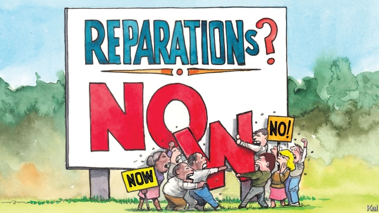

###### Lexington

# The idea of reparations for slavery is morally appealing but flawed 

 

> print-edition iconPrint edition | United States | Jun 29th 2019 

MITCH MCCONNELL is not known for his views on racial justice. But when asked last week whether he thought African-Americans should receive restitution for slavery and the decades of lawful discrimination that followed it, the Republican Senate leader’s response was sound. He was against the idea, he said, in part for practical reasons—for how would the recipients of compensation be selected? He also objected in principle: if African-Americans received reparations, what about the other victims of discrimination, including America’s many “waves of immigrants”? Continued, incremental improvements in the lives of black Americans seemed a more credible response to “our original sin”, said Mr McConnell. “We’ve elected an African-American president. I think we’re always a work in progress in this country.” 

Democrats, who were about to hold the first congressional hearing on slavery reparations in over a decade, hit the roof. Senator Cory Booker, one of at least seven candidates in the Democratic primary to have given their support for a bill to launch a congressional probe into the issue, slammed Mr McConnell’s “ignorance”. Another candidate, Marianne Williamson, a self-help guru who has proposed making reparations to African-Americans of up to half a trillion dollars, questioned his gradualist view of racial progress. “You can’t have the future that you want until you’re willing to clean up your past.” Yet Mr McConnell’s view of the matter was similar to that of the first black president he referred to. 

Barack Obama considered the idea of reparations to be politically fantastical, because a majority of Americans would never agree to it, and otherwise flawed. That was not to downplay the terrible legacy of slavery and Jim Crow among black Americans, including persistent white-black wealth, income and education gaps. But as a policy prescription, Mr Obama told the writer Ta-Nehisi Coates, whose 2014 essay in favour of reparations, published in the Atlantic, had revived the issue, it was a distraction. “Why are we even having the abstract conversation when we’ve got a big fight on our hands just to get strong, universal anti-poverty programmes and social programmes in place, and we’re still fighting to make sure that basic anti-discrimination laws are enforced?” 

This also represented a belief in the hard slog of incremental improvement, ingrained in Mr Obama by his study of history as well as by the political moment. The New Deal and civil-rights era were rare explosions of liberal progress, in special circumstances, which his election alone did not augur. That many Democrats are nonetheless now embracing the reparations distraction shows how much the party has changed since Mr Obama last secured the White House in 2012. That should worry anyone who hopes it will repeat the feat against President Donald Trump next year. 

The right’s racially charged opposition to Mr Obama has helped encourage the shift. Blowhards such as Rush Limbaugh and Glenn Beck characterised his spending proposals as “reparations”. Congressional Republicans, led by Mr McConnell, obstructed him to an unprecedented degree. Left-wing critics of Mr Obama, including black activists dismayed by his pragmatism, had previously warned that his attempts to meet Republicans in the centre ground would cause them to shift it to the right. The fact that this happened (when Mr Obama adopted a Republican health-care plan, Republicans called it socialism) is a reason many now cite for demanding a bolder agenda. Yet the idea that Mr Obama would have been more successful if he had tried to do the left-wing things his critics falsely accused him of defies reason. In the case of reparations, this would mean Democrats propounding an idea even more unpopular than Mr Trump’s policy of tearing migrant children from their parents. Over 80% of whites oppose it. 

Republicans are liable to dismiss any Democratic racial-justice scheme as identity politics. In this case they would be right. Mr Coates, who appeared alongside Mr Booker at the recent congressional hearing, argues that black Americans’ legacy of injustice is incomparably worse than that of any other group. Yet native Americans, a smaller and less Democratic group, would beg to differ. And though some Democrats propose giving them reparations too—last week California’s governor Gavin Newsom announced the launch of a commission to study the issue and Elizabeth Warren has said she might support it—that is less a solution than a warning against embarking on the endeavour at all. It would be liable to keep spreading—maybe to poor Hispanics next. 

That such a clearly impractical and politically no-win scheme made it through the Democratic policy machine might seem amazing; but it did not. It flew more or less straight from Mr Coates’s pen to Congress and the presidential primary, where Ms Williamson added noughts to it. No think-tank or policy unit appears to have given real thought to slavery reparations. Its sudden prominence reflects a lack of rigour characteristic of the party’s activist fringe. The Green New Deal and Medicare-for-all, two other fashionable ideas on the left, received similarly scant consideration before being pushed by activists into the mainstream. 

In their defence, Democratic candidates have mostly made far more measured commitments to all three ideas than the activists would like. Asked for his reparations policy, Mr Booker points to his proposal to fight wealth inequality by giving cash—in the form of “baby bonds”—to poor families. That is the sort of colour-blind anti-poverty measure which would have benefited African-Americans disproportionately and which Mr Obama would have approved of. Mr Booker should describe it as such. By flirting with reparations the Democrats have already provided Mr Trump with racially incendiary attack lines. And to what end? The issue is not even all that popular with African-Americans, only a small majority of whom support it. They tend to be as pragmatic as Mr Obama was, and so must know that it is a pipe-dream.◼ 

