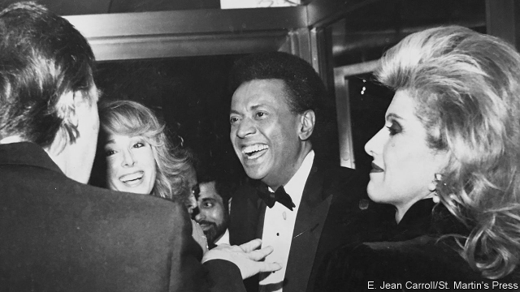

###### Elle accuse

# The president stands accused of rape, again 

 

> print-edition iconPrint edition | United States | Jun 29th 2019 

A  QUARTER OF a century ago a man is alleged to have raped a woman in the changing rooms of Bergdorf Goodman’s lingerie department. It was not the first time this woman had been raped but it was the last, and she has not had sex since. She never went to the police, though she did tell two friends about the rape at the time. He denies the allegation. She is an agony aunt who dispenses upbeat advice to women, urging them to put troubles behind them and move on. He is the sitting president of the United States. 

E. Jean Carroll is the 16th woman to credibly accuse the president of some kind of sexual molestation and the second to accuse him of rape. The first, Donald Trump’s ex-wife Ivana, claimed during a divorce settlement in 1989 that he had raped her, but later recanted. Ms Carroll described her encounter with Mr Trump in a searing essay called “Hideous Men” for The Cut, a website. She explains her previous silence thus: “I am a member of the Silent Generation. We do not flap our gums. We laugh it off and get on with life.” 

Getting on with life is what most Washington politicians have been doing since the accusation was made. Republicans have hardly bothered to defend Mr Trump, nor Democrats to denounce him. Among the more gloomy things about Ms Carroll’s accusation is how unsurprising it is. Whether they approve of him or not, only 35% of Americans say the president is a person they admire, according to Gallup. His defence—“She’s not my type”—with its implication that had she been more attractive he might have done it, is a reminder of why that is so.◼ 

