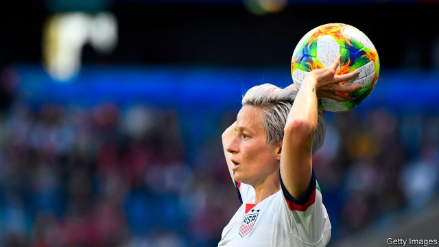

###### Better Play, Lesser Pay

# Where female athletes are more popular than male ones 

 

> print-edition iconPrint edition | United States | Jun 27th 2019 

EXCITED FANS in bald eagle baseball caps watched as the United States women’s football team beat Spain to progress to the quarter-finals of the World Cup on June 24th. This was no shock upset. The Stars and Stripes are the most successful side in the history of women’s football, having won the World Cup three times and Olympic gold four. This year they romped through the group stages with an aggregate score of 18-0, a total inflated by their record-breaking 13-0 drubbing of lowly Thailand. 

This on-pitch success, however, is marred by controversy in court. The members of the United States women’s team marked International Women’s Day on March 8th by filing a class-action suit against their employer, the United States Soccer Federation (USSF). The suit alleged that differences in pay and employment conditions between the women’s and men’s team violate the Equal Pay Act and Title VII of the Civil Rights Act. Despite engaging in “substantially equal work”, the women’s team is paid considerably less. If each team were to play 20 friendlies over the course of a year and win them all, the women would receive $99,000 whereas the men would net $263,320, according to the filing. 

It is common for female athletes to be paid less than men. The combined salaries of the 1,693 women playing in the top seven football leagues add up to $41.6m, just slightly less than the $41.7m salary paid to Neymar, a Brazilian forward, by Paris Saint-Germain. But football in America is unusual because the women’s team is paid less than the men, despite more people tuning in to watch them. 

Such pay differences are permissible if the employer can prove that one of four “affirmative defences” apply: a seniority system, a merit system, a pay system based on quantity or quality of output or any other factor apart from sex. The burden of proof is on the USSF to prove that the disparity can be legitimately explained by one of these four. The federation has attributed the discrepancy to “differences in the aggregate revenue generated by the different teams and/or any other factor other than sex.” The success of the lawsuit depends on whether this is true. 

A Wall Street Journal investigation into audited financial reports from the USSF suggests that it is not. Between 2016 and 2018 women’s games generated about $50.8m in revenue. The men took in about $49.9m. That alone is not enough to settle the case. This money came mostly from ticket sales, but that is not the only source of revenue attributable to the national teams. Much of it comes from broadcast rights and sponsorship deals. As these are bundled together, it is difficult to assess how much ought to be attributed to each team. It is, however, hard to believe that the men’s team, whose best result has been third place in the 1930 World Cup and who failed to qualify last time round, is such a sought-after commodity as to justify the pay disparity. 

Having qualified for the knockout stages of the World Cup, the 28 female players agreed to pursue mediation once the tournament ends. This is unlikely to resolve the matter. Legal disputes over equal pay have been going on since five players filed a complaint with the Equal Employment Opportunity Commission in March 2016. This has effectively been subsumed by the class-action suit. A previous effort at mediation fell apart in March. The team is now two matches away from the final at the Parc Olympique Lyonnais. Whether they make it there will be decided on the pitch. How they are compensated for their efforts is likely to be decided in court.◼ 

