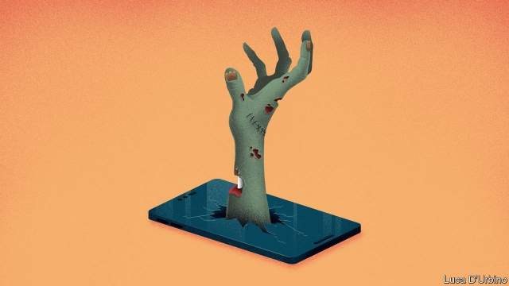

###### Smombie apocalypse

# A dangerous creature is haunting South Korean crossroads 

 

> print-edition iconPrint edition | Asia | Jul 6th 2019 

IN SOUTH KOREA smartphone cases come with rings mounted on the back, to prevent clumsy owners from dropping them. This makes people look like they are literally married to their phones. In many of Seoul’s most Instagrammable coffee shops, couples on dates spend vastly more time looking at their screens than at each other. The ramifications go beyond the potentially dire consequences for romance. 

Walk around the streets of Seoul or any other South Korean city, and there is a real risk of bumping into people whose eyes are glued to their smartphone screens. Insurers estimate that around 370 traffic accidents annually are caused by pedestrians using smartphones. That figure does not include those who bump into lamp posts and the like while perusing the latest cat videos. 

The government initially tried to fight the “smombie” (a portmanteau of “smartphone” and “zombie”) epidemic by distributing hundreds of stickers around cities imploring people to “be safe” and look up. This seems to have had little effect even though, in Seoul at least, it recently replaced the stickers with sturdier plastic boards. 

Instead of appealing to people’s good sense, the authorities have therefore resorted to trying to save them from being run over. Early last year, they began to trial floor-level traffic lights in smombie hotspots in central Seoul. Since then, the experiment has been extended around and beyond the capital. For the moment, the government is retaining old-fashioned eye-level pedestrian lights as well. But in future, the way to look at a South Korean crossroads may be down. 

