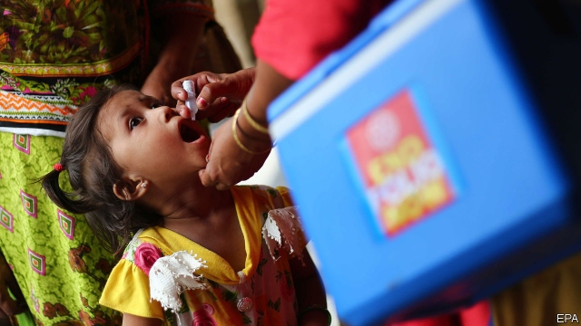

###### Drop goal

# Pakistan is trying new tactics to eliminate polio 

 

> print-edition iconPrint edition | Asia | Jul 6th 2019 

WORRIED PARENTS began arriving at hospitals in ones and twos, then dozens and soon hundreds. Each was convinced their child was sick, poisoned by polio drops dispensed in the latest government vaccination campaign. By the end of the day, a total of 25,000 children had overwhelmed hospitals in Peshawar alone. Health officials declared an emergency and the nationwide campaign was suspended. Yet doctors say none of the children was ill and none was admitted to hospital. 

Pakistan had seen resistance to polio vaccination before, but nothing like this bout of mass hysteria, which took place in April. It was triggered by false rumours that schoolchildren outside Peshawar had fainted, vomited or even died after taking drops. Fake videos of ailing children on social media amplified the panic. As imams called people onto the streets, a mob ransacked and burned a small clinic. In the aftermath of the panic, 2m children have gone unvaccinated. 

The worldwide campaign to eradicate polio is close to fruition. When it began in 1988, polio was endemic in 125 countries and infected 350,000 children a year. It now exists only in Pakistan and Afghanistan, which saw 33 cases in 2018. (There have been some cases in other countries, but derived from live vaccine, not from the wild virus.) Last year, however, international monitors declared that the eradication campaign had stalled. A few years ago, when Islamist terrorism was at its height in Pakistan, militants killed dozens of vaccine-distributors, who often worked with armed guards. Security has now improved, but polio cases are going up, not down. There have been 37 so far this year. Officials expect the annual figure to top 50, compared with 12 last year. Tests on sewage show that the virus lurks in many cities. 

Extremists have long peddled conspiracy theories about polio drops: that they are a Western plot to sterilise Muslims, or that vaccinators are spies. The panic in Peshawar showed that concerns are not limited to a lunatic fringe, however. At fashionable schools in Islamabad, the leafy, purpose-built capital, parents share fears about vaccines on WhatsApp groups. 

Even those who accept the need for the vaccine resent the government for insisting that children take it while failing to provide much else in the way of health care. “People have lost confidence in the health department,” says Raees Khan, a councillor in Bannu, a district where there have been 14 cases of polio this year. 

It does not help that much of neighbouring Afghanistan is off-limits to health workers, who are accused by the Taliban of snooping on behalf of the Afghan army. The persistence of the disease on both sides of the porous border allows it to return to areas where it had been eradicated—and increases the risk that it will spread to other countries. 

Around 90% of parents accept the vaccine, says Babar bin Atta, the government’s pointman on polio. To win over the final 10%, he argues, the campaign must become less punitive and intrusive. “We have to make parents feel they are in charge of their child’s right to immunisation and nothing is being forced on them.” 

Some households have been subjected to as many as eight visits during eradication drives in their area, not just from health workers but from clipboard-wielding monitors, too. Parents face a volley of personal questions. Gun-wielding guards are prominent. But from now on, vaccinators will ask fewer questions, and there will be fewer follow-up visits. The authorities will stop prosecuting parents who refuse the vaccine. The hope is that reducing the intrusion will help dissipate the resentment and suspicion. Eradication depends on winning everyone over. “Even a single case is a case too many,” says Mr bin Atta. “You are either a polio-free country or you are not a polio-free country. There’s nothing in the middle.” ◼ 

