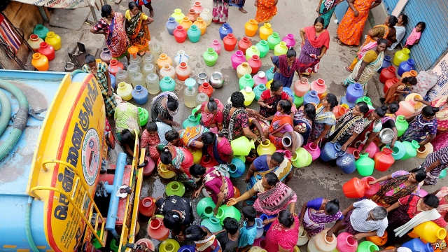

###### Do or dry

# Thirsty Indian cities have a management problem, not a water problem 

 

> print-edition iconPrint edition | Asia | Jul 6th 2019 

BETWEEN DECEMBER and June the largest reservoir supplying Chennai, India’s sixth-biggest city, shrivelled and then vanished. From the window of a plane, darker patches suggest Puzhal Lake still holds some water. Close up, the “water” turns out to be just a different shade of mud. 

Puzhal is indeed “bone dry”, says T. Prabhushankar, the head of Chennai’s water board, and so are three more lakes that are the other main sources of water for the city’s 8m people. In his air-conditioned office a computer screen indicates that the city’s reservoirs, which have a total capacity of 11bn cubic feet, contain a minuscule 25m cubic feet. “There is nothing to hide about it,” he shrugs. “There has been no rain for 190 days, so there is no water.” Yet Mr Prabhushankar is not worried. Not only does he expect to get through the current dry spell—Chennai’s worst since 2004—he also insists that, for the city, water scarcity will soon be a thing of the past. 

As with India as a whole, the growing city’s demand for water has placed huge stress on traditional sources such as groundwater, rivers and lakes. And, like all of India’s 1.3bn people, Chennai’s thirsty inhabitants may very well face long-term dangers from climate change, one effect of which is more erratic rainfall. But while it is easy to blame both the city’s and India’s water woes on nature, a closer look reveals a legacy of poor management, lax laws and underinvestment. Most of the time, the two annual monsoons suffice to top up lakes and groundwater. The trouble comes when leaks spring in the system. 

To allay Chennai’s acute scarcity, which is likely to last until the winter monsoon in November (for India’s east coast this is heavier than summer rains), the water board has contracted an impressive 1,000 GPS-tagged water tankers, each making up to a dozen daily runs. Free deliveries of drinking water reach every street in the city once every two days. Local volunteers ensure it is rationed fairly—typically 30 litres a day for each household. 

As neighbours in the middle-class Mylapore district line up brightly coloured pots for the scheduled tanker to fill, there is more good humour than annoyance. It was worse in the 2004 drought, recalls the tanker driver: there were so many fights he needed police protection. Kamala Kanan, a local businessman, says it is a bore having to wait for and haul water, and it is barely enough for the 13 people in his house. But the distribution is reliable, free and fair. And luckily his family has access to groundwater. This has grown saltier but they use it for washing and sanitation. Residents of two different slum districts say they get piped water for a few minutes a day. It is also enough, but sometimes stinks of sewage, so for drinking they buy 20-litre drums for about $0.50 each. 

Mr Prabhushankar explains that the city has been able to sustain about two-thirds of normal supply because it planned ahead. Two recently built desalination plants, new borewells, expanded facilities to recycle sewage and a new 220km pipeline from a distant reservoir all add to supply. Both desalination and recycling capacity are set to triple within five years. Faced with complaints of dwindling groundwater, the government promises to enforce long-standing laws mandating that all buildings should be equipped to harvest rainwater. It has also pledged to maintain not only its big reservoirs, but hundreds of smaller bodies of water that could help insure against drought. 

The promise is welcome, but not convincing to Sekhar Raghavan of the Rain Centre, an NGO that lobbies for better water management. Its research shows that, despite 99% compliance on paper, only 40% of buildings actually do trap rainwater and store it or inject it into aquifers. The severity of floods that hit the city in 2015 was largely owing to the government’s failure to clean and desilt canals and lakes or to build an adequate sewer system, Mr Raghavan says: “They are jokers. They would rather spend huge money on big new projects and giant storm drains than on fixing what is broken, which is our natural water-storage capacity.” 

Still, Mr Raghavan is optimistic. When he started out decades ago, his was a lonely voice. Now, he says, ordinary citizens are demanding action, or acting themselves. He has another new ally, too. Spooked by rapidly depleting groundwater, the central government plans a vast nationwide campaign to revamp local reservoirs. Perhaps if the government also stopped promoting greedy crops such as rice and sugarcane, did more to curb rampant pollution, and considered installing meters and applying realistic prices to regulate water consumption, India really would not have to worry about going thirsty. As Mr Raghavan says, “You cannot complain about nature. It’s we that have to adapt to nature.” ◼ 

