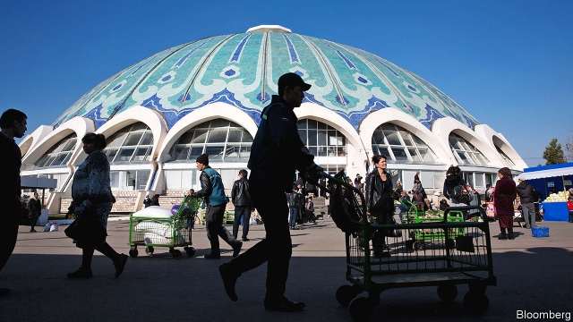
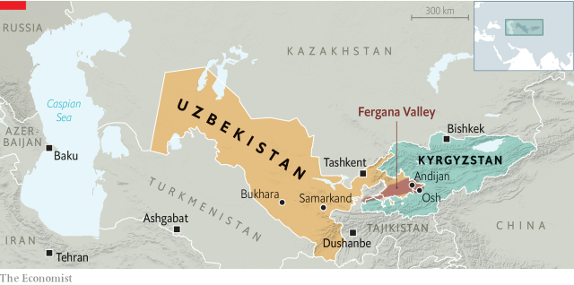

###### Ready, steady, structural reform

# Uzbekistan’s government is rapidly overhauling the economy 

 

> print-edition iconPrint edition | Asia | Jul 6th 2019 

THE LIGHT and airy chaikhana, or teahouse, had been built to take advantage of the traffic between two of the biggest cities of the Fergana Valley, a fertile region at the heart of Central Asia. After the break-up of the Soviet Union Andijan and Osh had found themselves in two different countries, Uzbekistan and Kyrgyzstan, creating a nearby border post (see map). Then in 2005 the Uzbek authorities brutally repressed anti-government demonstrations in Andijan and sealed the border, halting trade and dividing many families. The chaikhana was boarded up. 

It took the death in 2016 of Islam Karimov, the strongman who had led Uzbekistan since Soviet days, to bring the chaikhana back to life. His successor, Shavkat Mirziyoyev, reopened the border as part of an ongoing process of economic reform. Now waiters serve hearty bowls of lamb soup to migrant workers, traders and shoppers on their way between the two cities. Outside, lorries carrying everything from cement to electronic goods rattle back and forth. In Taskhent, the Uzbek capital, hotels are bustling with Western consultants, Saudi princes and eager Asian investors. 

 

The febrile atmosphere is reminiscent of the economic opening after the fall of communism elsewhere in the former Soviet Union. In Uzbekistan, communism never really fell. Whereas neighbouring Kazakhstan embraced capitalism and welcomed foreign investment, Karimov, a former central planner, kept the Uzbek economy largely closed and dominated by the state. The private sector was confined to retail and other services. Currency and capital controls left not just dollars but cash of any sort in short supply. Corrupt officials gummed up all interactions with the state. Some 2m Uzbeks migrated to Russia in search of jobs. The government funded itself by monopolising exports of natural gas and cotton, the latter harvested by forced labour. The security services ruled the roost. 

Mr Mirziyoyev has never publicly repudiated Karimov, but has spent the past two years undoing his legacy. He dismissed the previously all-powerful head of security, Rustam Inoyatov; business-friendly technocrats now call the shots. The government has abolished most of the capital and currency controls, dramatically curbed forced labour and opened the borders. Payroll levies have fallen from an effective rate of 70% to about 30%, officials say. “We lost 20 years and have a lot of catching up to do,” says Ravshan Gulyamov, the deputy economy minister. 

The number of registered businesses has doubled in the past year. Foreign investment has jumped fourfold, although its growth rate has recently dropped. But the changes made so far, says Jamshid Kuchkarov, the minister of finance, have been the easy ones, since they have been popular with ordinary citizens. Raising utility prices, rationalising and privatising state-owned firms and trying to improve the productivity of agriculture, which provides employment for a third of workers, will be much more controversial. Moreover, half of the population is under 30, requiring a brisk pace of job creation. 

Most of the country’s arable land is given over to cotton and wheat. Economically and environmentally this makes little sense: the two crops consume a lot of precious water but are not very profitable. The government is encouraging farmers to grow fruit and vegetables instead. “A hectare of cotton creates only two jobs. A hectare of tomatoes generates 20 jobs and that is before you count storage and transportation,” says Mr Gulyamov. The huge markets of China and Russia, which are hungry for Uzbek cherries and tomatoes, are nearby. 

The government has undone many of the subsidies for cotton farmers, but is paying them something closer to a market price for their crop. At the same time, it is trying to create a domestic textile industry by sharply restricting exports of raw cotton. Exports of textiles have risen from $100m ten years ago to $1.9bn last year. The government hopes to reach $7bn by 2025. 

Uzbek diplomats have been instructed to focus on drumming up investment above all; each big embassy has been assigned a different region to champion. Mukhsinkhoja Abdurakhmonov, the deputy governor of Fergana region, once worked at Coca-Cola and wrote a doctoral thesis at a Japanese university about foreign direct investment. “We still have to overcome our bad legacy. We need to demonstrate some success stories, to prove that property rights are sacrosanct,” he says. 

“They are pushing reforms faster than many of us think possible,” says one Western diplomat. To foster this ambition, Mr Mirziyoyev has drafted experienced émigrés, such as the former investment banker who now heads the stockmarket regulator and the ex-director of the European Bank for Reconstruction and Development who is now minister of trade and investment. It is also relying heavily on the expertise of the IMF, the World Bank and the Asian Development Bank, especially to help pave the way for a crowd of privatisations. 

“Everything should go through them. They provide transparency and expertise, which we might lack, and have no interest in cheating us,” says Mr Kuchkarov. In the end, it does not matter who owns what as long as everything is above board, he says: “I love the principle of an American supermarket, where every buyer is equal.” 

But some question how committed the government really is to equality. Kristian Lasslett of Ulster University, in Britain, points out that the mayor of Tashkent is overseeing a big new residential and office development, which firms with ties to him are helping build. Alisher Usmanov, a metals magnate who has become involved in Uzbekistan’s copper and steel industries, recently flew Mr Mirziyoyev on his private jet to meet Vladimir Putin, Russia’s president. A good way to put Uzbeks off Mr Mirziyoyev’s reforms is to give them the impression that changes are being made for the benefit not of the many, but the few. ◼ 

