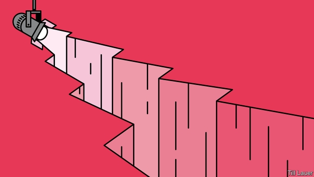

###### Banyan

# Who would dare to speak for Kim Jong Un and Donald Trump? 

 

> print-edition iconPrint edition | Asia | Jul 6th 2019 

DONALD TRUMP claims that his weekend meeting with Kim Jong Un at the Korean border village of Panmunjom came about thanks to an impromptu invitation issued less than a day before on Twitter (the North Korean dictator “follows” him there, of course). In fact, preparations must have been under way for longer. Yet like everything else about the hour-long get-together, which involved Mr Trump becoming the first serving American president to set foot in North Korea, the social-media invitation seemed designed to heighten the sense of drama and flourish, while the old diplomatic rulebook was tossed aside. 

Past presidents, bomber jackets on, went to the demilitarised zone to glower across the world’s most dangerous faultline, as did Mr Trump’s own vice-president, Mike Pence, saying he wanted the North Koreans “to see the resolve in my face”. Mr Trump, in contrast, is always in search of a televised triumph. He does not hold the vileness of Mr Kim against him, even though he has had his uncle, half-brother and many others killed. On the contrary, after three meetings the despot is a firm buddy. Nor does Mr Kim’s nuclear arsenal appear to Mr Trump to be a threat. Since his first clinch with the young dictator at a summit in Singapore just over a year ago, “All of the danger went away.” Like magic. 

To the killjoys, not only has Mr Kim kept his nuclear arsenal, he has quietly expanded it since then to perhaps 60 warheads. Only the testing of nuclear devices and long-range missiles to carry them has stopped, for the moment. Killjoy-in-chief is John Bolton, Mr Trump’s national security adviser. He has long highlighted North Korea’s litany of broken promises. Pointedly, he was not next to his boss in Panmunjom but over 1,000 miles away, on important business in Mongolia. 

Mr Bolton doubtless did not like the idea of giving away the symbolic honour of hobnobbing with America’s president while receiving nothing in return, bar a promise to keep talking. Does that really matter? Since North Korea revolves around its leader, it is logical to deal directly with him. President Moon Jae-in of South Korea, who accompanied Mr Trump to the border, was wildly exaggerating when he called the meeting the “de facto declaration of an end to hostile relations and the beginning of a full-fledged peace era”. But he was surely right to point out the limitations of the previous “diplomatic grammar” that flowed from seven decades of mutual hostility. 

It seems unlikely that Mr Trump has the blind faith he sometimes professes in Mr Kim’s sincerity. He must know that rocketman, as he once called him, is hoping to keep his nukes while seeking relief from sanctions. After all, at the pair’s previous summit in Vietnam in February, Mr Trump, bolstered by Mr Bolton and the secretary of state, Mike Pompeo, rejected Mr Kim’s offer to destroy an ageing nuclear complex, Yongbyon, which is no longer central to his nuclear ambitions, in return for an easing of sanctions. 

Yet there is now much speculation that Mr Trump’s team will somehow sell the farm in the working-level discussions that the leaders promised to restart. One rumour circulating in Washington suggests that Mr Trump will agree to lift sanctions in exchange for a mere freeze of North Korea’s nuclear programme, without surrendering the bombs it has already made. American officials have forcefully denied any such prospect. There have been hints, however, that America might accept a staggered deal, in which it gradually eases up on North Korea in return for a series of small concessions, rather than a one-off trade of complete disarmament for across-the-board relief from sanctions. 

Such gradualism has not worked with North Korea in the past. It would discomfit many in Japan and South Korea (though not Mr Moon). Moreover, it is far from clear whether Mr Kim is ready to offer more—or submit to the kind of intrusive inspections that enforcing such a deal would require. 

But there is a prior obstacle to striking any deal, however daring or flawed. In a top-down diplomatic dance led by strongmen, lower-level negotiators know that they and their counterparts have little authority. Even if reports that a furious Mr Kim had some of his negotiating team executed after the shambles in Vietnam are exaggerated, it would be a brave apparatchik who agreed to anything much on Mr Kim’s behalf. Mr Trump is not as violent, but just as mercurial. How can working-level talks get anywhere? 

