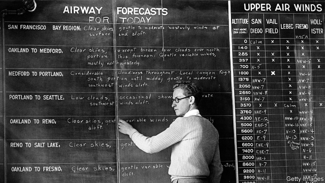

###### Eye of the storm

# How to predict the weather 

 

> print-edition iconPrint edition | Books and arts | Jul 6th 2019 

The Weather Machine. By Andrew Blum. Ecco; 224 pages; $25.99. Bodley Head; £16.99. 

IN 1943 A German U-boat surreptitiously landed on the coast of Labrador, Canada’s frigid north-eastern peninsula. Under cover of fog, the crew quickly deposited ten large canisters, each labelled “Canadian Meteor Service”, on a nearby hill. Inside were nickel-cadmium batteries and ten-metre antennae—components of a clandestine weather station. 

The landing by U-537 was the only known Nazi military operation on North American soil. It was an urgent, if risky, mission. Germany had been cut off from Allied-controlled weather-observation networks, leaving its U-boats vulnerable to eastern-moving storms. The German weather service scrambled to develop new kit that could automatically transmit vital weather reports back to Berlin. 

As Andrew Blum explains in “The Weather Machine”, his vivid account of the history and evolution of the modern daily forecast, conflict has always spurred innovation in atmospheric science. During the cold war, America raced to launch satellites that could spot a hurricane veering toward the Gulf of Mexico—or spy on Soviet weapons build-ups. Yet much as meteorologists thrive on competition, Mr Blum notes that weather prediction ultimately depends on global teamwork, facilitated by institutions such as the UN’s World Meteorological Organisation. Superstorms and cyclones rarely observe national borders. 

Like “Tubes”, Mr Blum’s book about the hidden infrastructure of the internet (published in 2012), “The Weather Machine” traces the “long supply chain of data” that produces the morning weather report. The smartphone weather app is “the handsome face of a complex and sprawling machine”, a vast operation encompassing awesome supercomputers, tens of thousands of observation stations and over 100 satellites. The book strips this forecasting engine down to its parts, revealing the people and places that keep the gears turning. 

One of them is a lighthouse on top of a worryingly blustery hill on the tiny Norwegian island of Utsira. A weather station has operated there since the 1860s, after the telegraph made it possible to track weather patterns across long distances. A wide-reaching observation network was the first step toward weather prediction; the next was to input the data into a mathematical model of the atmosphere to produce short-term forecasts. But calculating future atmospheric conditions proved quite a practical challenge in the pre-digital age. Lewis Fry Richardson, an English physicist, estimated in 1922 that a global forecasting office would require 64,000 “computers”—that is, humans working with pencil and paper. “The scheme is complicated because the atmosphere is complicated,” Richardson admitted. 

The European Centre for Medium-Range Weather Forecasts has developed a more streamlined system. It maintains two supercomputers that together carry out 90trn calculations per second. Visiting the centre’s modernist compound in Reading, England, Mr Blum watches one of these machines run a weather model from start to finish, spitting out a ten-day forecast in just over two hours. In 2012 the centre predicted Hurricane Sandy eight days in advance; by 2025 it aims to forecast such high-impact weather events with as much as two weeks’ warning. 

Mr Blum runs through the early history of weather prediction before embarking on a grand tour of forecasting institutions across Europe and America. He is a sharp analyst and engaging guide, adept at translating difficult concepts in meteorology and computer science for the uninitiated. He compellingly emphasises the forecast’s diplomatic foundations. Weather prediction represents “a last bastion of international co-operation”, a global effort to warn of natural disasters that ravage crops and displace communities. As extreme weather events become more common, the weather report—a daily marvel on which lives and livelihoods depend—should not be taken for granted. ◼ 

